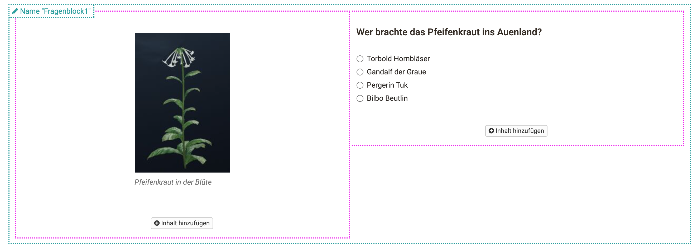
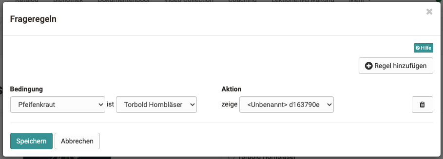

# Frageregeln

Frageregeln (Arbeitsname: "Branching") können ab jetzt neu in OpenOlat im

sites/manual_user/docs/forms/Question_rules.de.md §Form_editor_(Questionnaire_editor).de.md§ 481
[Fragebogeneditor](Formular+Editor.html) eingebaut werden. Abhängig von
bestimmten Antworten im Fragebaustein
"Mehrfachauswahl"
und
"Einfachauswahl",
können Aktionen ausgeführt werden.

Aktuell ist es nur möglich, bestimmte Fragecontainer anzeigen zu lassen.
Dadurch können unterschiedliche Fragestränge gebaut werden.

## Erstellung einer Regel

Um eine Frageregel zu erstellen, müssen diese Bedingungen erfolgt sein:

  *  Mehrfachauswahl/Einfachauswahl mit mind. 1 Antwort
  * Ein Container, der ein anderen Fragebaustein oder Inhalt besitzt und nicht die oben genannten Fragebausteine.

Falls die Bedingungen nicht erfüllt sind, erfolgt eine Warnung und sie können
keine Regeln erstellen.

  

Der Container kann zur besseren Verständigung benannt werden. Ohne eigene
Benahmung enthält dieser den Standardnamen _< Unbenannt>[Container ID]_  
  

Verschiedene Ebenen

Durch die Verschachtelung von Containern, kann es schnell unübersichtlich
werden. Empfehlenswert ist es nicht mehr als 2 verschachtelte Container mit
Frageregeln zu benutzen

|

  
  
---|---  
Namen sind bei Hover über den jeweiligen Container sichtbar.|

  
  
Die Frageregeln können oben rechts neben dem Administrationsmenü aufgerufen
werden.|

  
  
Ein neues Popup-Fenster taucht auf, das die Frageregeln beinhaltet. Auf "Regel
hinzufügen", kann man diese erstellen.

  

|

  
  
Links werden die "Bedingungen" definiert, rechts die "Aktionen". Zunächst kann
ganz links ein Frage-Item ausgewählt werden und im zweiten Dropdown-Menü die
zu bestimmende Antwort. Unter Aktion wird der Container selektiert, dessen
Inhalt angezeigt werden soll. Zum Schluss die Frageregel noch unten links
speichern.

|

  
  
  

  

  

  

  

  

  

