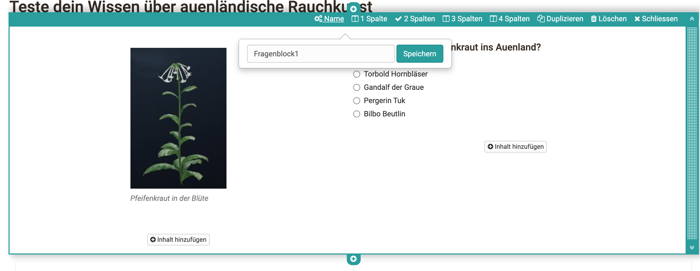
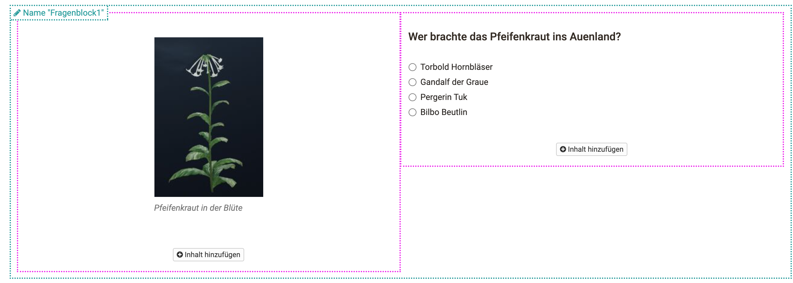
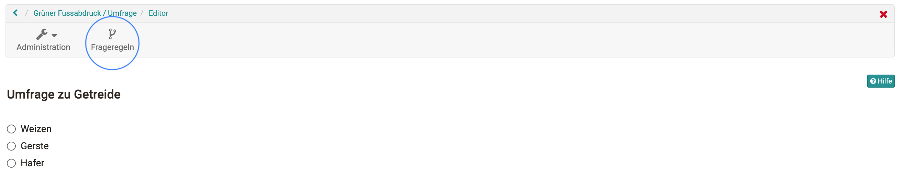
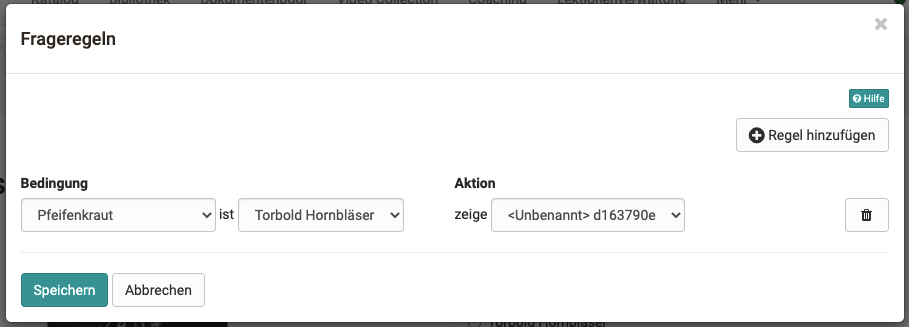

# Question rules

Question rules (working name: "Branching") can now be integrated in OpenOlat in the [form editor](../forms/Form_editor_Questionnaire_editor.md). Depending on certain answers in the question container { class=size24 } "multiple choice" and { class=size24 } "single choice", actions can be executed.

Currently it is only possible to display certain question containers. Thus, different question strings can be built.

## Creation of a rule

To create a question rule, these conditions must have been met:

* Multiple selection/single selection with at least 1 answer.
* A container that has a different question module or content and not the question modules mentioned above.

If the conditions are not met, a warning will be issued and you will not be able to create a rule.

* The container can be named for better understanding. Without own naming this contains the default name _< Unnamed>[Container ID]_.

    !!! info "Several levels"

        Due to the nesting of containers, it can quickly become confusing. It is recommended not to use more than 2 nested containers with question rules.

    { class="shadow lightbox" }

* Names are visible when hovering over the respective container.

  { class="shadow lightbox" }

* The question rules can be accessed in the upper right corner next to the administration menu.

  { class="shadow lightbox" }
  
* A new popup window will appear containing the question rules. On "Add rule", you can create them.

  { class="shadow lightbox" }
  
* On the left the "Conditions" are defined, on the right the "Actions". First, a question item can be selected on the far left and the answer to be determined in the second drop-down menu. Under Action, the container is selected whose content is to be displayed. Finally, the question rule is saved at the bottom left.

  { class="shadow lightbox" }
