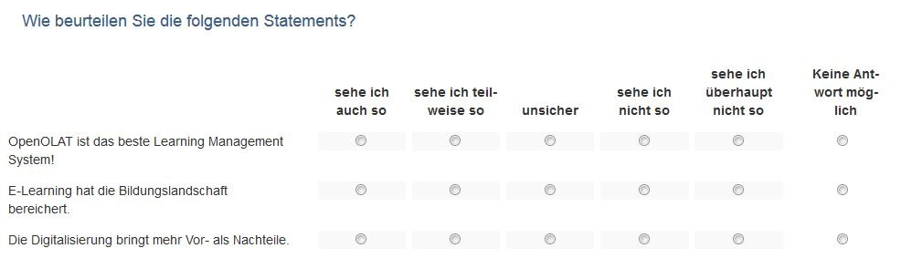
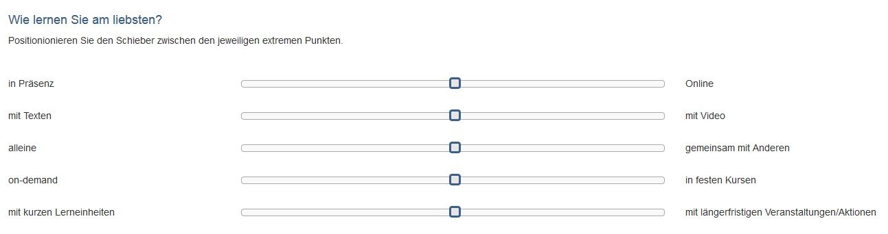
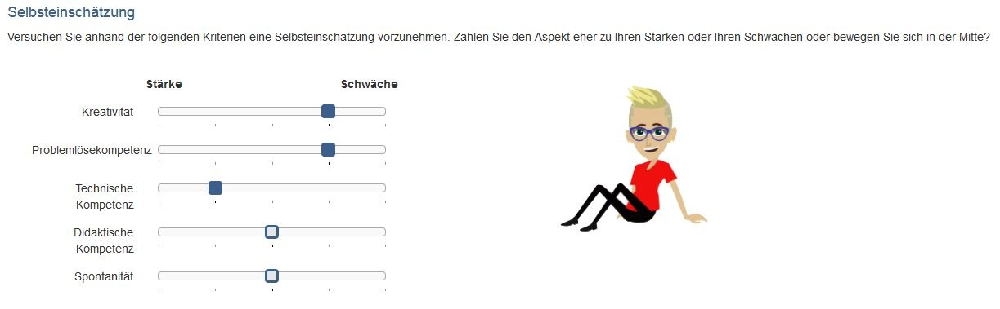
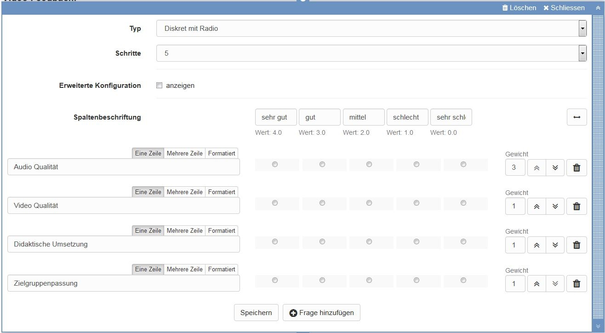
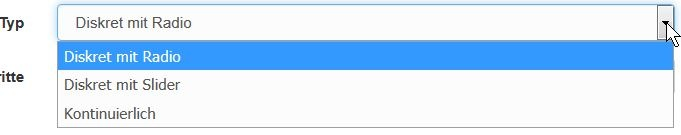
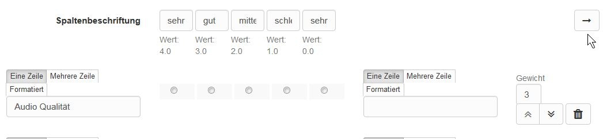
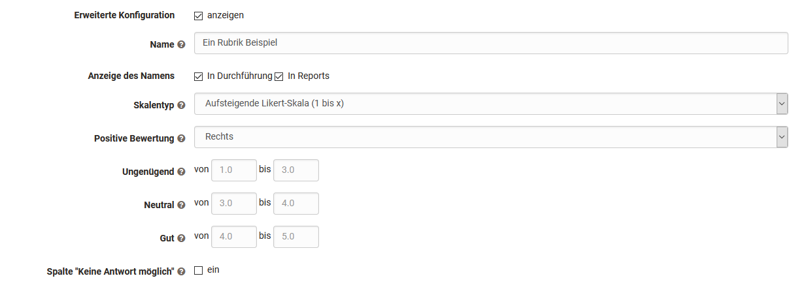

# Rubrik

Ein Rubrik ist in OpenOlat ein Element der Lernressource Formular. Rubriks
bieten sich an, wenn
Sie mehrere Fragen für die gleiche Bewertungsskala verwenden wollen. Der
Anwendungsbereich von Rubrik Bewertungen ist gross. Generell können Rubrik
Elemente in allen Formularen und für sämtliche Kursbausteine und
Lernressourcen, die Formulare nutzen, verwendet werden. Besonders relevant
sind sie allerdings für den Ei[nsatz im Kursbaustein
"Bewertung"](Forms_in_Rubric_Scoring.de.md) und in der [Portfolio 2.0
Vorlage.](Forms_in_the_ePortfolio_template.de.md)

In OpenOlat können Rubriks z.B. eingesetzt werden um

  

  * den Zustimmungsgrad zu einer Fragestellung abzufragen

|

  
  
---|---  
  
  * Ausprägungen zwischen zwei extremen Skalen abzufragen

|

  
  
  * Bewertungsraster für Lernenden-Aktionen zu erstellen

|

  
  
  * eine Selbsteinschätzung z.B. Stärken und Schwächen vornehmen zu lassen

|

  
  
  * Kriterien bezogene Punkte zu vergeben

|

  
  
Rubriks können über „Inhalt hinzufügen“ einem OpenOlat Formular hinzugefügt
und anschließend konfiguriert werden.

## Rubrik Konfiguration im Formular Editor

Es werden drei verschiedene Typen bzw. Darstellungsvarianten von Rubriks
unterschieden

Die Anzahl der Schritte definiert die Anzahl der Rubrik-Spalten. Geben Sie im
Bereich „Spaltenbeschriftung“ eine sinnvolle Bewertungsskala ein z.B.  sehr
gut, gut mittel, schlecht, sehr schlecht.  Jede Spalte ist immer mit einem
bestimmten Wert verbunden, der in den erweiterten Einstellungen konkreter
spezifiziert werden kann.

Geben Sie im Bereich der Zeilen einzelne Kriterien, Statements oder
Fragestellungen, die zu Ihrer Skala passen. Weitere Zeilen werden über „Frage
hinzufügen“ ergänzt. Sie können auch durch Klick auf den Pfeil, rechts einen
Skalenbereich ergänzen.  

Einzelne Zeilen können mit Hilfe der Doppelpfeile rechts verschoben werden.
Zusätzlich können Sie jede Zeile mit einer Gewichtung des jeweiligen
Statements versehen und so einzelne Kriterien besondere Bedeutung zuweisen,
was sich auch bei der Punktevergabe widerspiegelt, z.B. durch doppelte oder
dreifache Punkte. Ferner ist es möglich den Wert auf 0 zu setzen um einzelne
Fragen aus den Reports auszuschliessen.

Ein bearbeitetes Rubrik kann somit auch automatisch eine entsprechende
Punktzahl erhalten, was besonders bei der Verwendung im Kursbaustein

sites/manual_user/docs/forms/Rubric.de.md §Assessment.de.md§ 481
„[Bewertung](../course_elements/Assessment.de.md)“
relevant ist. ** **

Wird ein Rubrik in einem Kursbaustein Bewertung eingebunden kann die
Gewichtung nicht mehr geändert werden.

## Erweiterte Konfiguration

Wenn Sie die „Erweiterte Konfiguration“ aktivieren stehen Ihnen folgende
zusätzliche Optionen zur Verfügung:

Sie können dem Rubrik einen Namen geben, was Ihnen später die Zuordnung bei
der Auswertung erleichtert. Zusätzlich kann der Name bei Bedarf auch direkt im
Fragebogen angezeigt werden. Unter Skalentyp können Sie die Art der
verwendeten Likert –Skala näher bestimmen und somit auch den Wertebereich
definieren: Legen Sie fest an welchem Ende der Skala sich die positive
Bewertung befindet und definieren Sie bei Bedarf die Bereiche für ungenügend,
neutral und gut. Diese Information wird in der Auswertung berücksichtigt.

Mit dem Button „Speichern“ schliessen Sie den Rubrik-Editorbereich.
Anschließend kann das erstellte Rubrik wie jedes Fragebogenelement verschoben
werden.

  

