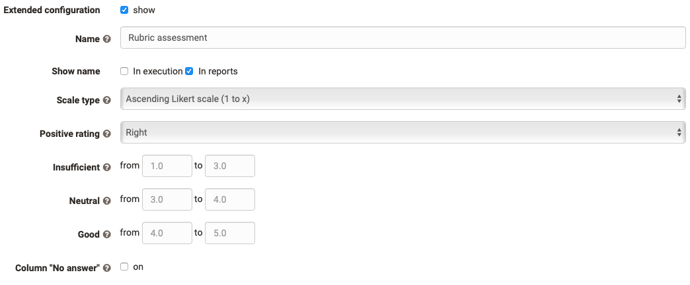

# Rubric

A rubric in OpenOlat is an element of the learning resource "Form".

The scope of rubrics is wide. In OpenOlat, rubrics can be used, for example,

  

  * to query the degree of agreement on a question

|

  
  
---|---  
  
  * to query characteristics between two extreme scales

|

  
  
  * to create a valuation grid for learner actions.

|

  
  
  * to have a self-assessment carried out, e.g. of strengths and weaknesses

|

  
  
  * to award criteria related points

|

  
  
Rubrics can be added to an OpenOlat form via "Add content" and then
configured.

## Rubric configuration in form editor

  

There are three different types and display variants of rubrics:

The number of steps defines the number of rubric columns. In the "Column
label" area, enter a meaningful rating scale, e.g. very good, good, medium,
bad, very bad.  Each column is always associated with a certain value, which
can be specified more concretely in the advanced settings.

Enter individual criteria, statements or questions in the row area that match
your scale. Additional lines are added via "Add question". You can also add a
scale range by clicking on the arrow on the upper right.

Individual lines can be moved up or down using the double arrows on the right
side. In addition, you can give each line a weighting of the respective
statement and thus assign special meaning to individual criteria, which is
also reflected in the scoring, e.g. by double or triple points. It is also
possible to set the value to 0 to exclude individual questions from the
reports.

An edited rubric can therefore automatically receive a corresponding number of
points, which is particularly relevant when used in the course element
"[Assessment](Knowledge+Transfer.html)".

If a rubric is included in a course module evaluation, the weighting can no
longer be changed.

## Extended Configuration

If you activate "Extended configuration", the following additional options are
available:

You can give the rubric a name, which makes it easier for you to assign it
later during evaluation. If required, you can also display the name directly
in the questionnaire. Under Scale type, you can specify the type of Likert
scale used and thus also define the value range: Determine at which end of the
scale the positive rating is and define if necessary the ranges for
insufficient, neutral and good. This information is taken into account in the
evaluation.

Click the "Save" button to close the rubric editor area. Afterwards the
created rubric can be moved like any other questionnaire element.

  

