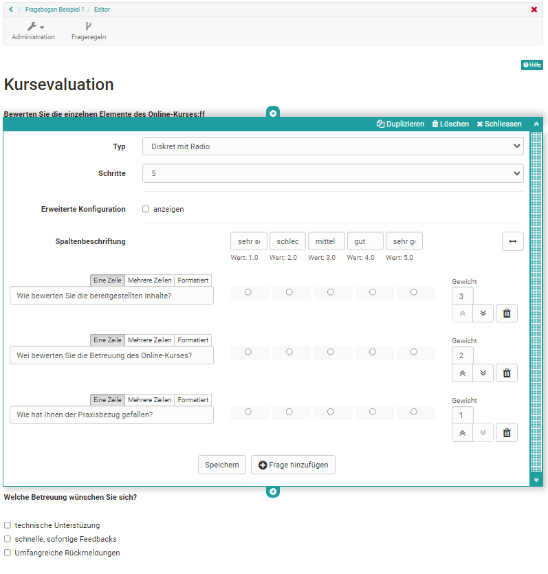

# Drei Schritte zu Ihrem Formular

Hier erfahren Sie wie Sie ein Formular für unterschiedliche Zwecke erstellen,
einrichten und in einen Kurs einbinden können.

Schritt 1: Lernressource Formular erstellen  
---  
1| Im [Autorenbereich ](Autorenbereich.html)den Link "Erstellen" anklicken und
die Lernressource "Formular " wählen.  
2| Vergeben Sie einen Titel für das Formular.  
3|

Es erscheint das Menü "[Einstellungen](Kurseinstellungen.html)" der
Administration. Hier können Sie optional gleich oder später weitere
Einstellungen vornehmen, z.B. eine Lizenz hinterlegen.  
  
Wenn Sie das [Formular in Kursen](Formulare+in+Kursen.html) verwenden wollen
brauchen Sie die den Tab "Freigabe" der Lernressource Formular _nicht_ weiter
einreichten. Die Einrichtung des Tabs "Freigabe" ist vorrangig relevant, wenn
Sie die Lernressource stand-alone verwenden wollen.

Tipp: Da die Lernressource Formular sehr unterschiedlich verwendet werden
kann, ist es sinnvoll schon bei der Vergabe des Titels die spätere Verwendung
zur berücksichtigen, z.B. ein passendes Kürzel voranzustellen. Das erleichtert
später das Auffinden und Zuordnen.

Schritt 2: Formular gestalten + finalisieren  
---  
1| In der "Administration" der Lernressource Formular → "Inhalt editieren"
wählen und sie gelangen in den [Formular Editor](Formular+Editor.html)|  
  
2|

"Inhalt hinzufügen" wählen und das gewünschte Element auswählen. Starten Sie
am besten mit einem "Titel" und fügen Sie mit dem Element "Paragraph" einen
kurzen Einstiegstext hinzu um die User entsprechend zu informieren.

Um das nächste Element hinzuzufügen klicken Sie auf das Pluszeichen oder
wählen Sie erneut "Inhalt hinzufügen". Sie sehen wieder die Auswahl aller
Elemente.

|

  
  
3| Wählen Sie anschließend die gewünschten Fragetypen und eventuell
organisatorische Elemente aus.  Speichern Sie jeweils, sofern auswählbar, Ihre
Einstellungen. Mit "Schließen" beenden Sie die Eingabe eines Elements und
können weitere Elemente hinzufügen.  
4|

Wiederholen Sie den Vorgang, bis das Formular fertiggestellt ist. Falls sie
wiederkehrende Elemente verwenden wollen, können sie diese einfach
duplizieren.

Wollen Sie die Reihenfolge der Elemente ändern können Sie diese einfach per
drag and drop verschieben.  
  
5| Wenn Sie fertig sind schliessen Sie den Editor indem Sie auf den Titel des
Formularsin der Krümelnavigation klicken. Das Formular ist jetzt gespeichert
und Sie sehen das Formular aus der Perspektive eines Users.|  
  
  
Je nachdem welche Art von Fragen Sie erstellen möchten wählen Sie „Rubrik“,
„Einzelauswahl“, „Mehrfachauswahl“, „Datei hochladen“ oder „Texteingabe“.

Weitere Einzelheiten zur Verwendung des Formular Editors finden Sie im Kapitel
"[Formular Editor"](Formular+Editor.html).

Schritt 3: Formular direkt im Kurs einbinden  
---  
1|

Gehen Sie in den [Autorenbereich](Autorenbereich.html). Im Bereich "Meine
Kurse sowie unter "Meine Einträge" und gegebenenfalls unter "Favoriten" finden
Sie Ihre Kurse. Starten Sie den Kurs in dem das Formular eingebunden werden
soll.  
  
2|

Öffnen Sie über die "Administration" den
"[Kurseditor](../../pages/viewpage.action%EF%B9%96pageId=108593713.html)".  
  
  
| Wählen sie "Kursbausteine einfügen" und klicken auf den gewünschten
[Kursbaustein
](../../pages/viewpage.action%EF%B9%96pageId=108593581.html)Formular, Umfrage
oder [Bewertung](../../pages/viewpage.action%EF%B9%96pageId=108593280.html),
je nach Ihrem Szenario.  
3|

Gehen Sie in den jeweiligen Tab Formular oder Umfrage des Kursbausteins und
fügen Sie hier ein passendes Formular hinzu → "Datei wählen, erstellen oder
importieren".

Beim Kursbaustein Bewertung aktivieren Sie die Rubrik-Bewertung" im Tab
"Bewertung" → "Rubrik-Formular auswählen"  
  
4| Es erscheint eine Liste mit Ihren Formular Lernressourcen. Wählen Sie das
vorbereitete Formular aus indem Sie auf den Auswahlhaken klicken.  
5| Bei Bedarf können Sie sich im Konfigurationstab mit Klick auf den Namen des
Formulars eine Vorschau des Formulars anzeigen lassen und solange das Formular
nicht bearbeitet wurde auch editieren.  
6| Bei Bedarf können noch die weiteren Tabs des Kursbausteins konfiguriert
werden.  
7|

Zum Schluss muss der Kurs noch publiziert werden damit das Formular für die
Teilnehmenden sichtbar wird und ausgefüllt werden kann.

Dafür einfach den Kurseditor durch Klick auf den Namen des Kurses in der
Krümelleiste schließen und bei der erscheinenden Auswahl das Publizieren durch
die Auswahl "Ja" manuell oder automatisch erlauben. Alternativ kann auch der
"Publizieren" Button im Editor rechts in der Toolleiste verwendet werden.  
  
Achten Sie gegebenenfalls auch darauf, dass nicht die Konfiguration vorheriger
Kursbausteine oder des obersten Kursknotens die Bearbeitung unerwünscht
einschränkt, z.B. durch sequenzielle Lernschritte oder unerwünschte
Erledigungskriterien im [Tab "Lernpfad".](Lernpfad+Kurs++-+Kurseditor.html)

