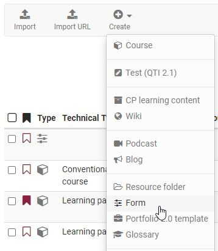
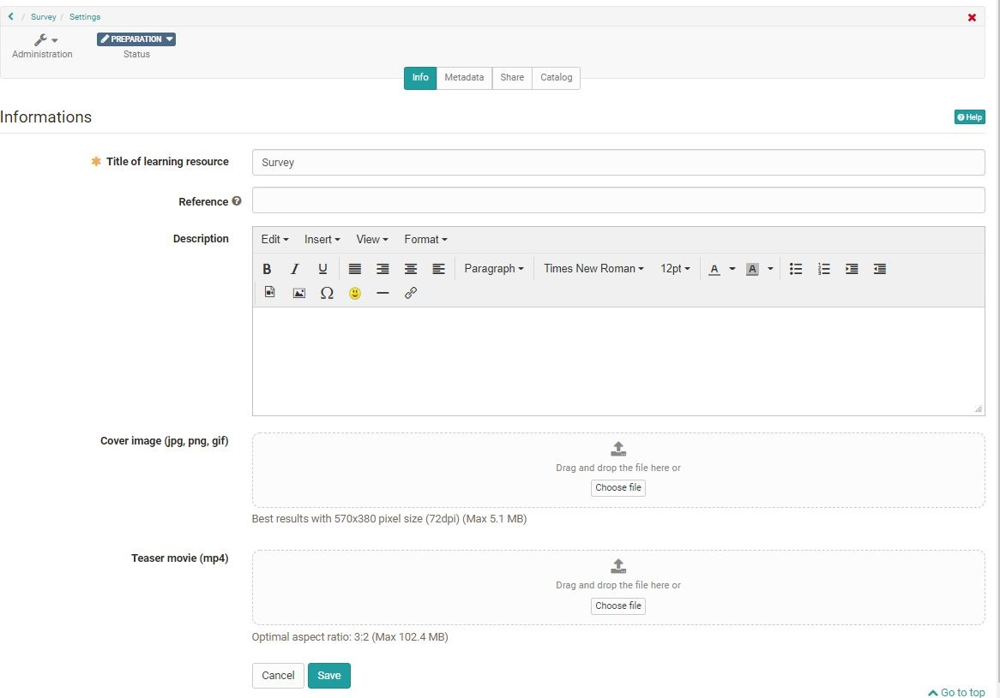
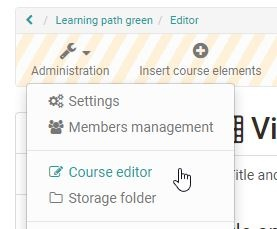
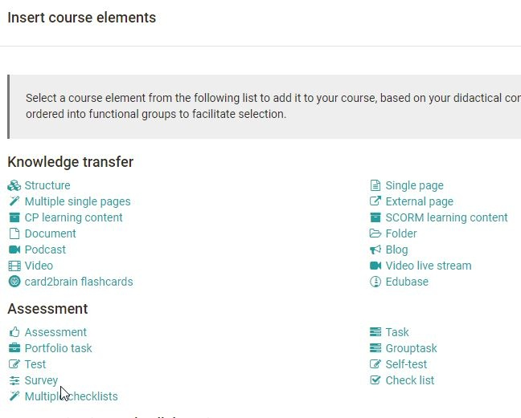
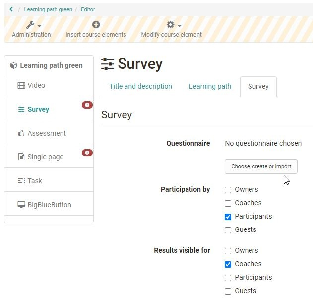
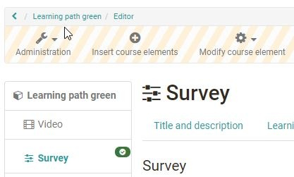

# 4 steps to your Questionnaire

How to create a questionnaire with the questionnaire editor.

  * 11\. Create learning resource Form
  * 22\. Create questionnaire content in the editor
    * 2.12.1 Add questions
    * 2.22.2 Add answer selection
    * 2.32.3 Adding additional elements and closing the editor
  * 33\. Include the questionnaire in the course
    * 3.13.1 Positioning the element
    * 3.23.2 Linking forms
  * 44\. Publish course

## 1\. Create learning resource Form

Go to the authors area, click on "Create" and select "Form". Assign a title to
the questionnaire.

You will then be taken to the general settings of the questionnaire and can
further configure the questionnaire if required (but this is not necessary for
the time being).

## 2\. Create questionnaire content in the editor

Select the "Edit content" link in the "Administration" menu and the form
editor opens. Now select "+ Add content".

Depending on the type of question you want to create, select "Rubric", "Single
choice", "Multiple choice", "Upload file" or "Text input". If you select
"Rubric", the questions and answers will be created together. For all other
question types, the questions are created with the help of the "Paragraph"
element and assigned to the answers of the appropriate question type. Proceed
as follows:

### 2.1 Add questions

Use "Paragraph" to enter your questions. A separate element is required for
each question. You can also enter all your questions one after the other with
a paragraph element.

### 2.2 Add answer selection

Depending on the question, add a ", "Single choice" or "Multiple choice",
"Upload file" or "Text input". You can use "Add entry" to add further answer
elements to single or multiple choice.

#### **Question type rubric**

[Rubrics ](Rubric.html)are useful if you want to use several questions for the
same rating scale. This question type is created slightly differently.

Select the editor element "Rubric" and enter a rubric name. Configure the type
of presentation via "Type", scale type and the number of steps.

Enter the question or the corresponding statement in the field on the left.
Add further question fields by clicking on "Add question" and complete the
texts.

Use the "Column caption" to set up a rating scale. You define the number of
scale elements under "Steps". Then click on "Save".

Use the "Advanced configuration" to name the rubric and define further details
about the scale.

### 2.3 Adding additional elements and closing the editor

If necessary, add further elements, e.g. "Terms of Use" or "Information".

It is useful to add a heading to the questionnaire, possibly also a short
piece of information. You can do this with the "Title" and "Paragraph"
elements.

When you are done, close the editor by clicking on the title of the
questionnaire in the breadcrumb navigation. The questionnaire is now saved and
you see the questionnaire from the perspective of a user. Now the
questionnaire is finished and can be integrated into your course.

  

## 3\. Include the questionnaire in the course

Go to the authoring area and open the course editor of the desired course.

### 3.1 Positioning the element

Use the cursor to select the point in the left-hand navigation where you want
to position the course element.

Under "Insert course elements" select the course element "Survey" and the new
course element will be added to your course.

### 3.2 Linking forms

In the "Survey" tab, click the "Select, create or import" option and select
the previously created form.

If necessary, also define the other options in the "Survey" tab and define who
can edit the survey and who can see the results.

In principle, a questionnaire can also be created directly here in the course
via the course element "Survey". However, it is often unclear to the creator
that the questionnaire created in this way is a course-independent OpenOlat
learning resource that can also be used in other courses. Therefore, the
general way is explained in this tutorial.

## 4\. Publish course

Finally, publish the course by clicking on the title of the course in the
breadcrumb navigation. Select "Yes, automatically" if you want to publish all
changes made or "Yes, manually" if you want to make further settings.

Only when you have published the course the questionnaire form will be visible
for the users. From this point on, no further questions can be added or
deleted in the editor and only minor corrections can be made.

