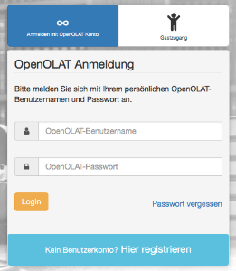

# Guest access

Beside system users a guest access can be enabled. Guests are anonymous, not
registered users, which cannot be managed in the user management.

In order to grant guests access the guest login has to be activated by the
administrator of the OpenOlat instance. It is also possible to configure which
OpenOlat areas guests have access to and which not. These basic settings can
only be made by the system administrator.

  

Guest access can only be activated for conventional courses, not for learning
path courses.

## Course level

In a course, the course owner can set up the access configuration in the
"Settings"→ "Access" tab so that guests can also access the course.

The following course elements can be seen by guests:

  * Read: CP learning content, blog, wiki, forum, notifications, calendar, single page, external page, file dialog, link list
  * Forum: In the course editor it can be defined by the course owner, if guests should be allowed to create forum entries
  * Watch podcast and video
  * Folder: download files
  * Participant folder: same as normal user
  * SCORM: do
  * Test: do it depending on configuration
  * Self-test: do it (even if option is not selected)

If you want to give a guest a direct access to a course, you can send him the
external link for the course. It is important, that the course is activated
for guests in the access configuration. The external link can be found on the
info page of the course.

  

  

Administrative settings are made by OpenOlat administrators in the section
Login → ["Guest and Invitation"](Guest+and+invitation.html) and under
["Customizing"](Customizing.html) → "Sites.

