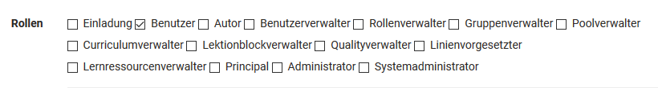
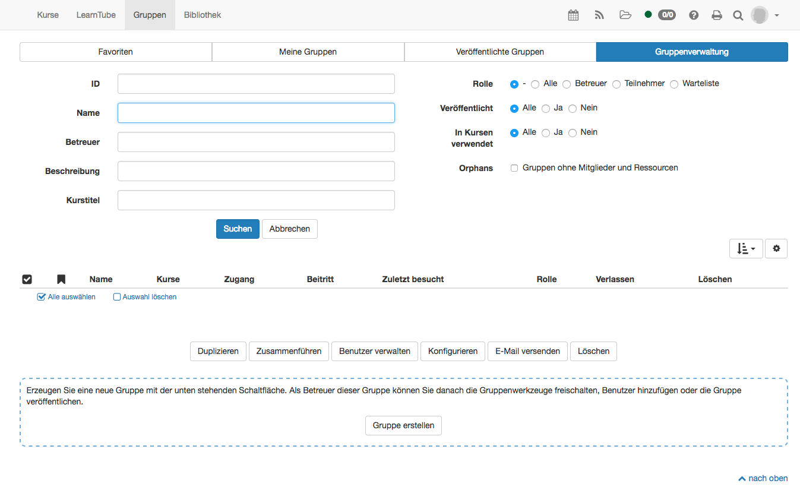
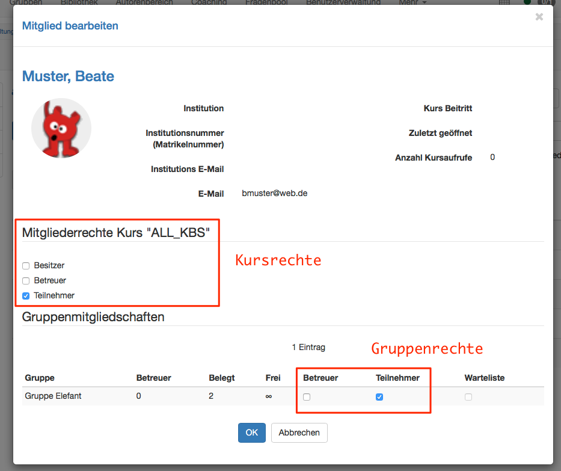
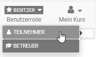

# Rollen und Rechte

  * 1 Rollen und Rechte 
  * 2Systemweite Rollen und Rechte
    * 2.1Benutzertypen
    * 2.2Rollen
  * 3Kursbezogene Rollen und Rechte
    * 3.1Kursrollen
    * 3.2Gruppenrollen

  

# Systemweite Rollen und Rechte

## Benutzertypen

OpenOlat arbeitet mit einem Rollen und Rechte Management. Zuerst wird zwischen
2 grundsätzlichen Benutzertypen unterschieden. Dies sind:

  *  **Anonymer Gast:** Gäste haben - ohne sich zu registrieren – beschränkten Zugang zu OpenOlat. Sie können für Gäste freigegebene Lerninhalte betrachten, sich jedoch nicht an den Lernaktivitäten beteiligen. Der Link zum Gastzugang befindet sich auf der Login-Seite. Weitere Informationen zum Gast finden Sie [hier](Guest_access.de.md).

sites/manual_user/docs/general/Roles_and_Rights.de.md §Personal_folders.de.md§ 481
  *  **Registrierter Benutzer:** Jeder Benutzer hat einen eindeutigen Benutzernamen, der nach der Registrierung nicht mehr geändert werden kann. Benutzer können freigeschaltete Lerninhalte nutzen und sich an allen Lernaktivitäten beteiligen. Zudem hat jeder Benutzer eine individuell konfigurierbare Startseite und [Speicherplatz ](../personal/Personal_folders.de.md)zur Verfügung. Darüber hinaus kann er Gruppen erstellen.

Bei registrierten Benutzern ohne weitere Rollen und Rechte handelt es sich in
der Regel um die Lernenden.

## Rollen

Registrierte Benutzer können zusätzlich eine oder mehrere Rollen erhalten.
Hier ein Überblick über alle OpenOlat Rollen.

  

  *  **Benutzer** : Standardrolle (siehe oben)
  *  **Autor** : Der Autor hat Zugriff auf den Autorenbereich. Damit ist er berechtigt, Kurse und alle weiteren Lernressourcen zu erstellen. In der Suchmaske findet der Autor alle Kurse und Lernressourcen wie Tests, Filme und Portfoliovorlagen, welche für Autoren zugänglich sind. Diese Rolle wird häufig an Lehrende oder E-Learning Verantwortliche vergeben.

sites/manual_user/docs/general/Roles_and_Rights.de.md §User_management.de.md§ 481
  *  **Benutzerverwalter** : Der Benutzerverwalter hat Zugriff auf die [Benutzerverwaltung ](Benutzerverwaltung.html)und alle Benutzer der eigenen Organisation. Er kann Benutzer erstellen, bearbeiten und inaktiv setzen. Zudem kann er die Rolle Autor vergeben.
  *  **Rollenverwalter** : Der Rollenverwalter hat Zugriff auf die Benutzerverwaltung und alle Benutzer der eigenen Organisationen. Er kann, ausser die Rollen Administrator und Systemadministrator, alle Rollen der Benutzer ändern, sie vergeben und entfernen.
  *  **Gruppenverwalter** : Der Gruppenverwalter hat Zugriff auf den Bereich Gruppen und darin Zugriff auf den Tab Gruppenverwaltung. Weitere Informationen zur Gruppenverwaltung finden Sie [hier](https://confluence.openolat.org/display/OO131DE/Gruppenverwaltung).   

  *  **Poolverwalter** : Der Poolverwalter hat Zugriff auf den Fragenpool. Im Fragenpool kann er den Bereich Administration öffnen. Weitere Informationen zur Administration des Fragenpools finden Sie [hier](https://confluence.openolat.org/display/OO131DE/Fragenpool+Administration).

sites/manual_user/docs/general/Roles_and_Rights.de.md §Curriculum_Management.de.md§ 481
  *  **Curriculumverwalter** : Der Curriculumverwalter hat Zugriff auf die [Curriculumverwaltung](../curriculum/Curriculum_Management.de.md). Er kann neue Curricula erstellen und bereits bestehende verwalten. Ist der Curriculumverwalter einer Organisation zugeordnet, so besitzt er nur Zugang zu Curricula dieser Organisation.  

sites/manual_user/docs/general/Roles_and_Rights.de.md §Lectures_and_absences.de.md§ 481
  *  **Lektionenblockverwalter** : Konfiguration des Moduls "[Lektionen und Absenzen](../course_operation/Lectures_and_absences.de.md)"  

  *  **Qualityverwalter** : Der Qualityverwalter hat Zugriff auf den Bereich Qualitätsmanagement und kann dort sämtliche Einstellungen und Objekte wie Fragebögen, Datenerhebungsgeneratoren sowie das Analysewerkzeug verwalten.
  *  **Linienvorgesetzter** : Der Linienvorgesetzte kann für alle Benutzer innerhalb seiner Organisation automatisch über den Erhalt von Zertifikaten informiert werden.
  *  **Lernressourcenverwalter** : Der Lernressourcenverwalter sieht im Autorenbereich alle Lernressourcen seiner Organisation. Er kann diese kopieren und exportieren. Im Profil kann eine Institution angegeben werden. Der Lernressourcenverwalter hat Besitzerrechte an allen Kursen die zu seiner Institution gehören.
  *  **Principal** : Der Principal ** ** sieht – ausser der Administration – ** ** alle Bereiche des Systems, hat aber nur Lesezugriff und kann keine Änderungen vornehmen, Objekte bearbeiten etc.   

  *  **Administrator** : Der Administrator besitzt Modul- und Funktionsverwaltung und hat auf alle Bereiche des Systems z.B.  Benutzerverwaltung, Katalogverwaltung, Curriculumverwaltung, Lektionenverwaltung Zugriff, ausser auf die Administrationsseite. Diese Rolle kann auf eine Organisation beschränkt werden. Der Administrator kann Benutzer löschen und zudem weiteren Personen das Recht für die Katalogverwaltung einräumen.
  *  **Systemadministrator** : Der Systemadministrator hat Zugriff auf die Administrationsseite und ist für die technische Systemkonfiguration und deren Überwachung zuständig. Dies ist eine globale Rolle, die nicht an eine Organisation gebunden ist.

  

Die bis OpenOlat 12.5 verwendete Rolle "Administrator" wird ab dem Release 13
in "Administrator" und "Systemadministrator" geteilt.

Hinweis

Die genannten Rollen stellen Optionen dar, normalen Usern systemweit
umfangreiche weitere Rechte zu geben. In der Regel wird bei einer OpenOlat
Instanz gezielt eine passende Rollenzusammensetzung gewählt und nicht alle
spezifischen Rollen vergeben. Typisch ist eine Kombination aus Benutzer, Autor
und Administrator bzw. Systemadministrator. Darüberhinausgehende Rollen
ergeben sich aus der Struktur der jeweiligen Institution und der Nutzung von

sites/manual_user/docs/general/Roles_and_Rights.de.md §Curriculum_Management.de.md§ 481
bestimmten Tools wie [Curriculum](../curriculum/Curriculum_Management.de.md) oder

sites/manual_user/docs/general/Roles_and_Rights.de.md §Lectures_and_absences.de.md§ 481
[Absenzen](../course_operation/Lectures_and_absences.de.md). Es ist also möglich, dass in Ihrer
Instanz nicht alle potenziellen OpenOlat Rollen verwendet werden.

Wenden Sie sich bei Rückfragen bezüglich der Rollenvergabe an den jeweiligen
Support Ihrer OpenOlat Instanz.

# Kursbezogene Rollen und Rechte

## Kursrollen

Wenn ein Benutzer einem Kurs hinzugefügt wird, kann definiert werden, welche
Mitgliederrechte der Benutzer in diesem einen Kurs erhalten soll. Zur Auswahl
stehen:

  *  **Besitzer** : Dieser Benutzer hat alle Rechte im Kurs. Er kann den Kurs bearbeiten, Mitglieder verwalten und den Kurs auch löschen. Somit ist der Besitzer Kursadministrator.

sites/manual_user/docs/general/Roles_and_Rights.de.md §Assessment_tool_-_overview.de.md§ 481
  *  **Betreuer** : Der Kursbetreuer hat Zugriff auf das [Bewertungswerkzeug ](../course_operation/Assessment_tool_-_overview.de.md)des Kurses, wie auch auf die Test- und Fragebogen-Statistik. Ein Kursbetreuer kann jedoch den Kurs weder im Kurseditor bearbeiten noch den Kurs löschen. Im Bewertungswerkzeug sieht der Kursbetreuer alle Kursteilnehmenden, jedoch keine Gruppenteilnehmenden.
  *  **Teilnehmer** : Ein Teilnehmer kann den Kurs öffnen und die bereitgestellten Kursbausteine und Inhalte bearbeiten (je nach Konfiguration). Ein Teilnehmer hat jedoch keine zusätzlichen Rechte im Kurs.

Neben den kursbezogenen Rollen können, je nach Konfiguration, auch [Gäste

sites/manual_user/docs/general/Roles_and_Rights.de.md §Guest_access.de.md§ 481
](Guest_access.de.md)ohne OpenOlat Account Zugang zu einem Kurs erhalten.

  

Rollenwechsel

Es ist auch möglich, dass Personen mehrere Kursrollen erhalten und so
verschiedene Perspektiven auf den Kurs einnehmen können. Ein Rollenwechsel
ist, nachdem einer Person mehrere kursbezogene Rollen zugewiesen wurden, über
den Wechsel der "Benutzerrolle" in der Toolbar des Kurses möglich.

Ferner bietet es sich an, dass auch der Besitzer des Kurses sich in den
weiteren Rollen im Kurs einträgt um so den Kurs aus einer anderen
Perspektive/Rolle zu betrachten.

## Gruppenrollen

Werden in Kursen Gruppen verwendet, können die Mitglieder entweder als
Teilnehmer oder Gruppenbetreuer eingetragen werden. Auch können beim
Rechtemanagement weitergehende Rechtepakete entweder an Gruppen Teilnehmende
oder Gruppen Betreuer vergeben werden.

Der  **Gruppenbetreuer**  hat praktisch die gleichen Rechte wie der
Kursbetreuer, jedoch nur für seine Gruppe. Er hat also Zugriff auf das
Bewertungswerkzeug und die Test und Fragebogen Statistik. Im
Bewertungswerkzeug sieht er jedoch nur die  **Teilnehmer**  seiner Gruppe.

Hinweis

Sowohl die Kurs- als auch die Gruppenrechte sind unabhängig von der
_systemweiten Rolle_ , welche ein Benutzer in der Benutzerverwaltung erhalten
hat. Ein registrierter Benutzer ohne zugewiesene Rolle kann auch Kursbesitzer,
Kursbetreuer oder Gruppenbetreuer sein.

Möchte man vermeiden, dass eine Person auf das Bewertungswerkzeug zugreifen
kann, sollte man ihr weder im Kurs noch in der Gruppe Betreuerrechte geben!

sites/manual_user/docs/general/Roles_and_Rights.de.md §Members_management.de.md§ 481
Personen, die das Recht "[Mitgliederverwaltung](../course_operation/Members_management.de.md)"
haben, können sowohl sich selbst weitere Rechte geben als auch andere
Mitglieder des Kurses, auch den Ersteller oder andere Besitzer, entfernen oder
deren Rechteumfang reduzieren.

