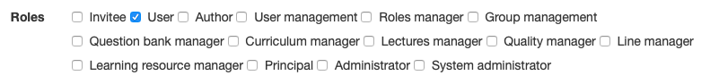
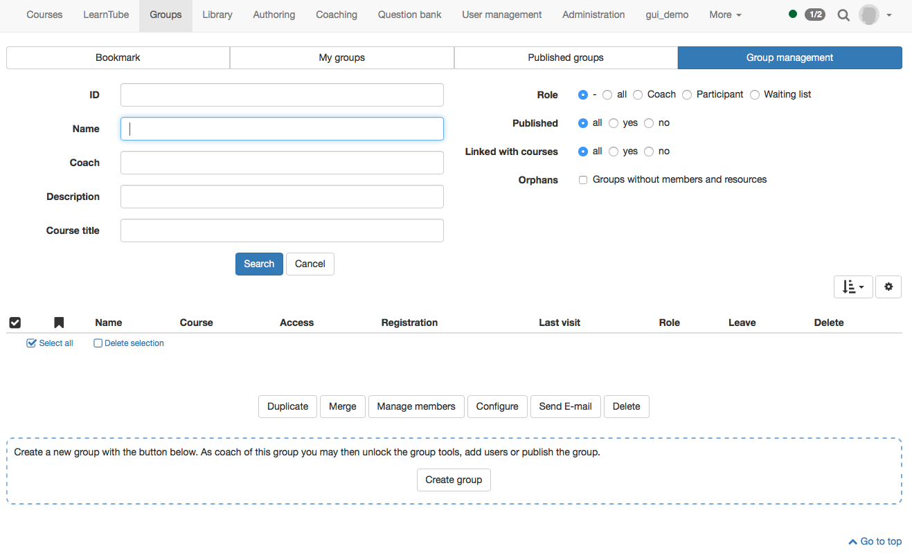
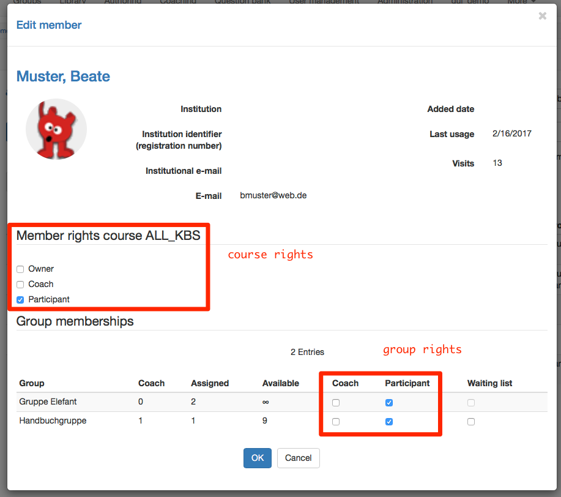
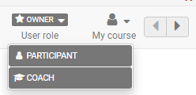
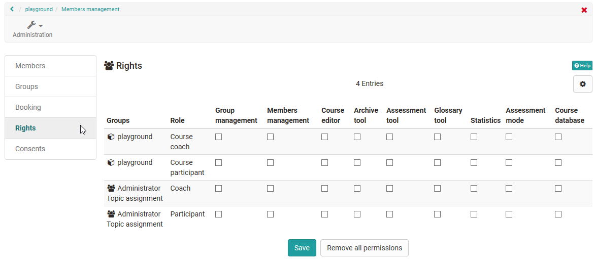

# Roles and Rights

  * 1 Roles and Rights 
  * 2 OpenOlat system wide roles and rights
    * 2.1 User type
    * 2.2 Roles
  * 3 Course rights and roles
    * 3.1 Course roles
    * 3.2 Group roles

# OpenOlat system wide roles and rights

## User type

OpenOlat works with a roles and rights management. First two user types are
differentiated. These are:

  *  **Anonymous guest:**  Guests have - without registration - limited access to OpenOlat. They can only have a look at learning content enabled for guests, but cannot take part in learning activities. The link to the guest access can be found on the login page. Further information about guest can be found [here](Guest_access.md). 
  *  **System user:**  Every user has a distinct user name, which cannot be changed after the registration anymore. Users can use enabled learning content and can take part in learning activities. Additionally every users has an individual configurable landing page and storage available. Further more he can create groups. 

!!! info inline end

    Normally registered users without any further roles or rights are learners.

## Roles

System users can get one ore more roles additionally.

With OpenOlat Release 13, the OpenOlat roles have been further enhanced. Here
is an overview of all OpenOlat roles.

  *  **User** : Standard role (see above)

  *  **Author** : The author has access to the authoring area. This allows the author to create courses and all other learning resources. In the search mask the author finds all courses and learning resources such as tests, films and portfolio templates which are accessible to authors. This role is often assigned to teachers or e-learning managers.

  *  **User manager** : The user manager has access to the [user management](User+management.html) and all users of the own organization. He/She can create, edit and inactivate users. Further more he can assign the Author role.

  *  **Role manager** : The role administrator has access to the user administration and all users of his or her own organization. Apart from the roles Administrator and System Administrator, he/she can change, assign and remove all user roles.

  *  **Group management** : The group manager has access to the group section and in there access to the tab group management. Further information to the group management can be found [here](https://confluence.openolat.org/display/OO130EN/Group+Management).  
  

  *  **Question bank manager** : The question bank manager has access to the question bank. In there he is able to open the administration section. Further information about this role can be found [here](https://confluence.openolat.org/display/OO112DE/Question+Bank+Administration).
  *  **Curriculum manager** : The curriculum manager has access to curriculum management and can create new curricula and manage existing ones. If the curriculum manager is assigned to an organization, he or she only has access to the curricula of this organization.
  *  **Lectures manager** : Configuration of the "Lectures and Absences" Module

  *  **Quality manager** : The quality manager has access to the Quality Management area and can manage all settings and objects such as questionnaires, data collection generators and the analysis tool.

  *  **Line manager** : The line manager can be automatically informed about the receipt of certificates for all users of his organization.

  *  **Learning resource manager** : The learning resource manager has access to the authoring area and sees all learning resources of the organization to which he/she is assigned. He or she can copy and export them. In the profile an institution can be added. The learning resource manager has owner rights for all courses, where the course owner has the same institution filled in in the profile as the learning resource manager.

  *  **Principal** : The principal sees all areas of the system except administration, but has read-only access and cannot make any changes, edit objects, etc. 

  *  **Administrator** : The administrator has module and function management and has access to all areas of the system e.g. user management, catalog management, curriculum management, lectures management, except the administration page. This role can be limited to an organization. The administrator can delete users and also grant other people the right to manage the catalogue.

  *  **System administrator** : The system administrator has access to the administration side and is responsible for the technical system configuration and its monitoring. This is a global role that is not tied to an organization.

  

!!! info "Info"

    The role "Administrator" used up to OpenOlat 12.5 is divided into "Administrator" and "System Administrator" as of Release 13.

!!! warning "Note"

    The mentioned roles represent options to give normal users system-wide extensive additional rights. Usually an appropriate role composition is selected for an OpenOlat instance and not all specific roles are assigned.
    Typical is a combination of user, author and administrator or system administrator. Additional roles result from the structure of the respective institution and the use of certain tools such as [curriculum] (../curriculum/Curriculum_Management.md) or [absences](../course_operation/Lectures_and_absences.md). It is therefore possible that not all potential OpenOlat roles are used in your instance.
    
    If you have any questions regarding the role management please contact the support of your own OpenOlat instance.

The mentioned roles represent options to give normal users system-wide
extensive additional rights. Usually an appropriate role composition is
selected for an OpenOlat instance and not all specific roles are assigned.
Typical is a combination of user, author and administrator or system
administrator. Additional roles result from the structure of the respective
institution and the use of certain tools such as curriculum or absences. It is
therefore possible that not all potential OpenOlat roles are used in your
instance.

If you have any questions regarding the role management please contact the
support of your own OpenOlat instance.

# Course rights and roles  

## Course roles

If a user is added to a course it can be defined which member rights the user
should get in this course.  

  *  **Owner** : The user has all rights in the course. He can edit a course, manage members and delete the course. So the owner is like the course administrator.
  *  **Coach** : The course coach has access to the assessment tool, as well as to the test and survey statistic. But a course coach cannot edit or delete a course. In the assessment tool a course coach can see the course participants, but not the group participants.
  *  **Participant** : A participant can open the course and edit everything where he got access right. A participant hasn't any further rights.

In addition to the course-related roles, depending on the configuration,
[guests](Guest_access.md) without an OpenOlat account can also have access
to a course.

!!! success "Role change"
  
    It is also possible for people to be given multiple course roles and thus have different perspectives on the course. Once a person has been assigned several course-related roles, it is possible to change roles by changing the "User role" in the course toolbar.
    
    Furthermore, it is a good idea that the owner of the course also enters himself in the other roles in the course in order to view the course from a different perspective/role.
    
    

## Group roles

If groups are used in courses, the members can be registered either as
participants or as group coaches. In the user management of a course and then
Rights further rights can be given to coaches or participants of assigned
groups.  

The group coach has almost the same rights as the course coach. In courses,
where his group is assigned to, he has access right to the assessment tool as
well as to the test and survey statistic. In the assessment tool he can only
see the **participants** of his group.

!!! warning "Note"

    Course rights as well as group rights are independent of the role which a user got system wide in the user management. A system user without an assigned role can be course owner, course coach or group coach. 
    
!!! danger "Attention"
    
    To avoid the access to the assessment tool for a given user, do not give any coach rights neither in the course nor in the group.

!!! danger ""

    Users with the right "Members management" can give more rights, remove it or reduce the rights of themselves as well as other members of the course, also the creator or other owners.

