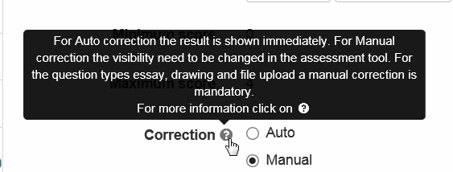
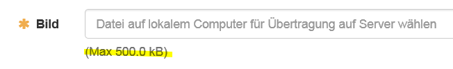

# About this Manual

This user manual helps you to make yourself familiar with OpenOlat while
thoroughly explaining it's functionality.

The OpenOlat manual is meant for people interested in e-learning as well as in
making use of OpenOlat for various reasons. If you have not worked with
OpenOlat (former OLAT) before you will get more information on how to get
started with this learning platform step by step which includes searching for
predefined learning content, its adaption, as well as the handling of
collaborative tools.

Perhaps you were already an experienced OLAT user but now you want to provide
others with learning content in OpenOlat. In this case the chapters on
learning resources, course elements, course editor and the ones on how to
create courses or tests will assist you in your work.

If you were already an OLAT expert this manual will serve as a work of
reference. Its table of contents is there to guide you in order to find what you are looking for as
fast as possible.

***

## Further Sources of Information

### Help tools in OpenOlat

#### Manual link

At the top right of the main menu bar there is always access to the OpenOlat
manual (this is where you are currently located) and possibly to further help
pages, depending on the configuration by the system administrator.  Just click
on the question mark :fontawesome-solid-circle-question:.

!!! info 
	If the link does not appear it was hidden in the user tools in the personal
	[settings](../personal/Configuration.md#settings).

#### Context help

{ height=24px }

While working with OpenOlat you cannot only dispose of this manual but also
use OpenOlat's  context-sensitive Help. This Help feature explains the options
you have regarding OpenOlat's configuration--right where you are at that
particular moment, by opening the relevant location in this manual. You will
recognize this feature by a question mark icon. Just click on that icon to
open the manual in a new window.

#### Help in forms

In addition to that, you will find 3 more types of assistance mainly in forms,
but not restricted to, which will provide you with brief information on single
form fields. When locating this icon
{ class=size16 }
to the right of a label, a mouseover will display a short information. Here an
example of the configuration of a test in the course editor:

{ class="shadow" width=400px }

  

#### Light grey text within a form field...

{ class="shadow" width=150px }

...assists you with filling out the field itself

#### Light grey text underneath a field...

{ class="shadow" width=420px }

...provides information about the what's required.

### Community, course templates and demo courses

On the [community server](https://community.openolat.org) as well as the [demo server](https://learn.olat.com "Demoserver") you will 
find demo courses.

### Support

Please contact your local support team. Normally this is found on the OpenOlat login page in the help menu in the header of the page or in the imprint in the header or the footer. 

***  
  
## Copyright

This is an extended Adaption of the "OLAT 7.1 - User Manual", used under a
**Creative Commons Attribution-NonCommercial-ShareAlike license**. 

Since 2015 the manual is financed and maintained by 
[frentix GmbH](https://www.frentix.com/), the company behind
the [Open Source LMS OpenOlat](https://www.openolat.org)

In the long history of this manual many people contributed their part. Please respect the intellectual property and the license under which this manual is published: 

!!! info "" 
	Some rights reserved! This document is copyright protected by the owners and
	companies listed below under the Attribution-NonCommercial-ShareAlike Creative
	Commons license. For more information check:
	<http://creativecommons.org/licenses/by-nc-sa/3.0/ch/>

##### Responsible people (in alphabetical order):

| Name | Contribution | Sponsored by |
| ---- | ------------ | ----------- |
| Benjamin Glock | Content | frentix |
| Christian Franck | Content | frentix |
| Christian Meier | Content | TU Dresden |
| Florian Gnägi | Content, Migration | frentix |
| Joël Fisler | Specials | Universität Zürich, MELS |
| Kirsten Scherer Auberson | Content | frentix |
| Kristina Isacson | Content | Universität Zürich, MELS  |
| Lukas Witschi | Content | frentix |
| Mandy Menzel | Content | frentix |
| Michael Enz | Migration | frentix |
| Oliver Kant | Technic | frentix |
| Renata Sevcikova | Content | Universität Zürich, MELS |
| Rico Eberle | Content | frentix |
| Sabine Hemsing | Content | VCRP |
| Sabrina Scheiwiler | Content | frentix |
| Sandra Arnold | Content | Universität Zürich, MELS |
| Sandra Hübner | Content | Hochschule Furtwangen |
| Tina Frenzel | Content | frentix |

