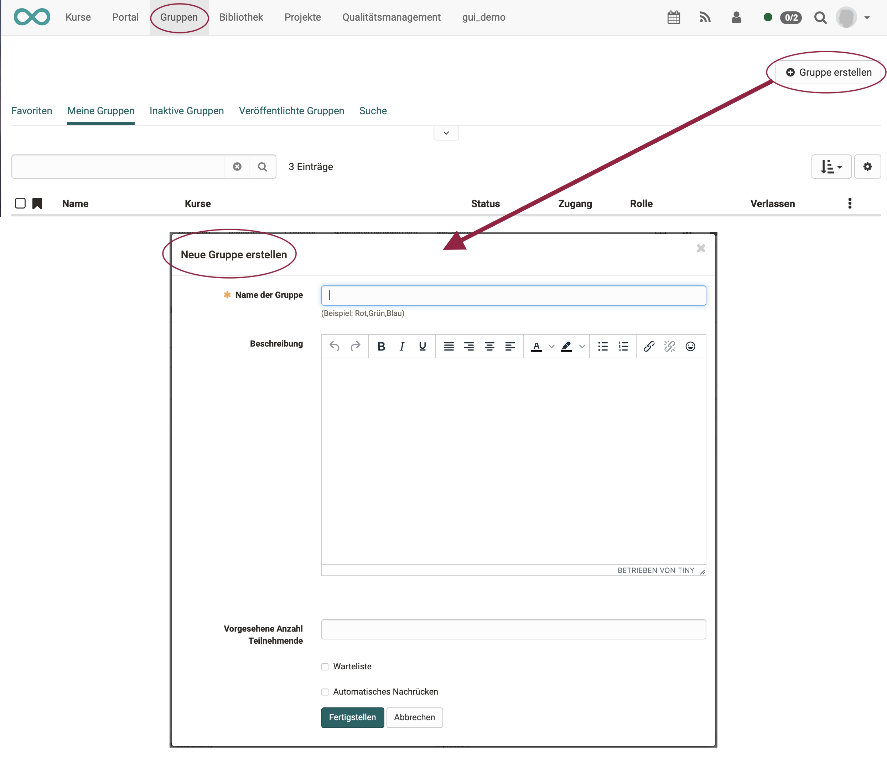

# Gruppen erstellen

Es gibt verschiedene Orte, an denen Sie Gruppen erstellen können. In der Regel ist der Einstigespunkt die Hauptnavigation mit dem Menüpunkt "Gruppen". Wenn Sie eine Gruppe erstellen möchten, klicken Sie auf den **Button "Gruppe erstellen"**.

{ class="shadow lightbox" }

### Name der Gruppe

Gruppen müssen mit Namen versehen werden. Der Name kann beliebig sein und darf
alle Sonderzeichen und Ziffern enthalten. Für Benutzer ist es hilfreich, wenn
sie aus dem Gruppennamen auf Ziel oder Absicht der Gruppe schliessen können.
Wählen Sie beispielsweise anstatt "Teilnehmer" den Gruppennamen
"TeilnehmerSozialpolitik22", oder fügen Sie Ihre Initialen oder ein Datum zum
Gruppennamen hinzu.

### Beschreibung

Optional können Sie der Gruppe eine nähere Beschreibung geben. Sie erscheint
in der Übersichtsseite, wenn Sie die Gruppe gestartet haben.

!!! tip "Tipp"

    Da die Beschreibung auch in der Übersicht der Gruppen als Spalte angezeigt werden kann, empfiehlt es sich nur kurze Beschreibungen zu verwenden. Längere
    Texte sollten lieber über das [Gruppen-Werkzeug](Using_Group_Tools.de.md)
    "Information an Mitglieder" bereitgestellt werden.

###  Vorgesehene Anzahl Teilnehmende

Beim Erstellen einer Gruppe oder später in der Gruppenadministration können Sie optional eine Platzbeschränkung einrichten, indem Sie festlegen, wie viele
Teilnehmende die Gruppe haben darf. Wenn die vorgesehene Anzahl Teilnehmenden überschritten wird, erhalten die Gruppenteilnehmenden die Mitteilung, dass in der Gruppe keine Plätze mehr frei sind. Wenn Sie dieses Feld leer lassen, kann die Gruppe beliebig viele Teilnehmende enthalten.

!!! info "Info"

    Wird eine Gruppe mit einem Kurs verknüpft können Kursbesitzer auf diesem Weg auch die Anzahl der Teilnehmenden eines Kurses steuern.

### Warteliste + Automatisches Nachrücken

Sofern Sie die Anzahl der Teilnehmenden beschränkt haben, können Sie der Gruppe eine Warteliste hinzufügen. Kursteilnehmende können sich dann bei vollen Gruppen auf die Warteliste setzen lassen. Wenn sich jemand aus der Gruppe austrägt
oder von dem/der Gruppenbetreuer:in ausgetragen wird, können Personen auf der Warteliste automatisch nachrücken. Dazu muss die Option "**automatisches Nachrücken**"
gewählt sein. Kriterium für das Nachrücken ist der Zeitpunkt der Einschreibung in die Warteliste, d.h. die sich am längsten auf der Warteliste befindende Person rückt nach.

## Wer kann Gruppen erstellen?

Sofern von OpenOlat Administrator:innen aktiviert, kann jeder/jede OpenOlat-Benutzer:in,
nicht nur Autor:innen, selbständig Gruppen erstellen, den Gruppen vielfältige
[Werkzeuge](Using_Group_Tools.de.md) zuordnen und beliebig
viele andere OpenOlat-Benutzer:innen in die Gruppe einladen.

## Gruppen für Kurse erstellen

OpenOlat Autor:innen haben darüber hinaus auch die Möglichkeit, kursspezifische
Gruppen direkt im gewünschten Kurs zu erstellen. Dies geschieht
im Normalfall in der [Mitgliederverwaltung](../learningresources/Members_management.de.md) eines Kurses im Untermenü "Gruppen".
Darüber hinaus können auch im Kurseditor an einigen Stellen Gruppen im jeweiligen Kontext erstellt werden. Hierzu zählen der
[Einschreibebaustein](../learningresources/Course_Elements.de.md) und die Gruppenaufgabe. Darüber hinaus können in herkömmlichen Kursen im [Tab Sichtbarkeit oder Zugang](../learningresources/General_Configuration_of_Course_Elements.de.md) ebenfalls Gruppen erstellt werden.