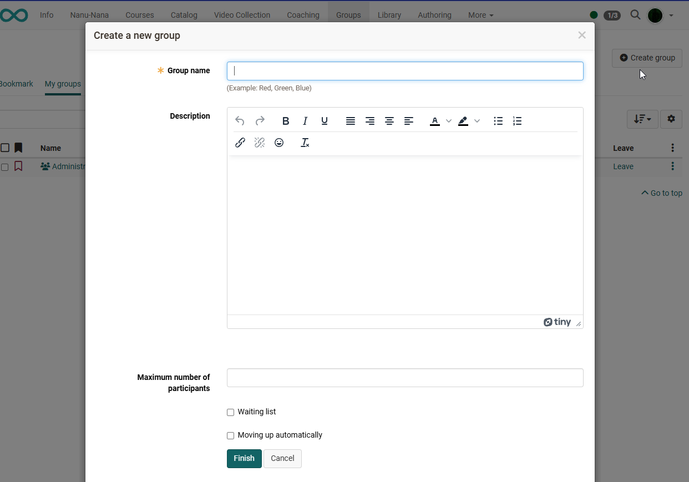

# Create Groups

There are several places where you can create groups. As a rule, the entry point is the main navigation with the menu item "Groups". If you want to create a group, click on the **Create Group** button.

{ class="shadow lightbox" }

### Group names

You have to provide your group with a name. The name is arbitrary and may contain any special characters and numbers. It is helpful for users if they can infer the goal or intent of the group from the group name. For example, instead of "Participant" choose the group name "ParticipantSocialPolicy22", or add your initials or a date to the group name.

### Description

Optionally you can provide your group with further details. It will appear on your overview page when starting your group.

!!! tip "Hint"

    As the description can also be displayed as a column in the overview of the groups
    it is recommended to use only short descriptions. Longer
    texts should rather be provided via the [Group tool](Using_Group_Tools.md) "Information to members".

### Number of Participants

When creating a group or later in the group administration there is the option to limit the number of participants; you can determine how many members your group should have. If the planned number of participants is exceeded, your course participants will receive a notification that there are no more vacancies. If you leave this field empty, your group will be open to any number of participants.

!!! info "Info"

    If a group is linked to a course, course owners can also control the number of participants in a course this way.

### Waiting list

If you have limited the number of participants, you can add a waiting list to the group. With an activated waiting list, potential members can enter their names on that list in case the limit is exceeded. If there are members leaving the group or if the group coach cancels some previous
registrations, persons on the waiting list will move up automatically if the option "**Moving up automatically**" has been selected. The main criterion here is the date of registration: the first one on the waiting list will be the one to move into your group.

## Who can create groups?

If activated by OpenOlat Administrator, any OpenOlat user, not only authors, can independently create groups, assign to the groups a variety of [tools](Using_Group_Tools.md) and invite or directly add any number of other OpenOlat users into the group.

## Creating groups for courses

OpenOlat authors also have the possibility to create course-specific groups directly in the desired course [Members management](../learningresources/Members_management.md) to create. This happens normally in the member administration of a course in the submenu "Groups". In addition, groups can also be created in the course editor in some places in the respective context. These include the [enrollment element](../learningresources/Course_Element_Enrolment.md) and the [group task](../learningresources/Course_Element_Grouptask.md). In addition, groups can also be created in conventional courses in the [Visibility or Access tab](../learningresources/General_Configuration_of_Course_Elements.md).

