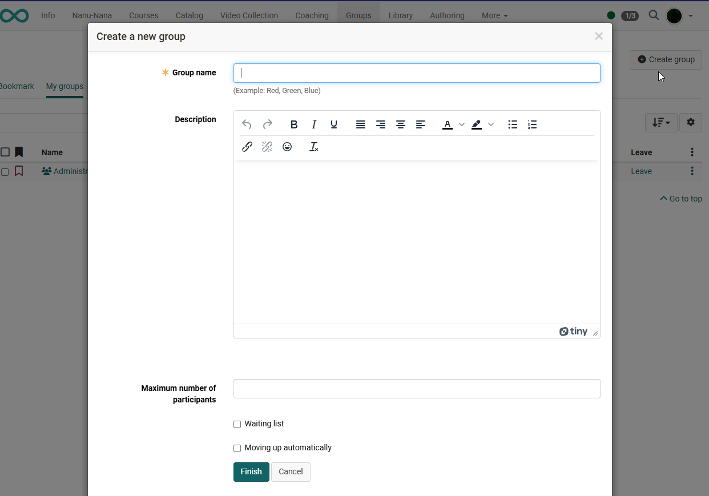

# Create Groups

There are several places where you can create groups. As a rule, the entry point is the main navigation with the menu item "Groups". If you are authorized to create groups, you will find the "Create Group" button here.

{ class="shadow lightbox" }

## Create a group

Click the "Create Group" button and fill in the fields of the pop-up window that appears.

### Group name (mandatory field)

Groups must be given a name. The name is arbitrary and may contain any special characters and numbers. It is helpful for users if they can infer the goal or intent of the group from the group name. For example, instead of "Participant" choose the group name "ParticipantSocialPolicy22", or add your initials or a date to the group name.

### Description

Optionally, you can give the group a more detailed description. It appears on the overview page once you have started the group.

!!! tip "Hint"

    As the description can also be displayed as a column in the group overview, it is recommended to use only short descriptions. Longer
    texts should rather be provided via the [group tool](Using_Group_Tools.md)
    "Information to members".

### Foreseen number of participants

When creating a group, or later in the group administration, you can optionally set a place limit by defining how many participants the group may have. If the foreseen number of participants is exceeded, group members receive a message that no places are left in the group. If you leave this field empty, the group can contain any number of participants.

!!! info "Info"

    If a group is linked to a course, course owners can also use this to control the number of participants in the course.

### Waiting list + automatic move-up

Activate the desired options as needed. If you have limited the number of participants, you can add a waiting list to the group. Interested users can then be placed on the waiting list when groups are full. If someone leaves the group or is removed by the group coach, people on the waiting list can move up automatically. The criterion for moving up is the time of registration on the waiting list, i.e. the person who has been on the waiting list the longest moves up.

## Who can create a group? {: #found_a_group}

If activated by OpenOlat administrators under `Administration > Modules > Groups`, any OpenOlat user, not only authors, can independently create groups, assign the groups a variety of [tools](Using_Group_Tools.md), and invite or directly add any number of other OpenOlat users to the group.

If you create a group, you automatically become the group coach. In this role, you get the "Administration" menu option for your group. There, in the "Members" tab, you can add further people (make them group members) and configure the rights of group members. For more information on adding members, see [here](../groups/Group_Membership.md).

## Creating groups for courses

OpenOlat authors also have the option of creating course-specific groups directly in the desired course. This normally happens in a course's [members management](../learningresources/Members_management.md), in the "Groups" submenu. Groups can also be created at several points in the course editor, in the relevant context. These include the [enrolment element](../learningresources/Course_Element_Enrolment.md) and the [group task](../learningresources/Course_Element_Grouptask.md). In addition, groups can also be created in conventional courses in the [Visibility or Access tab](../learningresources/General_Configuration_of_Course_Elements.md).

---

## Further information {: #further_information}

[Use group tools >](Using_Group_Tools.md) 
[Become a group member >](Group_Membership.md) 
[Members management >](../learningresources/Members_management.md) 
[Course element "Enrolment" >](../learningresources/Course_Element_Enrolment.md) 
[Course element "Group task" >](../learningresources/Course_Element_Grouptask.md) 
[Course elements in the course editor >](../learningresources/General_Configuration_of_Course_Elements.md)

[To the top of the page ^](#create-groups)
