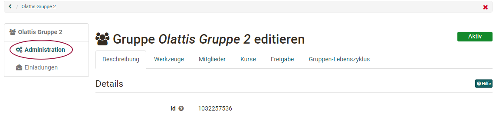
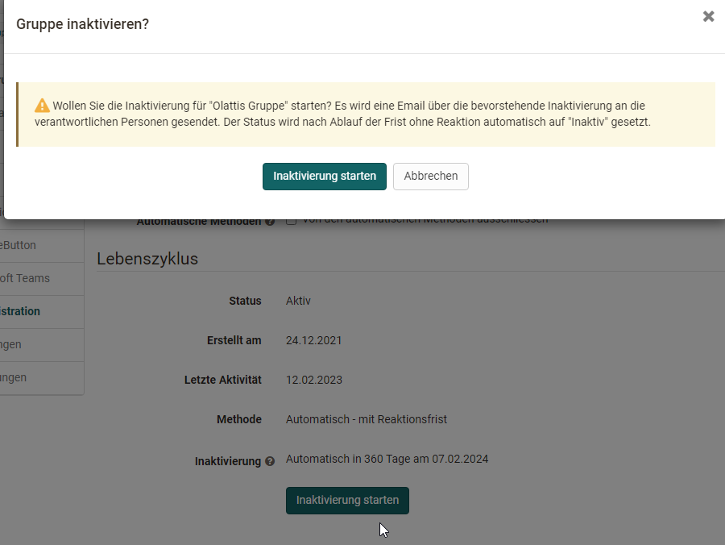

# Gruppenadministration

Wenn Sie eine neue Gruppe erstellen, sind Sie automatisch Betreuer:in dieser
Gruppe. Betreuer:innen einer Gruppe erhalten zusätzlich den Link "**Administration**" im Menu.

{ class="shadow lightbox"}

Über die angezeigten Tabs können Sie:

  * den Gruppenmitgliedern Werkzeuge zur Verfügung stellen und die linke Navigation der Gruppe so ergänzen,
  * Mitglieder verwalten,
  * die Gruppe Kursen zuordnen,
  * den Zugang zur Gruppe konfigurieren und
  * die Gruppe inaktiv setzen.

Als Gruppenbetreuer:in können Sie [generelle Einstellungen](../area_modules/Group_Management.de.md) vornehmen und die Gruppe auch wieder löschen.

Im Folgenden werden die einzelnen Tabs der Gruppen Administration erläutert.   

## Tab Beschreibung

Im Tab "Beschreibung" der Gruppen-Administration können Sie 

* den Gruppennamen ändern, 
* eine Beschreibung eingeben,
* den Link zur Gruppe auslesen,
* die Anzahl der Gruppenmitglieder begrenzen 
* und auch bei Bedarf eine Warteliste einrichten. 

Hinweis: Diese Einstellungen haben Sie bereits bei der Erstellung vorgenommen.

## Tab Werkzeuge {: #tools}

Im Tab Werkzeuge können Sie die Gruppe mit kollaborativen Werkzeugen
ausstatten. Wurde ein Werkzeug aktiviert, erscheint der entsprechende Eintrag inkl. Icon im Menü links.

!!! Info

    Damit die Werkzeuge in Gruppen zur Verfügung stehen, müssen Sie vom OpenOlat Administrator aktiviert werden. Das gilt insbesondere für BigBlueButton, MS Teams OpenMeetings, Wiki und Kalender. Stehen Ihnen bestimmte Werkzeuge als Gruppenbesitzer:in nicht zur Verfügung, wurden diese vom OpenOlat Administrator
    deaktiviert.

Folgende Werkzeuge können aktiviert werden: 

Werkzeug | | Beschreibung
---|---|---
:fontawesome-solid-circle-info: | Information an Mitglieder| Ist das Werkzeug "Information" aktiviert, kann definiert werden, ob nur Gruppenbetreuer:innen oder auch Gruppenmitglieder Mitteilungen erstellen können. Eigene Mitteilungen können immer editiert werden. Als Gruppenbetreuer:in können Sie alle Mitteilungen editieren und löschen.  
:fontawesome-regular-envelope:| E-Mail| Ist das Werkzeug "E-Mail" aktiviert, können auch Gruppenteilnehmer:innen Nachrichten an (ausgewählte) Betreuer:innen und/oder Teilnehmer:innen verschicken. 
:fontawesome-solid-calendar-days: | Kalender| Sie können der Gruppe einen Kalender zur Verfügung stellen, in den Sie gemeinsame Termine eintragen können. Es kann konfiguriert werden ob nur Gruppenbetreuer:innen oder alle Gruppenmitglieder Einträge im Kalender vornehmen dürfen. Weitere generelle Informationen zu Kalenderfunktionen finden Sie im Kapitel [Kalender](../personal_menu/Calendar.de.md).  
:fontawesome-regular-folder: | Ordner| Mit einem Ordner ermöglichen Sie den Austausch von Dateien zwischen den Mitgliedern Ihrer Gruppe. Auch eine gemeinsame Bearbeitung von Office-Dokumenten ist je nach Konfiguration durch die OpenOlat Administrator:innen möglich. Wenn der Ordner aktiviert ist und gespeichert wurde, können Sie die Schreibberechtigungen dafür konfigurieren, d.h. festlegen wer Dateien hochladen und erstellen darf.   
:fontawesome-brands-rocketchat:| Forum| Aktivieren Sie das Forum um allen eine asynchrone Austauschmöglichkeit zur Verfügung zu stellen. Als Betreuer:in der Gruppe haben Sie das Recht, Beiträge zu editieren und zu löschen, sowie neue Beiträge zu verfassen.   
:fontawesome-solid-comment-sms: | Chat| Sie können der Gruppe einen einfachen, synchronen Chat zur Verfügung stellen. Sie sehen hier auch, welche anderen Mitglieder aktuell im OpenOlat eingeloggt sind.   
:fontawesome-solid-globe: | Wiki| Sie können der Gruppe ein Wiki zur Verfügung stellen, um gemeinsam Inhalte zu erstellen. Weitere Infos zur Arbeit mit Wikis finden Sie [hier](../learningresources/Wiki.de.md).
:octicons-briefcase-24: | Portfolio| Sie können der Gruppe ein [Portfolio](../area_modules/Portfolio_General_Information.de.md) 2.0 zur Verfügung stellen um eine gemeinsame Portfolio-Arbeit zu ermöglichen. Es handelt sich dabei aber nicht um ein Assessment-Portfolio.   
:material-monitor: | OpenMeetings| Sofern OpenMeetings aktiviert und gespeichert wurde, steht der Gruppe ein virtueller Meetingraum bzw. ein virtuelles Klassenzimmer zur Verfügung. Die Funktionalität ist ähnlich wie beim entsprechenden Kursbaustein. Weitere Informationen zu OpenMeetings finden Sie [hier](../learningresources/Course_Element_OpenMeetings.de.md)  
:material-monitor: | BigBlueButton| Mit der Wahl von BigBlueButton können einer Gruppe mehrere BigBlueButton Räume zur Verfügung gestellt werden. Die Funktionalität ist ähnlich wie beim entsprechenden [Kursbaustein BigBlueButton](../learningresources/Course_Element_BigBlueButton.de.md). In der Gruppe stehen nur die für Gruppen generell aktivierten BigBlueButton Vorlagen zur Verfügung. Diese können von den Raum-Vorlagen in Kursen abweichen. Ist ein Gruppenmitglied im OpenOlat System Betreuer:in, Kursbesitzer:in, Autor:in oder Administrator:in, stehen gegebenenfalls noch weitere BigBlueButton Raum-Templates zur Verfügung.  
:material-monitor: | Microsoft Teams| Mit der Wahl von Microsoft Teams können einer Gruppe mehrere Räume zur Verfügung gestellt werden. Weitere Informationen zu MS Teams finden Sie [hier](../learningresources/Course_Element_Microsoft_Teams.de.md).  
  
Jedes Werkzeug kann nur einmal in eine Gruppe eingebunden werden. Es ist also nicht möglich, einer Gruppe mehrere Ordner, Wikis oder Foren-Bausteine zur Verfügung zu stellen. Wenn Sie mehrere Werkzeuge eines Typs benötigen, sollten Sie statt einer Gruppe einen Kurs verwenden.

Infos zur Nutzung der Gruppen-Werkzeuge aus der Gruppen-Teilnehmer:innen Perspektive finden Sie [hier](Using_Group_Tools.de.md).

## Tab Mitglieder {: #members}

Hier können Sie: 
*	definieren  wer welche Personen der Gruppe sehen kann.
*	definieren ob sich Teilnehmende selbst wieder aus der Gruppe austragen dürfen. 
* neue Mitglieder hinzufügen und verwalten. Sofern aktiviert kann auch eine Warteliste eingesehen und organisiert werden.

### Anzeige Mitglieder ###

Wird die Einstellung **"Mitglieder sehen Betreuer:innen"** oder **"Mitglieder sehen Teilnehmer:innen"** aktiviert, erscheint in der linken Navigation das Menü "Mitglieder". Je nach aktiviertem Haken, sehen dann die Mitglieder die entsprechenden Personen. 

Mit der Option **"Alle Benutzer:innen sehen Betreuer:innen"** und **"Alle Benutzer sehen Teilnehmer:innen"** kann die Liste der Gruppenmitglieder zudem auf der öffentlich sichtbaren Gruppenvisitenkarte für alle Systembenutzer:innen freigeschaltet werden. 

Sofern die Warteliste aktiviert ist, kann definiert werden ob sie nur für Mitglieder oder alle Benutzer:innen sichtbar sein soll.

Mit der Option **"Mitglieder dürfen Mitgliederliste herunterladen"** können Sie steuern, ob Teilnehmer:innen die Mitgliederliste zusätzlich auch als Excel-Datei herunterladen dürfen oder nicht und ob die Mitgliederliste ausgedruckt werden kann.

Wenn Sie die Option **"Teilnehmer können Gruppe verlassen"** aktivieren ist, können Teilnehmende sich selbst aus der Gruppe wieder austragen, wenn sie wollen. Ansonsten muss die Entfernung von einem/einer Gruppen-Betreuer:in vorgenommen werden und erfolgt in der Regel erst auf Nachfrage. 

**Mitglieder Übersicht**

Unter „Mitglieder“ werden die Mitglieder der Gruppe angezeigt. Sie können auch gefiltert nach Rolle oder Warteliste angezeigt oder gezielt gesucht oder gelöscht werden. Wenn Sie auf das Icon "Tabelle herunterladen" klicken, werden Betreuer bzw. Teilnehmer der Gruppe in einer Excel-Datei ausgegeben.

**Mitglieder hinzufügen**

Je nach Kurs-Rolle stehen dem User unterschiedliche Möglichkeiten zur Verfügung um Gruppenmitglieder hinzufügen. Benutzer:innen können über „Mitglied hinzufügen“ nach Personen, die ein Konto in OpenOlat haben, suchen.  OpenOlat Autor:innen können darüber hinaus auch die „Massensuche“ verwenden und mehrere Personen mit ihrer OpenOlat ID, E-Mail oder Institutionsnummer hinzufügen und auch Externe Mitglieder durch Angabe einer E-Mail-Adresse einladen.   

    
Autor:innen Ansicht

	

 

Beim Hinzufügen von Personen kann entschieden werden ob die Personen als Teilnehmende oder Betreuer:innen der Gruppe hinzugefügt werden.  

Wie unterscheiden sich Gruppen-Betreuer:innen von den Gruppen-Teilnehmenden?

  *  **Gruppen-Betreuer:innen:** Sie haben Zugriff auf die Einstellungen der Gruppen-Administration und können alle zuvor genannten Einstellungen vornehmen. Auch können Gruppen-Betreuer:innen eine Gruppe löschen. Wenn die Gruppe mit einem Kurs verbunden ist, haben Gruppen-Betreuer:innen im Kurs zusätzlich noch Zugriff auf das Bewertungswerkzeug und Teststatistiken der eigenen Gruppe. Sie können weitere, für Betreuer:innen freigegebene Aktionen vornehmen, allerdings nur mit Bezug auf ihre Gruppe. 
  *  **Teilnehmer:innen:**  Sie können die kollaborativen Werkzeuge der Gruppe nutzen und im Rahmen der vom Gruppen-Betreuer:innen konfigurierten Einstellungen agieren. 

Das manuelle Hinzufügen von Mitgliedern durch Gruppenbetreuer:innen macht beispielsweise dann Sinn, wenn Sie ganz gezielt einzelne Personen Ihrer Gruppe hinzufügen möchten.  Eine andere Möglichkeit Personen einer Gruppe hinzuzufügen erfolgt über die Erstellung eines Angebots im Tab „Freigabe“. Weitere Information finden Sie unter [„Gruppenmitglied werden“](../groups/Group_Membership.de.md) insbesondere bei 2a).

## Tab Kurse {: #courses}

Dieser Tab ist nur verfügbar, wenn die Gruppe mit einem oder mehreren Kursen verbunden ist oder der/die Gruppenbesitzer:in über Autorenrechte verfügt.

Wählt man "Kurs hinzufügen" erscheint eine Übersicht aller Ihnen als Gruppen-Betreuer:in zur Verfügung stehenden Kursen. Es können nur Kurse verbunden werden bei denen Sie als Besitzer:in eingetragen sind.

Um einen Kurs auszuwählen, markieren Sie ihn, klicken auf den Titel oder klicken auf den Haken in der Spalte  "_Auswählen_".  Weiterführende Informationen zum Kurs, wie z.B. Autor:in, Sprache oder Beschreibung, erhalten Sie mit einem Klick auf das :octicons-info-16: Icon. 

OpenOlat Autor:innen können in diesem Bereich auch neue zu verknüpfende Kurse erstellen oder importieren. 

Eine Gruppe kann von Kurs-Besitzer:innen mit einem oder mehreren Kursen verknüpft werden, ebenso wie in einen Kurs mehrere Gruppen eingebunden werden können. Es liegt keine Beschränkung der Anzahl eingebundener Kurse durch OpenOlat vor.

Gruppen werden in Kursen sehr vielfältig verwendet z.B. für die kontrollierte Einschreibung in den Kurs, für kooperative Aktivitäten, für die Vergabe von Referaten, die Anmeldung zu Exkursionen aber auch für das Rechtemanagement innerhalb von Kursen.

Gruppen und Kurse können auf zwei Wegen verknüpft werden. Entweder ausgehend von der Gruppe im Tab "Kurse" oder ausgehend vom Kurs über die [Mitgliederverwaltung](../learningresources/Members_management.de.md) → "Gruppen".

## Tab Freigabe {: #booking}

Neben dem manuellen Hinzufügen von Personen durch den/die Gruppenbetreuer:in kann für Gruppen auch ein Angebot (Buchungsoption) erstellt werden. So können sich Interessierte selbst in die Gruppe eintragen.

Folgende Optionen stehen zur Auswahl:

* :material-key-variant: **Zugangscode**: Wählen Sie die Buchungsmethode "Zugangscode" um die Buchung auf diejenigen zu begrenzen, die über das hinterlegte Passwort verfügen. Hierfür wird manuell ein Zugangscode festgelegt, der von dem/der Gruppenbesitzer:in weitergegeben wird. Nur Personen, die über diesen Zugangscode verfügen, können die Gruppe buchen. Vor dem ersten Öffnen der Gruppe muss dieser Code von dem/der Benutzer:in eingegeben werden. Auch eine zeitliche Begrenzung der Buchung mit dem Zugangscode kann definiert werden.
* :material-gift: **Frei verfügbar**: Wählen Sie die freie Buchungsmethode, wenn ein Zutritt ohne Passwort möglich sein soll. Alle Systembenutzer können die Ressource dann buchen. Ein/eine Benutzer:in wird dadurch als Teilnehmer:in der Gruppe hinzugefügt. Es ist aber auch möglich, den freien Zugang zeitlich zu begrenzen. 
* :fontawesome-brands-cc-paypal: **PayPal Checkout**  (nur verfügbar, wenn vom Administrator freigeschaltet): Wählen Sie diese Buchungsmethode um eine Buchung gegen eine finanzielle Vergütung zu ermöglichen. Bei dieser Buchungsmethode können Sie einen Betrag definieren, der mit einem PayPal Konto oder mit einer Kreditkarte (Visa/Mastercard) bezahlt werden muss. Die Warteliste kann mit dieser Buchungsmethode nicht verwendet werden. Die Optionen "Warteliste" bzw. "PayPal", werden nicht mehr in der Gruppenadministration angezeigt, sobald die jeweils andere gewählt wurde.

Sie können auch **mehrere Angebote** konfigurieren. Diese gelten als verschiedene Optionen. Beispielsweise könnte man den Zugang für 2 Tage "frei verfügbar" einrichten und danach nur noch mit Passwort oder Bezahloption. Wenn sich die konfigurierten Angebote überlappen, können sich Interessierte die Option auswählen. Unter "Editieren" können Sie die Konfiguration der Angebote jederzeit wieder ändern. 

Sobald ein Angebot konfiguriert wurde, wird die Gruppe in die Liste der **"Veröffentlichten Gruppen**" eingetragen und kann somit gesucht und gebucht werden. Wird keine Buchungsmethode konfiguriert, steht die Gruppe nur den eingetragenen Benutzer:innen zur Verfügung, die im Tab "Mitglieder" durch die Gruppen-Betreuenden hinzugefügt wurden.

Hat ein/eine Benutzer:in eine Gruppe gebucht, so wird die Person in der Teilnehmendenliste dieser Gruppe eingetragen. Von dem Zeitpunkt an entscheidet das System einzig über die Teilnehmerliste, ob eine Person Zugang zur Gruppe hat. Abgelaufene Angebote haben daher keinen Einfluss auf eine Teilnehmerschaft.

Wenn Sie Personen manuell aus der Gruppe löschen, können sich diese, sofern noch ein passendes Angebot existiert, durch erneutes Buchen wieder Zugang zur Gruppe verschaffen. Prüfen Sie in diesem Fall, ob es möglich ist das Angebot so zu ändern oder zu entfernen, dass ein erneuter Eintrag nicht mehr möglich ist. 

!!! info "Tipp"

    Löschen Sie nicht mehr benötigte Angebote wieder oder konfigurieren Sie diese mit einer Deadline. Die bereits getätigten Buchungen bleiben bestehen und sind davon nicht weiter tangiert.

Öffentliche Gruppen mit verschiedenen Zugangsmöglichkeiten eignen sich vor allem wenn:

* Projekte oder kursunabhängige Schulungen angeboten werden. 
* Sie die Gruppe zur Sammlung von Personen verwenden, die Sie später einem Kurs zuordnen wollen
* die Teilnehmerzahl begrenzt und die Organisation der Teilnehmenden über diese Gruppe erfolgen soll (auch mit automatischem Nachrücken)
* Wenn es für unterschiedliche OpenOlat Organisationen unterschiedliche Zugänge geben soll z.B. interne und externe Buchung

## Tab Gruppen-Lebenszyklus

Hier werden der Status der Gruppe sowie weitere Informationen angezeigt. Ferner kann der Status geändert werden, z.B. kann eine aktive Gruppe inaktiv gesetzt oder eine inaktive Gruppe gelöscht oder reaktiviert werden. Auch kann die Gruppe vom automatischen Gruppen-Lebenszyklus ausgenommen werden, z.B. wenn es sich um eine wichtige Gruppe handelt, die permanent vorhanden bleiben muss. 

{ class="shadow lightbox" }

Weitere Informationen finden Sie im separaten Kapitel [Automatischer Gruppen-Lebenszyklus](https://docs.openolat.org/de/manual_admin/administration/Automatic_Group_Lifecycle/) im Administrationshandbuch.

