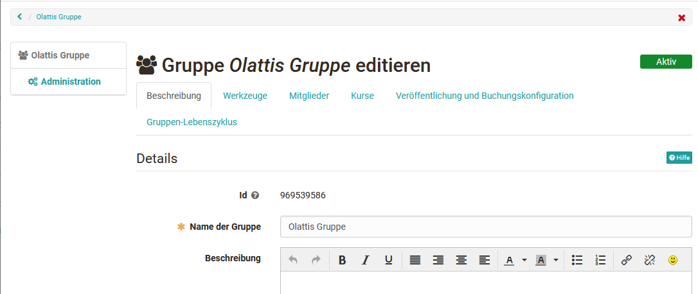
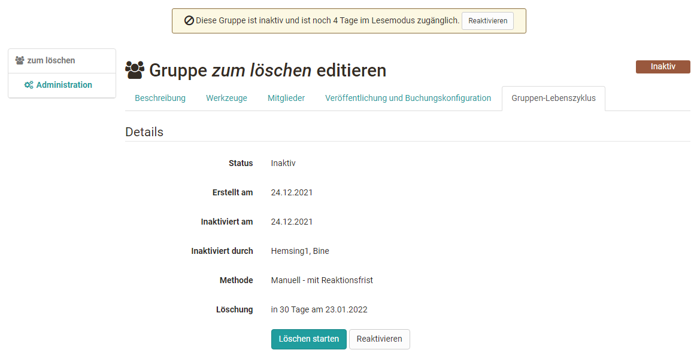

# Gruppenadministration

## Gruppenbetreuer

Wenn Sie eine neue Gruppe erstellen, sind Sie automatisch Betreuer dieser
Gruppe. Betreuer der Gruppe erhalten den Link "Administration" im Menu.
Generell können Sie die Gruppe administrieren, die Gruppe [löschen
](Group_Management.de.md)und diverse weitere Einstellungen vornehmen.

{ class="shadow lightbox"}

Über die Menüs im Bereich Administration können Sie:

  * der Gruppe Tools hinzufügen,
  * Mitglieder verwalten,
  * die Gruppe Kursen zuordnen,
  * den Zugang konfigurieren und
  * die Gruppe inaktiv setzen.

### Beschreibung

Im Reiter "Beschreibung" können Sie den Gruppennamen ändern, eine Beschreibung
eingeben, den Link zur Gruppe auslesen, die Anzahl der Gruppenmitglieder
begrenzen und auch bei Bedarf eine Warteliste einrichten. Diese Einstellungen
haben Sie bereits bei der Erstellung vorgenommen.

### Werkzeuge

Im Tab Werkzeuge können Sie die Gruppe mit kollaborativen Werkzeugen
ausstatten. Wurde ein Werkzeug aktiviert, erscheint der entsprechende Eintrag
inkl. Icon im Menü links.

!!! Info

    Damit die Werkzeuge in Gruppen zur Verfügung stehen, müssen Sie vom OpenOlat
    Administrator aktiviert werden. Das gilt insbesondere für BigBlueButton,
    OpenMeetings, Wiki, Kalender. Stehen Ihnen bestimmte Werkzeuge als
    Gruppenbesitzer nicht zur Verfügung, wurden diese vom OpenOlat Administrator
    deaktiviert.

Werkzeug | | Beschreibung
---|---|---
:fontawesome-solid-circle-info: | Information an Mitglieder| Ist das Werkzeug „Information“ aktiviert, kan definiert werden, ob nur Gruppenbetreuer oder auch Gruppenmitglieder Mitteilungen erstellen können. Eigene Mitteilungen können immer editiert werden. Als Gruppenbetreuer können alle Mitteilungen editiert und gelöscht werden.  
:fontawesome-regular-envelope:| E-Mail| Ist das Werkzeug „E-Mail“ aktiviert, können auch nicht-Mitglieder auf die E-Mail-Funktionalität zugreifen und so an Gruppenmitglieder (Betreuer, Teilnehmer oder alle Mitglieder) Nachrichten schicken.  
:fontawesome-solid-calendar-days: | Kalender| Sie können der Gruppe einen Kalender zur Verfügung stellen, in den Sie gemeinsame Termine eintragen können. Wenn der Kalender aktiviert ist und gespeichert wurde, können Sie die Schreibberechtigungen dafür konfigurieren, d.h. festlegen wer Termine erfassen darf. Weitere generelle Informationen zu Kalenderfunktionen finden Sie im Kapitel [Kalender](../personal/Calendar.de.md).  
:fontawesome-regular-folder: | Ordner| Mit einem Ordner ermöglichen Sie den Austausch von Dateien zwischen den Mitgliedern Ihrer Gruppe. Auch eine gemeinsame Bearbeitung von Office Dokumenten ist je nach Konfiguration durch den OpenOlat Administrator möglich. Der verfügbare Speicherplatz beträgt 10 MB. Wenn der Ordner aktiviert ist und gespeichert wurde, können Sie die Schreibberechtigungen dafür konfigurieren, d.h. festlegen wer Dateien hochladen und erstellen darf. Weitere Informationen zum Ordner finden Sie [hier](../personal/Personal_folders.de.md).  
:fontawesome-brands-rocketchat:| Forum| Hier stellen Sie Ihrer Gruppe ein Forum für Diskussionen zur Verfügung. Als Betreuer der Gruppe haben Sie das Recht, Beiträge zu editieren und zu löschen sowie neue Beiträge zu verfassen. Weitere Infos zur Arbeit mit Foren finden Sie [hier](../learning_activities/Working_with_Tasks_and_Group_Tasks.de.md).  
:fontawesome-solid-comment-sms: | Chat| Sie können der Gruppe einen Chatraum zur Verfügung stellen. Sie sehen, welche anderen Mitglieder sich im Gruppenchat befinden.  
:fontawesome-solid-globe: | Wiki| Sie können der Gruppe ein Wiki zur Verfügung stellen, um gemeinsam Inhalte zu erstellen. Weitere Infos zur Arbeit mit Wikis finden Sie [hier](../learning_activities/Working_with_Wiki.de.md).  
:octicons-briefcase-24: | Portfolio| Sie können der Gruppe ein [Portfolio](../portfolio/Creating_Portfolio_Tasks.de.md)2.0 zur Verfügung stellen.  
:material-monitor: | OpenMeetings| Wenn OpenMeetings aktiviert und gespeichert wurde, steht der Gruppe ein virtueller Meetingraum bzw. ein virtuelles Klassenzimmer zur Verfügung.  
:material-monitor: | BigBlueButton| Mit der Wahl von BigBlueButton können einer Gruppe mehrere BigBlueButton Räume zur Verfügung gestellt werden. Die Funktionalität ist ähnlich wie beim entsprechenden [Kursbaustein BigBlueButton](../course_elements/Course_element_BigBlueButton.de.md). In der Gruppe stehen nur die für Gruppen generell aktivierten BigBlueButton Vorlagen zur Verfügung. Diese können von den Raum-Vorlagen in Kursen abweichen. Ist ein Gruppenmitglied im OpenOlat System Betreuer, Kursbesitzer, Autor oder Administrator, stehen ihm gegebenenfalls noch weitere BigBlueButton Raum- Templates zur Verfügung.  
:material-monitor: | Microsoft Teams| Mit der Wahl von Microsoft Teams können einer Gruppe mehrere BigBlueButton Räume zur Verfügung gestellt werden. Weitere Informationen zu MS Teams finden Sie [hier](../course_elements/Course_element_Microsoft_Teams.de.md).  
  
Jedes Werkzeug kann nur einmal in eine Gruppe eingebunden werden. Es ist also
nicht möglich, einer Gruppe mehrere Ordner, Wiki oder Foren Bausteine zur
Verfügung zu stellen. Wenn Sie mit mehreren Werkzeugen eines Typs benötigen
sollten Sie statt einer Gruppe einen Kurs verwenden.

Infos zur Nutzung der Werkzeuge durch die Gruppen-Teilnehmer finden Sie
[hier](Using_Group_Tools.de.md).

### Mitglieder ... {: #members}

In diesem Tab können weitere Personen der Gruppe hinzugefügt, die Sichtbarkeit
der Personen definiert und die Austrittsmöglichkeit konfiguriert werden.

#### Wer sieht was?

Im Tab Mitglieder legen Sie fest, wen die Mitglieder sehen dürfen, die
Betreuer und/oder die Teilnehmer. Mit der Option "Alle Benutzer sehen
Betreuer" und "Alle Benutzer sehen Teilnehmer" kann die Liste der
Gruppenmitglieder zudem auf der öffentlich sichtbaren Gruppenvisitenkarte für
alle Systembenutzer freigeschaltet werden. Sofern die Warteliste aktiviert
ist, kann definiert werden ob sie für Mitglieder oder alle Benutzer sichtbar
sein soll.

Mit der Option "Mitglieder dürfen Mitgliederliste herunterladen" können Sie
steuern, ob Teilnehmer die Mitgliederliste zusätzlich auch als Excel Datei
herunterladen dürfen oder nicht und ob die Mitgliederliste ausgedruckt werden
kann.

Wenn Sie die Option "Teilnehmer können Gruppe verlassen" aktivieren, können
Teilnehmer die Gruppe direkt in der Gruppenübersicht verlassen. Falls nicht,
erhalten Sie von Ihren Teilnehmern eine Mail zum Austrittswunsch. Der
Teilnehmer muss dann manuell aus der Gruppe entfernt werden.

#### Mitglieder hizufügen, löschen und anzeigen

In diesem Tab kann der Gruppenbetreuer weitere Personen als Gruppenmitglied
und/oder Gruppenbetreuer hinzufügen, löschen, bearbeiten und per Mail
kontaktieren, kurz gesagt die Mitglieder der Gruppen organisieren.

Über "Mitglied hinzufügen" können Sie nach einzelnen Personen suchen. Über
"Mitglieder hinzufügen" können Sie auf einen Schlag auch mehrere Personen
hinzufügen sofern Sie deren Benutzernamen kennen oder z.B. aus anderen
OpenOlat Kursen oder Gruppen exportiert haben.

Wenn Sie auf das Icon „Tabelle herunterladen“ (unterhalb der Schaltfläche
„Mitglieder hinzufügen“) klicken, werden Betreuer bzw. Teilnehmer der Gruppe
in einer Excel-Datei ausgegeben.

Das Hinzufügen von Mitgliedern durch den Gruppen-Betreuer macht beispielsweise
dann Sinn, wenn Sie ganz gezielt einzelne Personen Ihrer Gruppe hinzufügen
möchten.  Dabei haben  Sie die Wahl zwischen 2 Gruppen-Rollen.  Die Benutzer
können als Teilnehmer oder als Gruppen-Betreuer  hinzugefügt werden.

  *  **Gruppen-Betreuer:** Haben Zugriff auf die Einstellungen der Gruppen Administration. Hier Können sie z.B. Mitglieder ernennen oder entfernen und die Gruppe mit kollaborativen Werkzeugen ausstatten. Auch können Gruppen-Betreuer eine Gruppe löschen. Wenn die Gruppe mit einem Kurs verbunden ist, haben Betreuer im Kurs zusätzlich noch Zugriff auf das Bewertungswerkzeug und Teststatistiken der eigenen Gruppe.
  *  **Teilnehmer:**  Können die kollaborativen Werkzeuge einer Gruppe nutzen.

###  Veröffentlichung und Buchungskonfiguration {: #booking}

Eine weitere Möglichkeit Personen einer Gruppe hinzuzufügen erfolgt im Tab
"Veröffentlichung und Buchungskonfiguration". Hier kann eine Buchungsmethode
definiert werden, so dass sich Interessierte selbst in die Gruppe eintragen
können. Dies kann entweder mit oder ohne Zugangscode erfolgen. Dies ist
besonders wichtig, wenn die Gruppe unabhängig von einem Kurs genutzt wird.
Buchen kann als Synonym für Belegen, Einschreiben, Einkaufen verstanden
werden. Wird die Gruppe jedoch in Verbindung mit einem Kurs verwendet, braucht
dieser Tab nicht extra eingerichtet werden.

Folgende Optionen stehen unter "Buchungsmethode hinzufügen" zur Auswahl:

* :material-key-variant: **Zugangscode** : Wählen Sie die Buchungsmethode "Zugangscode" um die Buchung auf diejenigen zu begrenzen, die über das hinterlegte Passwort verfügen. Hierfür wird manuell ein Zugangscode festgelegt, der vom Gruppenbesitzer weitergegeben wird. Nur Personen die über diesen Zugangscode verfügen können die Gruppe buchen. Vor dem ersten Öffnen der Gruppe muss dieser Code vom Benutzer eingegeben werden.
* :material-gift: **Frei verfügbar** : Wählen Sie die freie Buchungsmethode, wenn keine weiteren Einschränkungen gelten. Alle Systembenutzer können die Ressource buchen. Ein Benutzer wird dadurch als Teilnehmer der Gruppe angelegt.
* :fontawesome-brands-cc-paypal: **PayPal und Kreditkarte**  (nur verfügbar, wenn vom Administrator freigeschaltet): Wählen Sie die PayPal/Kreditkarten Buchungsmethode um eine Buchung gegen eine finanzielle Vergütung zu ermöglichen. Bei dieser Buchungsmethode können Sie einen Betrag definieren, der mit einem PayPal Konto oder mit einer Kreditkarte (Visa/Mastercard) bezahlt werden muss. Die Warteliste kann mit dieser Buchungsmethode nicht verwendet werden. Die Optionen „Warteliste“ respektive „PayPal und Kreditkarte“ werden nicht mehr in der Gruppenadministration angezeigt sobald die jeweils andere gewählt wurde.

Sobald eine Buchungsmethode konfiguriert wurde, wird die Gruppe in die Liste
der **"Veröffentlichten Gruppen** " eingetragen und kann somit gesucht und
gebucht werden. Wird keine Buchungsmethode konfiguriert, steht die Gruppe nur
den eingetragenen Benutzern zur Verfügung, die im Tab "Mitglieder" durch einen
Betreuer hinzugefügt wurden.

Sie können auch mehrere Buchungsmethoden konfigurieren. Diese gelten als
verschiedene Optionen, aus denen der Benutzer wählen kann. Unter "Editieren"
kann einer Buchungskonfiguration mit Hilfe eines Start- und Enddatums optional
eine Gültigkeitsperiode beigefügt werden. Diese Konfiguration ist dann nur
zwischen dem konfigurierten Datum gültig. Sie können auch nur ein Start- oder
nur ein Enddatum angeben. Möchten Sie keine zeitliche Einschränkung vorgeben,
so lassen Sie dieses Feld leer.

Das Start- und Enddatum bezieht sich ausschliesslich auf den Buchungsprozess.
Hat ein Benutzer eine Ressource gebucht, so wird die Person in der
Teilnehmerliste dieser Ressource eingetragen. Von dem Zeitpunkt an entscheidet
das System einzig über die Teilnehmerliste, ob eine Person Zugang zu einer
Gruppe hat. Abgelaufene Buchungskonfigurationen haben daher keinen Einfluss
auf eine Teilnehmerschaft.

Als Gruppenbetreuer können Sie auch jederzeit eine Person zu der
Teilnehmerliste hinzufügen bzw. austragen. In dem zweiten Fall kann sich der
Benutzer durch erneutes Buchen (sofern möglich) wieder als Teilnehmer in die
Ressource eintragen.

Sie können die konfigurierten Buchungsmethoden jederzeit problemlos löschen.
Die bereits getätigten Buchungen bleiben bestehen und sind davon nicht weiter
tangiert.

Öffentliche Gruppen mit verschiedenen Zugangsmöglichkeiten eignen sich vor
allem wenn Projekte oder kursunabhängige Schulungen angeboten werden. Oder
wenn Sie die Gruppe zur Sammlung von Personen verwenden, die Sie später einem
Kurs zuordnen wollen oder wenn die Teilnehmerzahl begrenzt und die Organiation
der Teilnehmenden über diese Gruppe erfolgen soll und beispielsweise ein
automatisches Nachrücken ermöglicht werden soll.

###  Kurse {: #courses}

Dieser Tab ist nur verfügbar, wenn die Gruppe mit einem oder mehreren Kursen
verbunden ist oder der Gruppenbesitzer auch über Autorenrechte verfügt.

Eine Gruppe kann von Kurs-Besitzern mit mehreren Kursen verknüpft werden,
ebenso wie in einen Kurs mehrere Gruppen eingebunden werden können. Es liegt
keine Beschränkung der Anzahl eingebundener Kurse durch OpenOlat vor.

Gruppen werden in Kursen sehr vielfältig verwendet z.B. für die kontrollierte
Einschreibung für kooperative Aktivitäten, für die Vergabe von Referaten, die
Anmeldung zu Exkursionen aber auch für das Rechtemanagement innerhalb von
Kursen.

Gruppen und Kurse können auf zwei Wegen verknüpft werden. Entweder ausgehend
von der Gruppe im Tab "Kurse" oder ausgehend vom Kurs über die
"[Mitgliederverwaltung](../course_operation/Members_management.de.md)" → "Gruppen"

in der Gruppenansicht im Menüpunkt Administration unter dem **Tab „Kurse** “
wählt man "Kurs hinzufügen". Es können nur Kurse verbunden werden bei denen
Sie als Besitzer eingetragen sind. Klicken Sie dafür entweder auf den
Kursnamen oder auf den Haken unter " _Auswählen_ " rechts vom Kursnamen.
Weiterführende Informationen zum Kurs, wie z.B. Autor, Sprache oder
Beschreibung, erhalten Sie mit einem Klick auf das
:octicons-info-16: Icon. Über die Schaltfläche " **Kurs einbinden** " am Ende der Tabelle können
schnell beliebig viele Kurse mit einem Klick eingebunden werden. Ferner können
an dieser Stelle auch Kurse erstellt oder importiert werden.

Dieser Tab steht nur OpenOlat Autoren zur Verfügung.

### Gruppen-Lebenszyklus

Hier werden der Status der Gruppe sowie weitere Informationen angezeit. Ferner
kann der Status geändert werden, z.B. eine aktive Gruppe inaktiv gesetzt oder
eine inaktive Gruppe gelöscht oder reaktiviert werden.

{ class="shadow lightbox" }

Weitere Informationen finden Sie im separaten Kapitel "[Automatischer Gruppen-
Lebenszyklus".](../../manual_admin/administration/Automatic_Group_Lifecycle.de.md)

