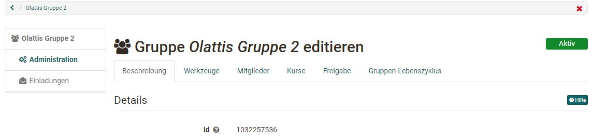

# Gruppenadministration

Konfigurationsmöglichkeiten für Gruppenbetreuer

Wenn Sie eine neue Gruppe erstellen, sind Sie automatisch Betreuer dieser
Gruppe. Betreuer der Gruppe erhalten den Link "Administration" im Menu.
Generell haben Sie die Möglichkeit die Gruppe zu administrieren,  [generelle Einstellungen](../area_modules/Group_Management.de.md) vorzunehmen und die Gruppe auch wieder zu löschen.

{ class="shadow lightbox"}

Über die Menüs im Bereich Administration können Sie:

  * der Gruppe Tools hinzufügen,
  * Mitglieder verwalten,
  * die Gruppe Kursen zuordnen,
  * den Zugang zur Gruppe konfigurieren und
  * die Gruppe inaktiv setzen.

Im Folgenden werden die einzelnen Tabs der Administration von Gruppen erläutert.   

## Tab Beschreibung

Im Reiter "Beschreibung" der Gruppen-Administration können Sie den Gruppennamen ändern, eine Beschreibung
eingeben, den Link zur Gruppe auslesen, die Anzahl der Gruppenmitglieder
begrenzen und auch bei Bedarf eine Warteliste einrichten. Diese Einstellungen
haben Sie bereits bei der Erstellung vorgenommen.

## Tab Werkzeuge

Im Tab Werkzeuge können Sie die Gruppe mit kollaborativen Werkzeugen
ausstatten. Wurde ein Werkzeug aktiviert, erscheint der entsprechende Eintrag inkl. Icon im Menü links.

!!! Info

    Damit die Werkzeuge in Gruppen zur Verfügung stehen, müssen Sie vom OpenOlat
    Administrator aktiviert werden. Das gilt insbesondere für BigBlueButton, MS Teams
    OpenMeetings, Wiki und Kalender. Stehen Ihnen bestimmte Werkzeuge als
    Gruppenbesitzer nicht zur Verfügung, wurden diese vom OpenOlat Administrator
    deaktiviert.

Folgende Werkzeuge können aktiviert werden: 

Werkzeug | | Beschreibung
---|---|---
:fontawesome-solid-circle-info: | Information an Mitglieder| Ist das Werkzeug „Information“ aktiviert, kann definiert werden, ob nur Gruppenbetreuer oder auch Gruppenmitglieder Mitteilungen erstellen können. Eigene Mitteilungen können immer editiert werden. Als Gruppenbetreuer können alle Mitteilungen editiert und gelöscht werden.  
:fontawesome-regular-envelope:| E-Mail| Ist das Werkzeug „E-Mail“ aktiviert, können auch Gruppen Teilnehmende Nachrichten an (ausgewählte) Betreuer und oder Teilnehmende verschicken. 
:fontawesome-solid-calendar-days: | Kalender| Sie können der Gruppe einen Kalender zur Verfügung stellen, in den Sie gemeinsame Termine eintragen können. Es kann konfiguriert werden ob nur Gruppen-Betreuer oder alle Gruppen-Mitglieder Einträge im Kalender vornehmen dürfen. Weitere generelle Informationen zu Kalenderfunktionen finden Sie im Kapitel [Kalender](../personal_menu/Calendar.de.md).  
:fontawesome-regular-folder: | Ordner| Mit einem Ordner ermöglichen Sie den Austausch von Dateien zwischen den Mitgliedern Ihrer Gruppe. Auch eine gemeinsame Bearbeitung von Office Dokumenten ist je nach Konfiguration durch den OpenOlat Administrator möglich.  Wenn der Ordner aktiviert ist und gespeichert wurde, können Sie die Schreibberechtigungen dafür konfigurieren, d.h. festlegen wer Dateien hochladen und erstellen darf.   
:fontawesome-brands-rocketchat:| Forum| Aktivieren Sie das Forum um allen eine asynchrone Austauschmöglichkeit zur Verfügung zu stellen. Als Betreuer der Gruppe haben Sie das Recht, Beiträge zu editieren und zu löschen sowie neue Beiträge zu verfassen.   
:fontawesome-solid-comment-sms: | Chat| Sie können der Gruppe einen einfachen synchronen Chat zur Verfügung stellen. Hier sehen Sie auch, welche anderen Mitglieder sich aktuell im Gruppenchat befinden.  
:fontawesome-solid-globe: | Wiki| Sie können der Gruppe ein Wiki zur Verfügung stellen, um gemeinsam Inhalte zu erstellen. Weitere Infos zur Arbeit mit Wikis finden Sie [hier](../learningresources/Working_with_Wiki.de.md).  
:octicons-briefcase-24: | Portfolio| Sie können der Gruppe ein [Portfolio](../area_modules/Portfolio_General_Information.de.md) 2.0 zur Verfügung stellen um eine gemeinsame Portfolio-Arbeit zu ermöglichen. Es handelt sich dabei aber nicht um ein Assessment-Portfolio.   
:material-monitor: | OpenMeetings| Sofern OpenMeetings aktiviert und gespeichert wurde, steht der Gruppe ein virtueller Meetingraum bzw. ein virtuelles Klassenzimmer zur Verfügung. Weitere Informationen zu OpenMeetings finden Sie [hier](assets/../../course_elements/Course_Element_OpenMeetings.de.md)  
:material-monitor: | BigBlueButton| Mit der Wahl von BigBlueButton können einer Gruppe mehrere BigBlueButton Räume zur Verfügung gestellt werden. Die Funktionalität ist ähnlich wie beim entsprechenden [Kursbaustein BigBlueButton](../learningresources/Course_Element_BigBlueButton.de.md). In der Gruppe stehen nur die für Gruppen generell aktivierten BigBlueButton Vorlagen zur Verfügung. Diese können von den Raum-Vorlagen in Kursen abweichen. Ist ein Gruppenmitglied im OpenOlat System Betreuer, Kursbesitzer, Autor oder Administrator, stehen ihm gegebenenfalls noch weitere BigBlueButton Raum- Templates zur Verfügung.  
:material-monitor: | Microsoft Teams| Mit der Wahl von Microsoft Teams können einer Gruppe mehrere Räume zur Verfügung gestellt werden. Weitere Informationen zu MS Teams finden Sie [hier](../learningresources/Course_Element_Microsoft_Teams.de.md).  
  
Jedes Werkzeug kann nur einmal in eine Gruppe eingebunden werden. Es ist also
nicht möglich, einer Gruppe mehrere Ordner, Wiki oder Foren Bausteine zur
Verfügung zu stellen. Wenn Sie mit mehreren Werkzeugen eines Typs benötigen
sollten Sie statt einer Gruppe einen Kurs verwenden.

Infos zur Nutzung der Werkzeuge durch die Gruppen-Teilnehmer finden Sie
[hier](Using_Group_Tools.de.md).

## Tab Mitglieder {: #members}

In diesem Tab können Personen der Gruppe hinzugefügt und die Mitglieder verwaltet werden.

Das manuelle Hinzufügen von Mitgliedern durch den Gruppen-Betreuer macht beispielsweise
dann Sinn, wenn Sie ganz gezielt einzelne Personen Ihrer Gruppe hinzufügen möchten. 

**Wer sieht was?**

Wird die Einstellung "Mitglieder sehen Betreuer" oder "Mitglieder sehen Teilnehmer" aktiviert erscheint in der linken Navigation das Menü "Mitglieder". Je nach aktiviertem Haken sehen dann die Mitglieder die entsprechenden Personen. 

Mit der Option "Alle Benutzer sehen
Betreuer" und "Alle Benutzer sehen Teilnehmer" kann die Liste der
Gruppenmitglieder zudem auf der öffentlich sichtbaren Gruppenvisitenkarte für
alle Systembenutzer freigeschaltet werden. Sofern die Warteliste aktiviert
ist, kann definiert werden ob sie für Mitglieder oder alle Benutzer sichtbar
sein soll.

Mit der Option "Mitglieder dürfen Mitgliederliste herunterladen" können Sie
steuern, ob Teilnehmer die Mitgliederliste zusätzlich auch als Excel Datei
herunterladen dürfen oder nicht und ob die Mitgliederliste ausgedruckt werden
kann.

Wenn Sie die Option "Teilnehmer können Gruppe verlassen" aktiviert ist, können
Teilnehmende die Gruppe direkt in der Gruppenübersicht verlassen. Falls nicht, erhalten die Gruppenbetreuer vom jeweiligen Teilnehmenden eine Mail zum Austrittswunsch. Die Gruppenbesitzer müssen dann die Person manuell aus der Gruppe entfernen.

**Mitglieder hinzufügen, löschen und anzeigen**

Im Tab "Mitglieder" können Personen der Gruppe sowohl als Gruppenteilnehmer als auch als Gruppenbesitzer hinzugefügt werden. Auch externe Mitglieder, also Personen ohne OpenOlat Account, können eingeladen werden. 

Wie unterscheiden sich Gruppen-Betreuer von den Gruppen-Teilnehmenden?

  *  **Gruppen-Betreuer:** Haben Zugriff auf die Einstellungen der Gruppen Administration und können alle zuvor genannten Einstellungen vornehmen. Auch können Gruppen-Betreuer eine Gruppe löschen. Wenn die Gruppe mit einem Kurs verbunden ist, haben Gruppen-Betreuer im Kurs zusätzlich noch Zugriff auf das Bewertungswerkzeug und Teststatistiken der eigenen Gruppe und können weitere für Betreuer freigegebene Aktionen vornehmen, allerdings nur mit Bezug auf ihre Gruppe. 
  *  **Teilnehmer:**  Können die kollaborativen Werkzeuge der Gruppe nutzen und im Rahmen der vom Gruppen-Betreuer konfigurierten Einstellungen agieren. 

Über "Mitglied hinzufügen" können Sie nach einzelnen Personen suchen oder auch mehrere Personen direkt der Gruppe hinzufügen, wenn Sie  deren Anmeldenamen, E-Mail oder Institutionsnummer kennen. 

Wenn Sie auf das Icon „Tabelle herunterladen“ klicken, werden Betreuer bzw. Teilnehmer der Gruppe
in einer Excel-Datei ausgegeben.

## Tab Kurse {: #courses}

Dieser Tab ist nur verfügbar, wenn die Gruppe mit einem oder mehreren Kursen verbunden ist oder der Gruppenbesitzer über Autorenrechte verfügt.

Wählt man "Kurs hinzufügen" erscheint eine Übersicht aller Ihnen als Gruppen-Betreuer zur Verfügung stehenden Kursen. Es können nur Kurse verbunden werden bei denen Sie als Besitzer eingetragen sind.

Um einen Kurs auszuwählen markieren Sie ihn, klicken auf den Titel oder klicken  auf den Haken in der Spalte  _Auswählen_ ". 
Weiterführende Informationen zum Kurs, wie z.B. Autor, Sprache oder
Beschreibung, erhalten Sie mit einem Klick auf das
:octicons-info-16: Icon. 

OpenOlat Autoren können in diesem Bereich auch neue zu verknüpfende Kurse erstellen oder importieren. 

Eine Gruppe kann von Kurs-Besitzern mit einem oder mehreren Kursen verknüpft werden, ebenso wie in einen Kurs mehrere Gruppen eingebunden werden können. Es liegt keine Beschränkung der Anzahl eingebundener Kurse durch OpenOlat vor.

Gruppen werden in Kursen sehr vielfältig verwendet z.B. für die kontrollierte
Einschreibung für kooperative Aktivitäten, für die Vergabe von Referaten, die
Anmeldung zu Exkursionen aber auch für das Rechtemanagement innerhalb von
Kursen.

Gruppen und Kurse können auf zwei Wegen verknüpft werden. Entweder ausgehend von der Gruppe im Tab "Kurse" oder ausgehend vom Kurs über die [Mitgliederveraltung](../learningresources/Members_management.de.md) → "Gruppen".

## Tab Freigabe {: #booking}

Neben dem manuellen Hinzufügen von Personen durch den Gruppen Betreuer kann für Gruppen auch eine Gruppenbuchung (Angebot) erstellt werden. So können sich Interessierte selbst in die Gruppe eintragen.

Folgende Optionen stehen zur Auswahl:

* :material-key-variant: **Zugangscode**: Wählen Sie die Buchungsmethode "Zugangscode" um die Buchung auf diejenigen zu begrenzen, die über das hinterlegte Passwort verfügen. Hierfür wird manuell ein Zugangscode festgelegt, der vom Gruppenbesitzer weitergegeben wird. Nur Personen die über diesen Zugangscode verfügen können die Gruppe buchen. Vor dem ersten Öffnen der Gruppe muss dieser Code vom Benutzer eingegeben werden. Auch eine zeitliche Begrenzung der Buchung mit dem Zugangscode kann definiert werden.
* :material-gift: **Frei verfügbar**: Wählen Sie die freie Buchungsmethode, wenn ein Zutritt ohne Passwort möglich sein soll. Alle Systembenutzer können die Ressource dann buchen. Ein Benutzer wird dadurch als Teilnehmer der Gruppe hinzugefügt. Es ist aber auch möglich, den freien Zugang zeitlich zu begrenzen. 
* :fontawesome-brands-cc-paypal: **PayPal Checkout**  (nur verfügbar, wenn vom Administrator freigeschaltet): Wählen Sie diese Buchungsmethode um eine Buchung gegen eine finanzielle Vergütung zu ermöglichen. Bei dieser Buchungsmethode können Sie einen Betrag definieren, der mit einem PayPal Konto oder mit einer Kreditkarte (Visa/Mastercard) bezahlt werden muss. Die Warteliste kann mit dieser Buchungsmethode nicht verwendet werden. Die Optionen „Warteliste“ respektive PayPal werden nicht mehr in der Gruppenadministration angezeigt sobald die jeweils andere gewählt wurde.

Sobald eine Buchungsmethode konfiguriert wurde, wird die Gruppe in die Liste
der **"Veröffentlichten Gruppen**" eingetragen und kann somit gesucht und gebucht werden. Wird keine Buchungsmethode konfiguriert, steht die Gruppe nur
den eingetragenen Benutzern zur Verfügung, die im Tab "Mitglieder" durch die Gruppen-Betreuenden
hinzugefügt wurden.

Sie können auch mehrere Angebote konfigurieren. Diese gelten als verschiedene Optionen. Beispielweise könnte man den Zugang für 2 Tage "frei verfügbar" einrichten und danach nur noch mit Passwort oder Bezahloption. Wenn sich die konfigurierten Angebote überlappen, können sich Interessierte die Option auswählen. Unter "Editieren" können Sie die Konfiguration der Angebote jederzeit wieder ändern. 

Hat ein Benutzer eine Gruppe gebucht, so wird die Person in der Teilnehmerliste dieser Gruppe eingetragen. Von dem Zeitpunkt an entscheidet
das System einzig über die Teilnehmerliste, ob eine Person Zugang zur Gruppe hat. Abgelaufene Buchungskonfigurationen haben daher keinen Einfluss
auf eine Teilnehmerschaft.

Wenn Sie Personen manuell aus der Gruppe löschen können sich diese, sofern noch ein passendes Angebot existiert, durch erneutes Buchen wieder Zugang zur Gruppe verschaffen. 

!!! info "Tipp"

    Löschen Sie nicht mehr benötigte Angebote wieder oder konfigurieren Sie diese mit einer Deadline. Die bereits getätigten Buchungen bleiben bestehen und sind davon nicht weiter tangiert.

Öffentliche Gruppen mit verschiedenen Zugangsmöglichkeiten eignen sich vor
allem wenn:
* Projekte oder kursunabhängige Schulungen angeboten werden. 
* Sie die Gruppe zur Sammlung von Personen verwenden, die Sie später einem Kurs zuordnen wollen
*die Teilnehmerzahl begrenzt und die Organisation der Teilnehmenden über diese Gruppe erfolgen soll (auch mit automatischem Nachrücken)

## Tab Gruppen-Lebenszyklus

Hier werden der Status der Gruppe sowie weitere Informationen angezeigt. Ferner kann der Status geändert werden, z.B. eine aktive Gruppe inaktiv gesetzt oder
eine inaktive Gruppe gelöscht oder reaktiviert werden. Auch kann die Gruppe vom automatischen Gruppen-Lebenszyklus ausgenommen werden, z.B. wenn es sich um eine wichtige Gruppe handelt, die permanent vorhanden bleiben muss. 

{ class="shadow lightbox" }

Weitere Informationen finden Sie im separaten Kapitel "Automatischer Gruppen-Lebenszyklus" im Administrationshandbuch

