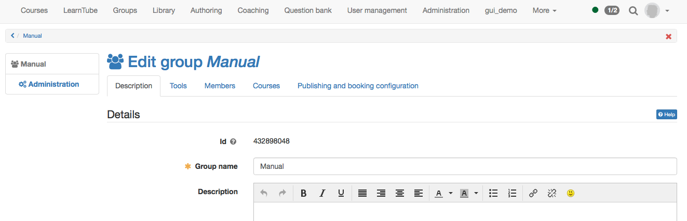
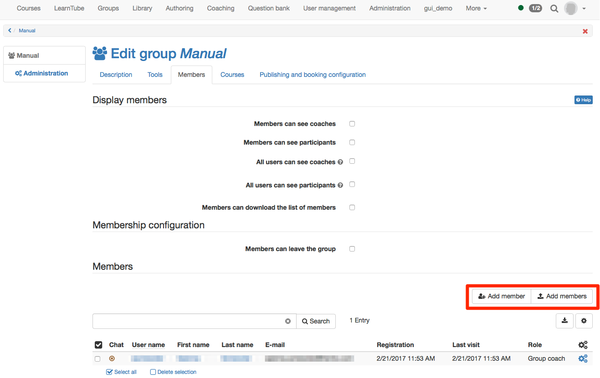
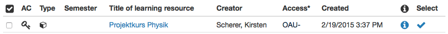

# Group Administration

If you create a new group you are automatically coach of this group. Coaches
of a group get the link "Administration" in the menu in the group. You can
manage the group, but also announce users to coaches, delete groups and
configure some more settings.

## Description

Under the tab "Description" you can change the group name, add a description,
read out the link to the group, limit the number of group participants and
activate a waiting list, if required.

## Configuring Tools of Groups

In the tab Tools the group can be provided by collaborative tools. At a later
point the tools can be edited or removed here.

  

In order for the tools to be available in groups, they must be activated by
the OpenOlat administrator. This is especially true for BigBlueButton,
OpenMeetings, Wiki, Calendar. If certain tools are not available to you as a
group owner, they have been deactivated by the OpenOlat administrator.

The following tools are available for group use. Once a tool is activated, its
corresponding icon will be visible in the group menu on the left.

| Information| If the tool "Information" is activated it can be defined, if
only group coaches also group participants can create messages. The own
created messages can be edited always. As group coach all messages can be
edited and deleted.  
---|---|---  
  

| E-Mail| If the tool "E-mail" is activated, non-members of a group are able
to use the mail function and contact group coaches and/or participants. E-Mail
can thus also be sent out of the members list.  
  

| Calendar| You can put a calendar at the disposal of your group to record
joint events. Furthermore you can determine the calendar's write access, that
is, who will have the right to record data. Further information on calendar
functions can be found in the [calendar](../personal/Calendar.md) chapter.  
  

| Folder| You enable members of your group to exchange files by using a
folder. The available storage capacity is 10 MB. Furthermore you can determine
the folder's write access, that is, who will have the right to record files.
Further information to the folder can be found [here](../personal/Personal_folders.md).  
  

| Forum| You provide your group with a forum for discussions. As coach of a
group you have the right to edit and delete contributions as well as to write
new ones. Participants of a group can write contributions, however, they are
not allowed to neither edit nor delete contributions of others. For more info
on working with forums, click [here](../learning_activities/Working_with_Forums.md).  
  

| Chat| You can provide this group with a private chat room. You will see who
else is present in the group chat. Enter the chat room to communicate with
others in real time.  
  

| Wiki| You can put a Wiki at the disposal of your group to jointly create
learning content. You can find more info on working with wikis
[here](https://confluence.openolat.org/display/OO151EN/Working+with+Wiki).  
  

| ePortfolio| You can provide this group with a Portfolio 2.0. Use a portfolio
to jointly create a binder or add entries.  
  

| OpenMeetings| If you activated and saved OpenMeetings, a virtual classroom
is at the group's disposal.  
  

| BigBlueButton|

Once BigBlueButton has been activated and saved, the group has access to a
virtual meeting room or virtual classroom. The group administrator can
configure whether only the group administrators or all members can create and
manage appointments.

In the group, only the BigBlueButton templates generally activated for groups
are available. These may differ from the room templates in courses.

If a group member is a coach, course owner, author or administrator in the
OpenOlat system, other BigBlueButton room templates may be available to
him/her.

The functionality of BigBlueButton is described in the [course element

sites/manual_user/docs/groups/Group_Administration.md §Course_element_BigBlueButton.md§ 481
BigBlueButton](../course_elements/Course_element_BigBlueButton.md).  
  
Each tool can only be used once in a group. It is therefore not possible to
e.g. provide your members with more than one folder. If you want to work with
more than one forum or Wiki or if you want to provide documents in more than

sites/manual_user/docs/groups/Group_Administration.md §Types_of_Course_Element.md§ 481
one folder it is better to use [course elements](Types+of+Course+Element.html)
instead. Link one or more courses to the group, and configure the courses or
the course elements to be only visible or accessible to the respective group.

  

## Managing Members of Groups

In the tab "Members" you determine whom the members are allowed to see, the
coaches and/or participants. With the option "Alls users can see coaches" and
"All users can see participants" the list of group members can be activated
for all system users in on the visiting card, visible public. If the waiting
list is activated, it can be defined if it should be visible for members or
all users.

The option "Users can download the list of members" additionally allows
participants to download the list of members as excel file and to print it.

If you enable the option "Members can leave the group" in the **Membership
configuration** , group participants are allowed to leave the group on their
own volition. If not checked, you will be notified via mail if a member wishes
to leave the group. The participant must then be removed manually from the
group.

You can also add more group Members.

There are two different ways to allocate members to a group:

  1. OpenOlat users enroll on their own.
  2. The course owner or group coach allocates members to groups.

 **OpenOlat users enroll on their own**

To enable users to enroll themselves, the group must either be published, or
accessible through the course element "Enrollment". Public groups are suited
for projects or course independent trainings. The first option is suitable for
groups with many participants, for participants you do not know yet or for
participants who should decide on their own in which group or topic they want
to register (e.g. when assigning tasks to be performed in groups). When
configuring the course element, please determine in which group(s) your
participants should be able to register. For more information about publishing
groups, please refer to the section "Publishing and booking configuration".

 **The course owner or group coach allocates members to groups**

The second option is suitable for participants you already know to which
groups they belong to and if you want to make sure that only those will be
able to register who qualify for your group.

Participants are added in the lower section of the Members tab in the group
administration. You can either search for members and upload them or import
them. The users can either be added as participants or coaches.

  *  **Coach:** Has access to the group administration settings. Here it is possible to add or remove participants and provide collaborative tools to the group. Group coaches can also delete a group. If the group is linked to a course a coach has additional access to the assessment tool as well as the test statistics of the own group.
  *  **Participant:**  Uses the collaborative tools of a group.

The classic role of a tutor can be represented in OpenOlat by means of those
coach rights mentioned above.

When clicking on the icon "Download table" (below the button "Add users") an
excel file containing all owners or participants of a group will be generated.

## Courses

A group can be linked to several courses, and a a course may have several
embedded groups. OpenOlat does not restrict the number of embedded courses.

Groups are often used in courses for controlled enrollment, for the assignment
of papers or to register for field trips. Groups and courses can be linked in
two ways:

  * In the group, under the tab "Courses" in the group administration. Here you can determine whether a group is connected to one or multiple courses. Clicking on "Add course" allows you to link as many courses you are owner of with the group. Just click on the course name or the checkmark under " _Select_ " to the right of the course name. A click on the  icon provides you with further information on the course, such as author, language or the description. Use the button " **Add course** " at the end of the table in order to embed several courses at once.  
  
  

  * In the course members management as well as in the editor view of individual course elements: You can either use the button "Create Group" to create a new linked group, or add an already existing group you own via the button "Add group". If you are in the editor view on course element level, you can also create new groups under the access and visibility tabs. The same goes for learning areas.

## Publishing and booking configuration

In the tab "Publishing and booking configuration" you configure the access
control for that specific group. This is especially important, if a group is
used independently from a course. If the group is linked to a course there is
no need to set up this tab. Booking can be understood as a synonym of
register, enroll or buying.

With the help of a booking method OpenOlat users can register themselves to a
group. The following options are available under "Add booking method":

  

  *  **  Access code**: Select the access code booking methods if the booking shall be restricted to people in possession of the access code. An access code is manually set by the coach of the group, who then passes the code on to authorized users. Only users who can provide this access code will be able to book the resource. In order to open the group, this code must be entered when opening the group for the first time.
  *  **  Freely available:** Select the free booking method if no other restrictions shall apply. All users can book the resource. Using this booking method adds users as participants to the group.
  *  **  PayPal and Credit card** (only available if unlocked by an administrator): Selecting the PayPal/Credit card payment method requires a financial payment to access the resource. When using this booking method you can define an amount of money required to be payed in the currency defined in the system configuration. This amount can then be payed by either a PayPal account or by using a credit card (Visa/Mastercard). The waiting list cannot be combined with this booking method. The options "waiting list" respectively "PayPal and Credit Card" will not appear in the group administration if the respective other is selected.

Once a booking method is configured, the group will be listed in the
"Published groups" and can thus be searched and booked by users. If no booking
method is configured the group is only available for registered users, which
has been added to the group by a coach under the tab "members".

You can also configure multiple booking methods. These methods serve as
different options the users can choose from. Optionally you can configure a
start and end date in order to add a validity period date to each booking
method. In that case the booking method is only available during this period.
It is also possible to specify just a start or just an end time. If you don't
want to restrict the booking method to a specified period just leave the
fields empty.

The start and end date is only valid for the booking process. Once a resource
has been booked by a user he will be added to the resource members list. From
that moment the members list grants access to the user. When a booking method
is no longer valid or has been deleted users on the members list will still
have access to the resource. As an owner of the resource you can add or remove
users to/from the resource members list at any time. In the latter case the
user can register again for the resource as a participant by booking again.

You can delete configured booking methods at any time. The already booked
orders will not be affected by this.

  

