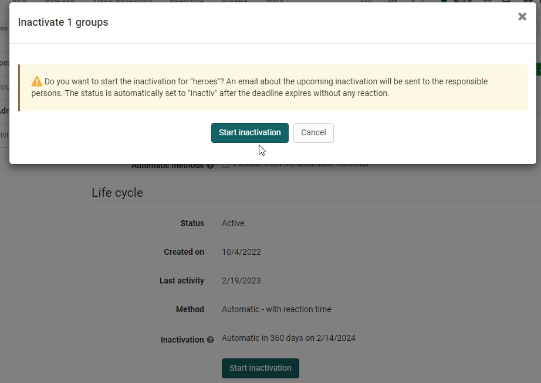

# Group Administration

If you create a new group you are automatically coach of this group. Coaches of a group get the link "**Administration**" in the menu of the group. 

{ class="shadow lightbox"}

Via the displayed tabs you can:

  * Provide tools to the group members,
  * manage members,
  * Assign the group to courses,
  * configure access to the group and
  * set the group inactive.

As a group coach, you can make [general settings](../area_modules/Group_Management.md) and delete the group.

The individual tabs of the administration of groups are explained below.  

## Tab Description

Under the tab "Description" you can

* change the group name,
* add a description,
* read out the link to the group
* limit the number of group participants and
* activate a waiting list, if required. 

You have already made these settings during creation.

## Tab Tools  {: #tools}

In the tab Tools the group can be provided by collaborative tools. 
Once a tool is activated, its
corresponding icon will be visible in the group menu on the left.

!!! Info  

    In order for the tools to be available in groups, they must be activated by the OpenOlat administrator. This is especially true for BigBlueButton, MS Teams OpenMeetings, Wikis and Calendars. If certain tools are not available to you as a group owner, they have been deactivated by the OpenOlat administrator.

The following tools are available for group use. 

Tool | | Description
---|---|---
:fontawesome-solid-circle-info: | Information to members| If the tool "Information" is activated, you can define if only group coaches or group members can create messages. Own messages can always be edited. As a group owner, all messages can be edited and deleted.  
:fontawesome-regular-envelope:| E-Mail| If the "E-Mail" tool is enabled, non-members can access the e-mail functionality and send messages to group members (coaches, participants or all members).  
:fontawesome-solid-calendar-days: | Calendar| You can provide the group with a calendar where you can enter common dates. Once the calendar is activated and saved, you can configure the write permissions for it, i.e. specify who can enter appointments. For more general information about calendar functions, see [Calendar](../personal_menu/Calendar.md).  
:fontawesome-regular-folder: | Folder| With a folder you enable the exchange of files between the members of your group. Joint editing of office documents is also possible, depending on the configuration by the OpenOlat administrator. Once the folder is activated and saved, you can configure the write permissions for it, i.e. define who can upload and create files.   
:fontawesome-brands-rocketchat:| Forum| Here you provide your group with a forum for discussions. As the group's coach, you have the right to edit and delete posts as well as create new ones.  
:fontawesome-solid-comment-sms: | Chat| You can provide a chat room for the group. You can see which other members are in the group chat.  
:fontawesome-solid-globe: | Wiki| You can provide a wiki for the group to create content together. Further information about working with wikis can be found [here](../learningresources/Course_Element_Wiki.md)
:octicons-briefcase-24: | Portfolio| You can provide a [portfolio](../area_modules/Portfolio_General_Information.md) 2.0 to the group. However, it is not an assessment portfolio.  
:material-monitor: | OpenMeetings| When OpenMeetings is enabled and saved, a virtual meeting room or classroom is available to the group. Further information about OpenMeetings can be found [here](../learningresources/Course_Element_OpenMeetings.md)
:material-monitor: | BigBlueButton| By selecting BigBlueButton, multiple BigBlueButton rooms can be made available to a group. The functionality is similar to the corresponding [course element BigBlueButton](../learningresources/Course_Element_BigBlueButton.md). In the group, only the BigBlueButton templates generally activated for groups are available. These may differ from the room templates in courses. If a group member is a coach, course owner, author or administrator in the OpenOlat system, additional BigBlueButton room templates may be available to them.  
:material-monitor: | Microsoft Teams| By choosing Microsoft Teams, multiple rooms can be made available to a group. Further information about MS Teams can be found [here](../learningresources/Course_Element_Microsoft_Teams.md)
  
Each tool can only be used once in a group. It is therefore not possible to e.g. provide your members with more than one folder, wiki or forum elements. If you need more tools of said elements, it is better to use an OpenOlat course instead.

Information about the usage of tools of group participants can be found [here](Using_Group_Tools.md).

## Tab Members  {: #members}

In this tab, people can be added to the group and the members can be managed.

The manual addition of members by the group coach makes sense, for example, if you want to add specific individuals to your group.

**Who sees what?**

If the setting "Members see coaches" or "Members see participants" is activated, the **menu "Members"** appears in the left navigation. Depending on the activated hook, the members will then see the corresponding people.

With the option "All users can see coaches" and "All users can see participants" the list of group members can be activated for all system users in on the **visiting card, visible to the public**. If the waiting list is activated, it can be defined if it should be visible for members or all users.

The option "Users can download the list of members" additionally allows participants to download the **list of members as excel file** and to print it.

If you enable the option "**Members can leave the group**", participants can leave the group directly in the group overview. If not checked, you will be notified via mail if a member wishes
to leave the group. The participant must then be removed manually from the group.

**Add, delete and display members**

In the tab "Members", people of the group as well as group participants can be added as group owners. External members (people without an OpenOlat account) can be invited as well.

What differentiates group coaches from group participants?

  *  **Coach:** You have access to the group administration settings and can make all the previously mentioned settings. Group coaches can also delete a group. If the group is linked to a course, group coaches in the course also have access to the assessment tool and test statistics of their own group. They can perform other actions released for coaches, but only with reference to their group.
  *  **Participant:**  Uses the collaborative tools of a group and act within the framework of the settings configured by the coach.

Via "Add member" you can search for individual persons or add several persons directly to the group if you know their login name, e-mail or institution number.

When clicking on the icon "Download table" an excel file containing all owners or participants of a group will be generated.

**Add external members**

If your OpenOlat administrator has made it possible to invite external users as group members, you can change this under 
**Groups > Select group > Administration > Tab Members > Button "Invite external members"**

    
Screen

	

## Tab Courses {: #courses}

This tab is available only if the group is associated with one or more courses or the group owner has author rights.

If you select "Add course", an overview of all courses available to you as a group supervisor will appear. Only courses for which you are registered as the owner can be connected.

To select a course, highlight it, click on the title or click on the check mark in the "_Select_" column. A click on the :octicons-info-16: icon provides you with further information on the course, such as author, language or the description. 

OpenOlat authors can also create or import new courses to be linked in this area.

Course owners can link groups to several courses, and a course may have several embedded groups. OpenOlat does not restrict the number of embedded courses.

Groups are used in courses in a wide variety of ways e.g. for controlled enrollment for cooperative activities, for the assignment of papers, the enrollment for registration for excursions but also for rights management within courses.

Groups and courses can be linked in two ways: In the group, under the tab "Courses" in the group administrationor starting from the course via the "[Members management](../learningresources/Members_management.md)" → "Groups"
 

### Tab Share {: #booking}

In addition to adding people manually by the group coach, a group booking (offer) can also be created for groups. This way, interested parties can sign up for the group themselves.

The following options are available:

  * :material-key-variant: **Access code**: Select the "access code" booking methods if the booking shall be restricted to people in possession of the access code. An access code is manually set by the owner of the group, who then passes the code on to authorized users. Only users who can provide this access code will be able to book the resource. In order to open the group, this code must be entered when opening the group for the first time. It is also possible to define a time limit for booking with the access code.
  * :material-gift: **Freely available:** Select the free booking method if no other restrictions shall apply. All users can book the resource. Using this booking method adds users as participants to the group. However, it is also possible to limit the free access in time.
  * :fontawesome-brands-cc-paypal: **PayPal Checkout** (only available if unlocked by an administrator): Select this booking method to enable booking for financial compensation. This booking method allows you to define an amount that must be paid with a PayPal account or with a credit card (Visa/Mastercard). The waiting list cannot be combined with this booking method. The options "waiting list" respectively "PayPal" will not appear in the group administration if the respective other is selected.

Once a booking method is configured, the group will be listed in the "**Published groups**" and can thus be searched and booked by users. If no booking method is configured the group is only available for registered users, which has been added to the group by a coach under the tab "members".

You can also configure multiple booking methods. These methods serve as different options the users can choose from.  For example, you could set up the access for 2 days "freely available" and then only with password or payment option. If the configured offers overlap, interested parties can choose the option. Under "Edit" you can change the configuration of the offers again at any time.

Once a resource has been booked by a user he/she will be added to the resource members list. From that moment on, the system decides whether a person has access to the group solely on the basis of the list of participants. Expired booking configurations therefore have no influence on a participation.

If you delete people from the group manually, they can gain access to the group again by booking again, provided that a suitable offer still exists.

!!! info "Hint"

    Delete offers that are no longer needed or configure them with a deadline. The bookings already made remain valid and are not affected by this.

Public groups with various access options are particularly suitable, especially when:

* Projects or course-independent training can be offered 
* You use the group to collect people you want to assign to a course later on
* the number of participants is limited and the organization of the participants should be done through this group (also with automatic moving up)

### Tab Group Life Cycle

The status of the group and other information are displayed here. Furthermore, the status can be changed, e.g. an active group can be set inactive or an inactive group can be deleted or reactivated. Also, the group can be excluded from the automatic group life cycle, e.g. if it is an important group that must remain permanently present.

{ class="shadow lightbox" }

For more information, see the separate chapter [Automatic group life cycle](https://docs.openolat.org/manual_admin/administration/Automatic_Group_Lifecycle/?h=automa) in the Administration Manual.
