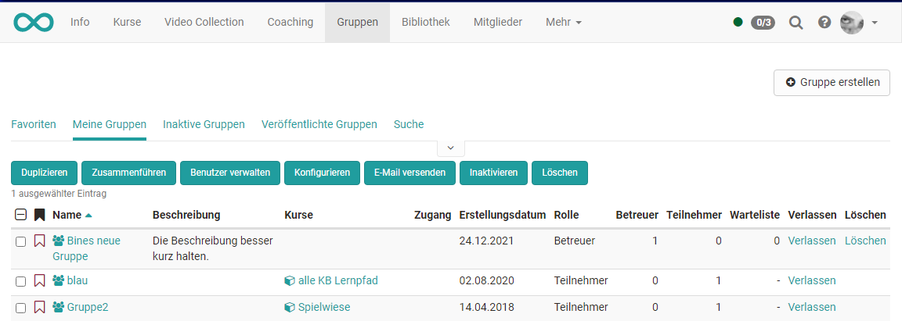
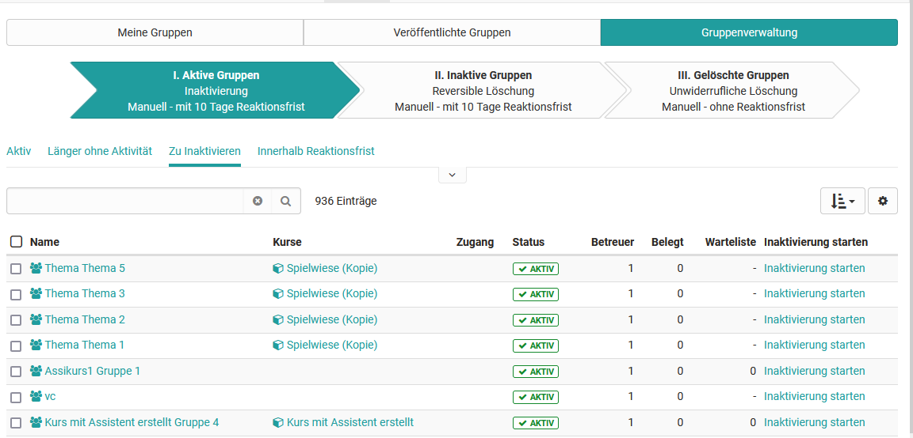

# Gruppenverwaltung

## Meine Gruppen

{ class="shadow lightbox" }

Nach Auswahl einer oder mehrerer Gruppen können Sie folgende Aktionen
ausführen:

  *  **Duplizieren** : Das duplizieren von Gruppen erspart Ihnen die einzelne manuelle Konfiguration der kollaborativen Werkzeuge, wenn diese in allen Gruppen identisch sein soll.
  *  **Zusammenführen** : Ausgewählte Gruppen werden zu einer Gruppe zusammengeführt, nachdem die Zielgruppe im Wizard ausgewählt wurde. Dazu müssen mindestens 2 Gruppen ausgewählt werden.
  *  **Benutzer verwalten** : Für die ausgewählten Gruppen können bereits eingeschriebene Mitglieder aus der Gruppe entfernt werden, neue Benutzer als Betreuer oder Teilnehmer hinzugefügt oder auf die Warteliste gesetzt werden.
  *  **Konfigurieren** : Legen Sie für die ausgewählten Gruppen fest, welche Werkzeuge in der Gruppe verwendet werden. In einem nächsten Schritt können Sie noch Kurse in die Gruppen einbinden.
  *  **E-Mail versenden:** Versenden Sie Emails auf diese Weise an mehrere Gruppen gleichzeitig.
  *  **Inaktivieren** : Die Gruppe erhält den Status "inaktiv"
  *  **Löschen** : Als Betreuer können Sie alle von Ihnen betreuten Gruppen löschen.

!!! hint
	Damit Sie die entsprechenden Optionen sehen und nutzen können, müssen Sie mindestens eine Gruppe ausgewählt haben und Betreuer der Gruppe sein.

##  Veröffentlichte Gruppen

Eine Liste aller veröffentlichten Gruppen finden Sie im Tab „Veröffentlichte
Gruppen“. Alle Gruppen, die mit einer Buchungsmethode veröffentlicht wurden,
können hier eingesehen und ausgewählt werden. Die Tabelle gewährt eine
Übersicht über die Anzahl freier Plätze, die Art der Buchungsmethode und,
soweit festgelegt, die Buchungskosten. Gruppen können direkt aus der Tabelle
heraus mit einem Klick auf die Links „Beitreten“ oder „Warteliste eintragen“
belegt werden.

## Gruppenverwaltung für Gruppenverwalter

Benutzer mit der Rolle Gruppenverwalter sehen zusätzlich noch den Tab
„Gruppenverwaltung“. Gruppenverwalter sehen alle veröffentlichten und privaten
Gruppen, und können diese im selben Umfang verwalten wie ein Gruppenbetreuer
seine Gruppen. Weitere Informationen dazu unter „Meine Gruppen“. Der
Gruppenverwalter kann zudem Gruppen ohne Mitglieder und Kursanbindung finden
und löschen.

{ class="shadow lightbox" }

