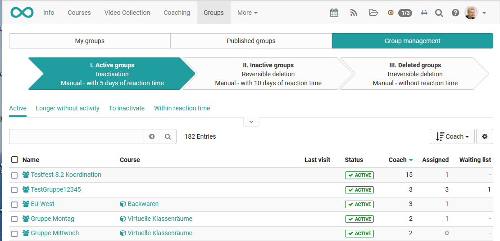

# Group Management

## My groups

Under "Groups" in the top main navigation you will see in the tab "My groups"
all groups you have enrolled in. There you can leave a group and delete those
groups you have created by yourself or have been nominated as co-owner. If a
group is deleted which is connected to a course, only the group is deleted,
but not the course.

After selecting at least one group in the table column on the left, you can
perform the following actions below the table:

  * Duplicate: Copying groups will spare you the individual manual configuration of collaborative tools if those are identical in all of your groups.
  * Merge: Selected groups are merged into one single group, after selecting the target group in the wizard.
  * Manage members: This allows you to collectively remove enrolled members from groups, add new users as either coach, participant or put them on the waiting list.
  * Configure: Define which collaborative tools should be available for all selected groups. The next wizard step allows you to link one or more courses to the groups.
  * Send E-mail: Send E-mails to multiple groups simultaneously.
  * Delete: Coaches are able to delete all the groups they supervise.

In order to see and use the corresponding options, you must have at least one
group selected.

## Published Groups

A table overview of all published groups are available in the tab "Published
groups". All groups with at least one defined booking method can be viewed and
selected here. The table provides an overview of the number of free slots, the
type of booking method used and, where specified, the booking costs. Book or
enter a group directly by clicking either the links "Book" or "Add to waiting
list".

## Group Management

Users with the group management role see the additional tab "Group
management". Group managers are able to view all published as well as private
groups, and are eligible to manage them to the same extent as group coaches.
Please refer to the section "Manage Groups" for more information". In
addition, a group manager can find and manage so-called "Orphans", groups
without members and linked resources.

