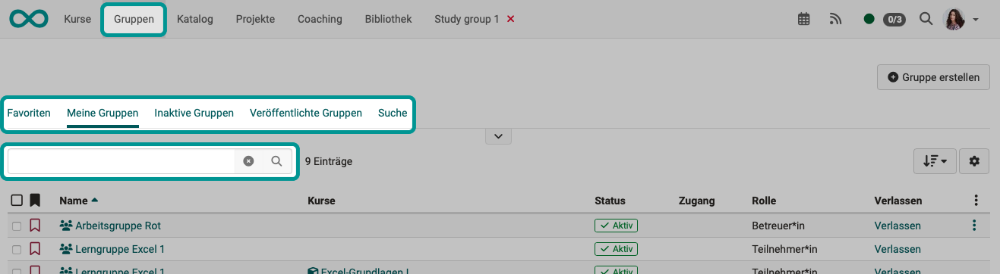
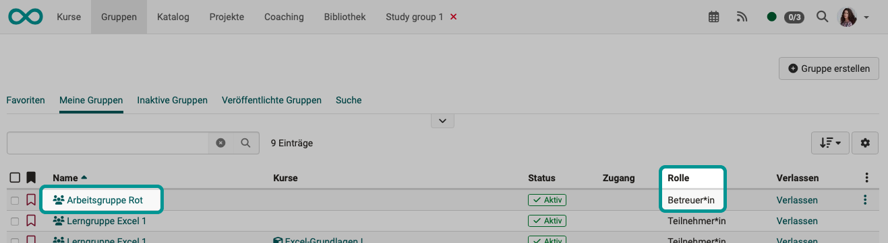
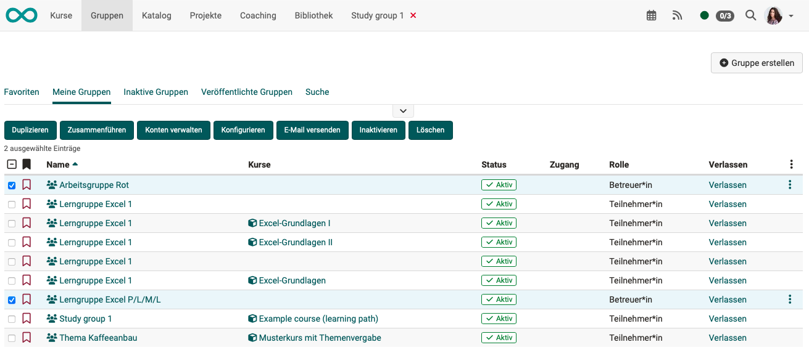
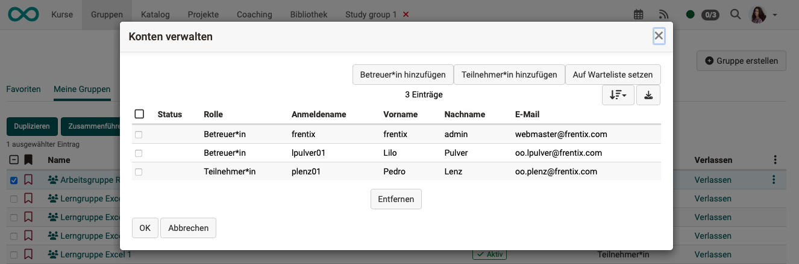
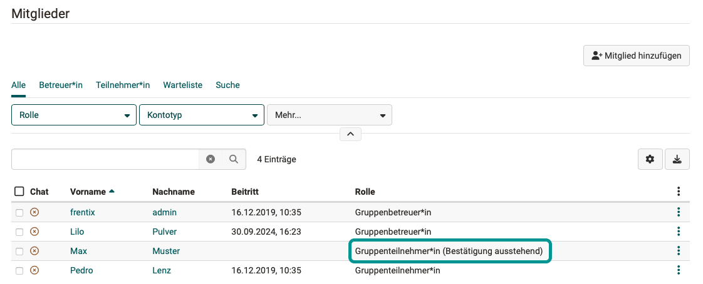
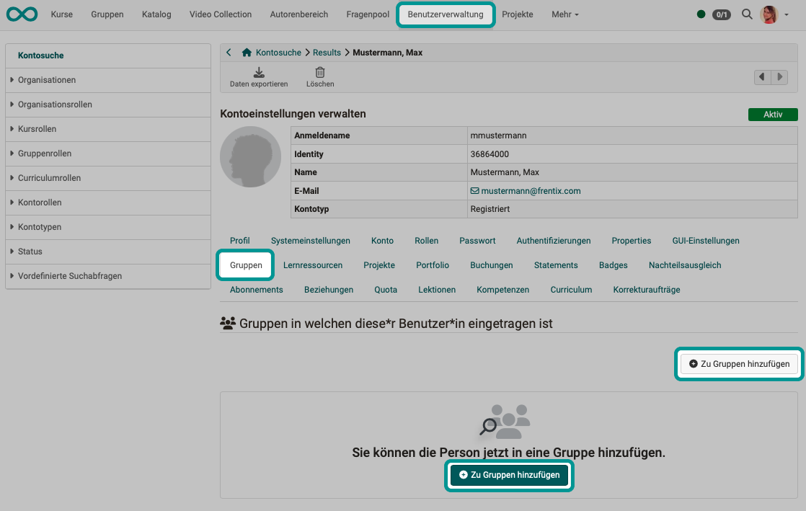
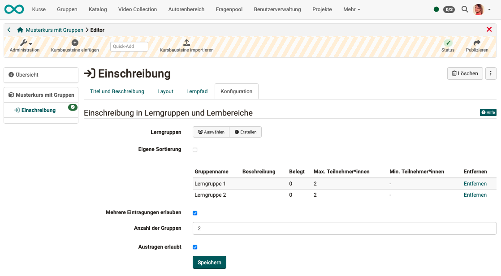
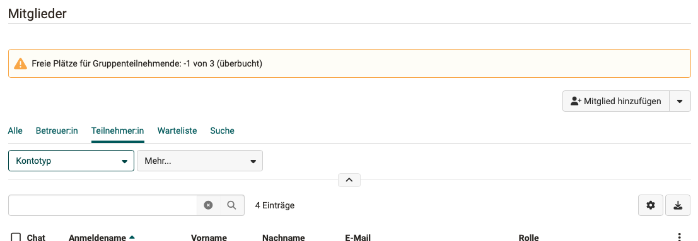
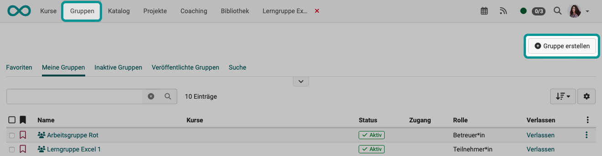

# Gruppenmitglied werden {: #group_membership}

Es gibt in OpenOlat grundsätzlich 3 Möglichkeiten um Gruppenmitglied zu werden:

* Sie können von Betreuer:innen und anderen Berechtigten in eine OpenOlat-Gruppe eingeladen und zum Mitglied gemacht werden,
* Ihre Gruppenmitgliedschaft kann automatisch erstellt werden
* oder Sie können sich selbst als Gruppenmitglied eintragen.

Auf welche Art Sie Gruppenmitglied werden können, hängt davon ab, um welche Gruppe es sich handelt und wie die Gruppe vom Ersteller/der Erstellerin konfiguriert ist.

---

## Durch Andere zum Gruppenmitglied werden

### Wer kann jemand zum Gruppenmitglied machen? 
 
* Gruppenbetreuer:innen (Dies wird man automatisch, wenn man eine Gruppe erstellt, oder die Rolle wird einem zugewiesen.)
* Benutzerverwalter:innen
* weitere administrative Rollen (Administrator:innen u.a.)

[Zum Seitenanfang ^](#group_membership)

### Wie können Gruppenbetreuer:innen jemand zum Gruppenmitglied machen? {: #add_groupmember}

**Schritt 1:** 
Navigieren Sie via Hauptmenü zur gewünschten Gruppe. Verwenden Sie die Suche oder die Tabs mit vorsortierten Listen der bestehenden Gruppen.

{ class="shadow lightbox" }

**Schritt 2:** 
Wählen Sie durch Klick auf den Gruppennamen die Gruppe aus, der ein Mitglied hinzugefügt werden soll. Achten Sie darauf, dass Sie Gruppenbetreuer:in dieser Gruppe sind, sonst steht Ihnen die Option "Administration" im nächsten Schritt nicht zur Verfügung. 

{ class="shadow lightbox" }

**Schritt 3:** 
Wählen Sie links "Administration" und dann den Tab "Mitglieder". Dort finden Sie den Button "Mitglied hinzufügen". 

{ class="shadow lightbox" }

[Zum Seitenanfang ^](#group_membership)

---

### Wie macht man jemand gleichzeitig in mehreren Gruppen zum Gruppenmitglied? {: #add_several_groupmembers}

**Schritt 1:** 
Navigieren Sie via Hauptmenü zur gewünschten Gruppe.

**Schritt 2:** 
Markieren Sie die Checkboxen vor allen Gruppen, denen die Person hinzugefügt werden soll. Achten Sie darauf, dass Sie selbst in allen selektierten Gruppen als Betreuer:in Mitglied sind.

{ class="shadow lightbox" }

**Schritt 3:** 
Sobald mindestens eine Checkbox markiert ist, erscheint u.a. der Button "Konten verwalten" über der Liste. Klicken Sie diesen Button, öffnet sich ein Popup, in dem die Mitglieder aller selektierten Gruppen gemeinsam aufgeführt sind. Mit den beiden Buttons fügen Sie weitere Teilnehmer:innen und Betreuer:innen zu allen selektierten Gruppen hinzu.

{ class="shadow lightbox" }

**Schritt 4:** 
Die Gruppenmitgliedschaft so gleichzeitig mehrfach hinzugefügter Mitglieder muss evtl. noch bestätigt werden. Wenn Sie in der Mitgliederverwaltung in einem der Kurse nachsehen, finden Sie ggf. einen entsprechenden Hinweis. Ob eine solche Bestätigung durch die neuen Gruppenmitglieder erforderlich ist, kann durch Administrator:innen vorgegeben werden.

{ class="shadow lightbox" }

[Zum Seitenanfang ^](#group_membership)

---

### Gruppenmitgliedschaft in der Benutzerverwaltung hinzufügen

Haben Sie die Berechtigung zur Benutzerverwaltung, können Sie auch dort in einem Tab die vorhandenen Gruppenmitgliedschaften einsehen und neue hinzufügen. 

{ class="shadow lightbox" }

[Zum Seitenanfang ^](#group_membership)

---

## Automatisch erstellte Gruppenmitgliedschaften

Werden in einem anderen System (z.B. einer HR-Software) bereits bestimmte Personen in Gruppen zusammengefasst, können diese Gruppenmitgliedschaften auch in OpenOlat abgebildet werden. Dazu benötigt es allerdings eine Middleware (Syncher), die dann automatisiert Benutzer:innen bestimmten OpenOlat-Gruppen zuordnen kann.

Bei Fragen zu automatisch zugewiesener Gruppenmitgliedschaft wenden Sie sich bitte an frentix.

[Zum Seitenanfang ^](#group_membership)

---

## Sich selbst als Gruppenmitglied eintragen

!!! warning "Attention"

    This article is still under construction.

### Gruppen im Kursbaustein "Einschreibung"

Wird von Autor:innen der [Kursbaustein "Einschreibung" ](../learningresources/Course_Element_Enrolment.de.md) verwendet, können dort Lerngruppen angelegt werden, die zunächst noch ohne Teilnehmer:innen sind. Diese können sich dann bei aktivem Kurs selbst in eine (oder mehrere) der angebotenen Gruppen als Mitglied eintragen.

{ class="shadow lightbox" }

[Zum Seitenanfang ^](#group_membership)

---

### Angebot

Gruppen werden in mancher Hinsicht wie Lernressourcen behandelt. Auch für Gruppen kann ein Angebot erstellt werden unter **Gruppe > Administration > Tab Freigabe**.

Zugangscode oder Frei verfügbar

Wo finden TN Angebote für Gruppen?

Angebote für Gruppen nutzen

[Zum Seitenanfang ^](#group_membership)

---

### Überbuchung

Wurde die Gruppengrösse begrenzt, können Teilnehmer:innen, die sich in eine Gruppe eintragen wollen, in der schon alle Plätze besetzt sind, auf eine Warteliste genommen werden. (Siehe [Gruppen erstellen >](Create_Groups.de.md#vorgesehene-anzahl-teilnehmende))

Bei Überbuchung erscheinen entsprechende Hinweise, z.B.:

{ class="shadow lightbox" }

[Zum Seitenanfang ^](#group_membership)

---

## Selbst eine neue Gruppe gründen

### Wer kann selbst eine Gruppe erstellen?

Administrator:innen können in **Administration > Module > Gruppen** systemweit festlegen, ob das Erstellen neuer Gruppen für Kursautor:innen und/oder auch Teilnehmer:innen erlaubt ist.

### Gruppe erstellen

Ist diese Erlaubnis für Sie erteilt, finden Sie unter dem Menüpunkt "Gruppen" im Hauptmenü auch den Button "Gruppe erstellen". 
[Mehr zum Erstellen von Gruppen >](Create_Groups.de.md)

{ class="shadow lightbox" }

### Meiner Gruppe Mitglieder hinzufügen

Wird eine Gruppe durch Sie erstellt, werden Sie automatisch Gruppenbetreuer:in. In dieser Rolle erhalten Sie für Ihre Gruppe die Menüoption "Administration". Dort können Sie im Tab "Mitglieder" weitere Personen hinzufügen (zu Gruppenmitgliedern machen) und Rechte der Gruppenmitglieder konfigurieren. 

[Siehe oben "Wie können Gruppenbetreuer:innen jemand zum Gruppenmitglied machen?" ^](#add_groupmember)

[Zum Seitenanfang ^](#group_membership)

---

## Weitere Informationen

[Gruppe erstellen >](Create_Groups.de.md) 
[Gruppenwerkzeuge nutzen >](Using_Group_Tools.de.md) 
[Gruppe verlassen > ](Leave_a_Group.de.md) 
[LTI-Zugang zu einer Gruppe konfigurieren > ](LTI_Share_groups.de.md) 
[Für Administrator:innen: Systemweite Konfiguration der Gruppen >](../../manual_admin/administration/Modules.de.md) 

[Zum Seitenanfang ^](#group_membership)