# Gruppenmitglied werden {: #group_membership}

Es gibt verschiedene Möglichkeiten, wie Personen Mitglied in einer Gruppe werden können. Dabei tauchen folgende Fragen auf:

**Wer trägt das Mitglied in die Gruppe ein?**

Möglich sind:

1)	Die Person trägt sich selbst ein 
2)	Die Gruppenbetreuer:in trägt Mitglieder ein
3)	Administrative Rollen wie Benutzerverwalter:innen oder Gruppenverwalter:innen fügen Personen hinzu
4)	Automatische Zuordnung durch ein externes System

**Wo erfolgt die Zuordnung?**

Möglich sind:

* a)	Direkt in der Gruppe 
* b)	In einem zur Gruppe zugehörigen Kurs 
* c)	In weiteren OpenOlat System-Bereichen
* d)	Ausserhalb von OpenOlat

Beide Aspekte können wie folgt miteinander kombiniert werden:

## 1a) Die Person trägt sich selbst in die konkrete Gruppe ein {: #by_yourself}

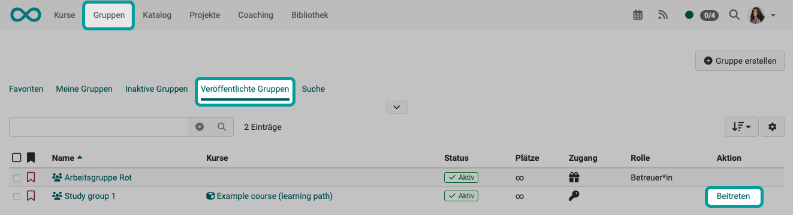{ class="shadow lightbox" }

Hierfür muss der/die Gruppenbetreuer:in direkt in der Gruppe unter `Administration > Freigabe` ein **„Angebot“** hinterlegen.

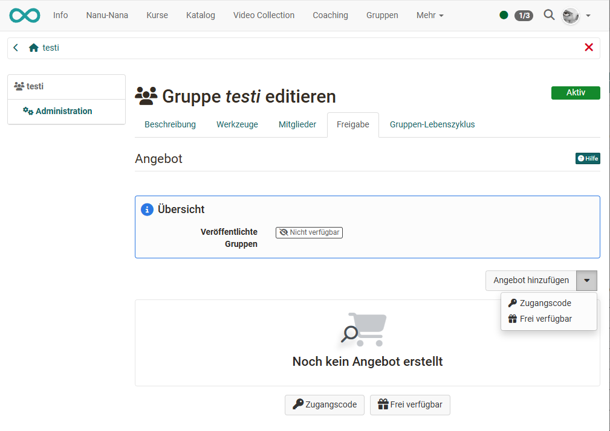{ class="shadow lightbox" }

Für das Angebot stehen mehrere Optionen zur Verfügung: 

**„Frei verfügbar“** erstellt eine Buchung ohne Passwort. Interessierte kommen nach der Buchung direkt in die Gruppe. Bei der Option **„Zugangscode“** wird ein Passwort für den Zugang hinterlegt und die Person muss bei der Buchung das zuvor mitgeteilte Passwort eingeben. Das bietet sich an, wenn nicht jeder Zugang zu einer Gruppe erhalten soll, sich die Personen aber selbst eintragen sollen. Je nach Konfiguration der Systemadministrator:innen steht auch noch die Option **„PayPal Checkout“** zur Verfügung. Mit diesem Angebot ist die Ressource mit PayPal kostenpflichtig buchbar. 

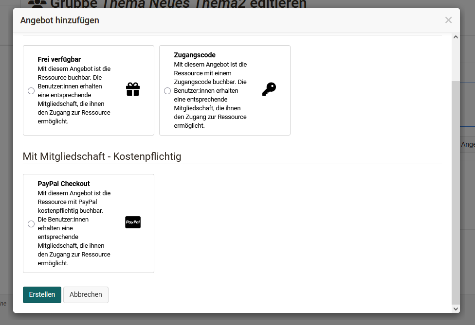{ class="shadow lightbox" }

**Wo finden Benutzer:innen Gruppen die sie buchen können?**

Gruppen mit Angeboten finden Benutzer:innen unter “Veröffentlichte Gruppen”. Mit Klick auf **“Beitreten”** kann ein Angebot gebucht werden und man wird zum Gruppenmitglied.

{ class="shadow lightbox" }

**Überbuchung** {: #overbooking}

Wird die Gruppengrösse begrenzt, können Teilnehmer:innen, die sich in eine Gruppe eintragen wollen, in der schon alle Plätze besetzt sind, auf eine Warteliste genommen werden. (Siehe [Gruppen erstellen](Create_Groups.de.md#vorgesehene-anzahl-teilnehmende)).

Bei Überbuchung erscheinen entsprechende Hinweise, z.B.:

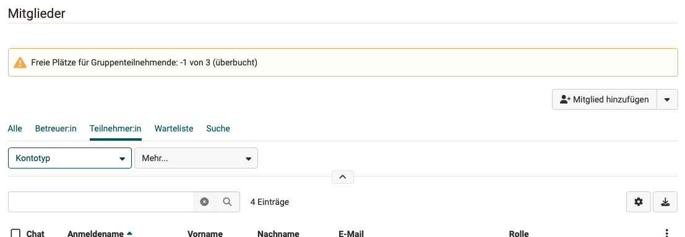{ class="shadow lightbox" }

[Zum Seitenanfang ^](#group_membership)

## 2a) Gruppenbetreuer:innen tragen Personen direkt in die Gruppe ein {: #add_groupmember}

Als Gruppenbetreuer:in wählen oder erstellen Sie die gewünschte Gruppe und gehen in den Tab „Administration“ der Gruppe. Im Tab „Mitglieder“ können dann weitere Teilnehmende und auch Betreuende hinzugefügt werden.

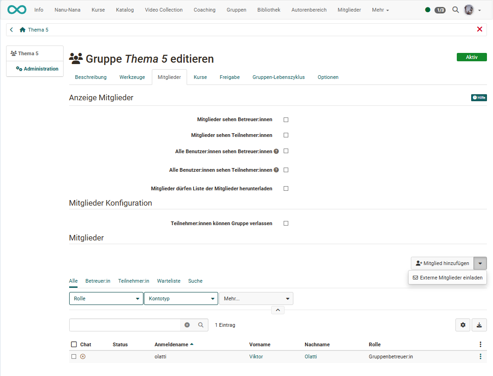{ class="shadow lightbox" }

OpenOlat Autor:innen stehen zusätzlich noch die „Massensuche“ beim Hinzufügen der Mitglieder zur Verfügung. Auf diesem Weg können rasch Personen, deren OpenOlat ID oder E-Mail-Adresse bekannt ist, direkt hinzugefügt werden.
Ferner haben Autor:innen die Möglichkeit, auch „externe Mitglieder“, die aktuell noch kein OpenOlat-Konto haben, in die Gruppe einzuladen. Hierfür müssen die konkreten E-Mail-Adressen der Personen eingetragen werden.

### Eine Person in mehrere Gruppen eintragen {: #add_several_groupmembers}

Gruppenbetreuer:innen können eine Person auch direkt in mehrere Gruppen eintragen, z.B. wenn zu einem Studiengang eine Zuordnung zu mehreren Gruppen notwendig ist. Gehen Sie dafür in den Gruppenbereich und wählen Sie alle Gruppen aus, denen die Person hinzugefügt werden soll. Voraussetzung ist, dass Sie auch Betreuer:in der jeweiligen Gruppen sind. Es erscheinen mehrere Buttons.

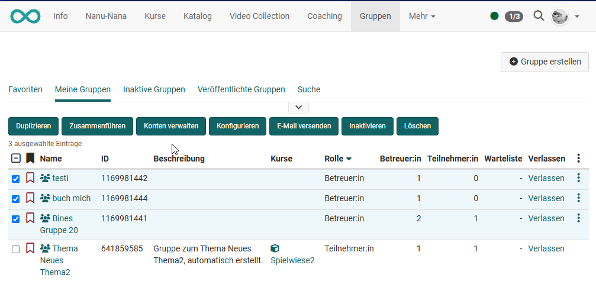{ class="shadow lightbox" }

Wählen Sie hier **„Konten verwalten“**. Es öffnet sich ein Popup-Menü, in dem die Mitglieder aller selektierten Gruppen gemeinsam aufgeführt sind. Nutzen Sie die entsprechenden Buttons, um weitere Teilnehmende oder Betreuende allen gewählten Gruppen hinzuzufügen bzw. diese auf die Warteliste zu setzen.

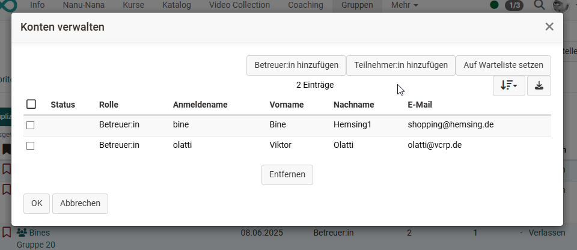{ class="shadow lightbox" }

Die Gruppenmitgliedschaft muss anschliessend evtl. noch bestätigt werden. Wenn Sie in der Mitgliederverwaltung in einem der Kurse nachsehen, finden Sie ggf. einen entsprechenden Hinweis. Ob eine solche Bestätigung durch die neuen Gruppenmitglieder erforderlich ist, kann durch Administrator:innen vorgegeben werden.
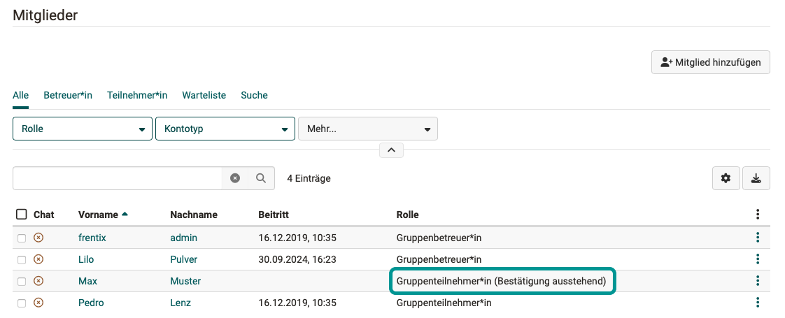{ class="shadow lightbox" }

[Zum Seitenanfang ^](#group_membership)

## 1b) Die Person trägt sich im Rahmen eines Kurses in eine Gruppe ein

Kurse und Gruppen können miteinander verbunden sein. Ist das der Fall, können sich Personen auch an bestimmten Stellen innerhalb des Kurses in eine Gruppe eintragen. 

Konkret funktioniert das über die Kursbausteine ["Einschreibung"](../learningresources/Course_Element_Enrolment.de.md) und ["Themenvergabe"](../learningresources/Course_Element_Topic_Assignment.de.md). Bei diesen Kursbausteinen wird automatisch eine OpenOlat Gruppe angelegt. Wählen Personen ein Thema oder schreiben sie sich in eine Gruppe ein, werden sie automatisch der entsprechenden Gruppe hinzugefügt.

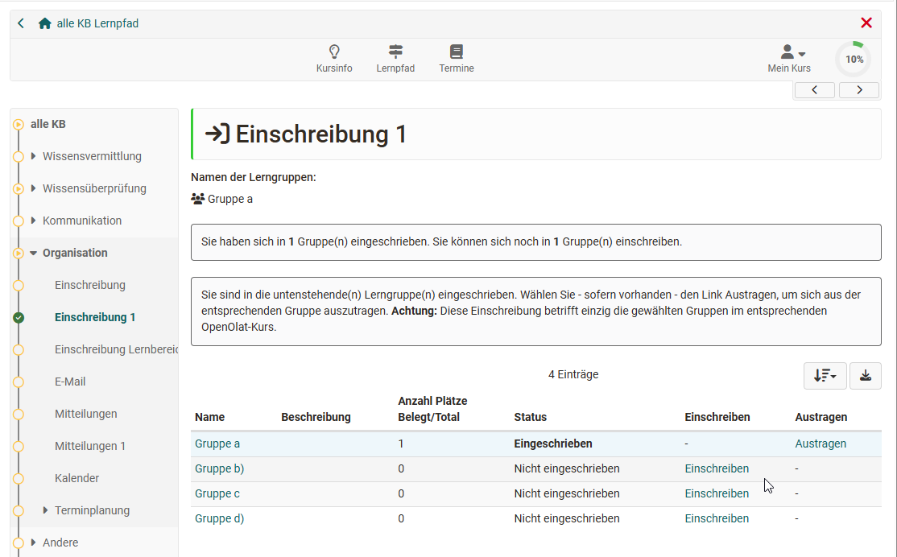{ class="shadow lightbox" }

[Zum Seitenanfang ^](#group_membership)

## 2b) Kursbesitzer:innen tragen Personen in eine kursbezogene Gruppe ein

Gruppen können auch mit Kursen verbunden sein. Ist dies der Fall, können Kursbesitzer:innen bzw. Personen mit dem Recht, die „Mitgliederverwaltung“ des Kurses zu nutzen, dort auch Gruppen erstellen und hinzufügen.

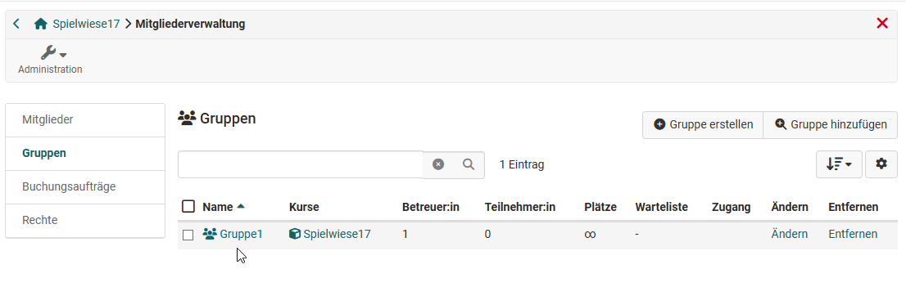{ class="shadow lightbox" }

Über den angezeigten Gruppennamen gelangt man zur Gruppe und kann dann wie unter 2a) beschrieben als Gruppenbetreuer:in Personen hinzufügen.

Eine andere Möglichkeit im Kurs ist der Weg über die Mitgliederliste des Kurses: `Mitgliederverwaltung > Mitglieder`. Hier kann man eine oder mehrere Kursmitglieder kursspezifischen Gruppen zuordnen.

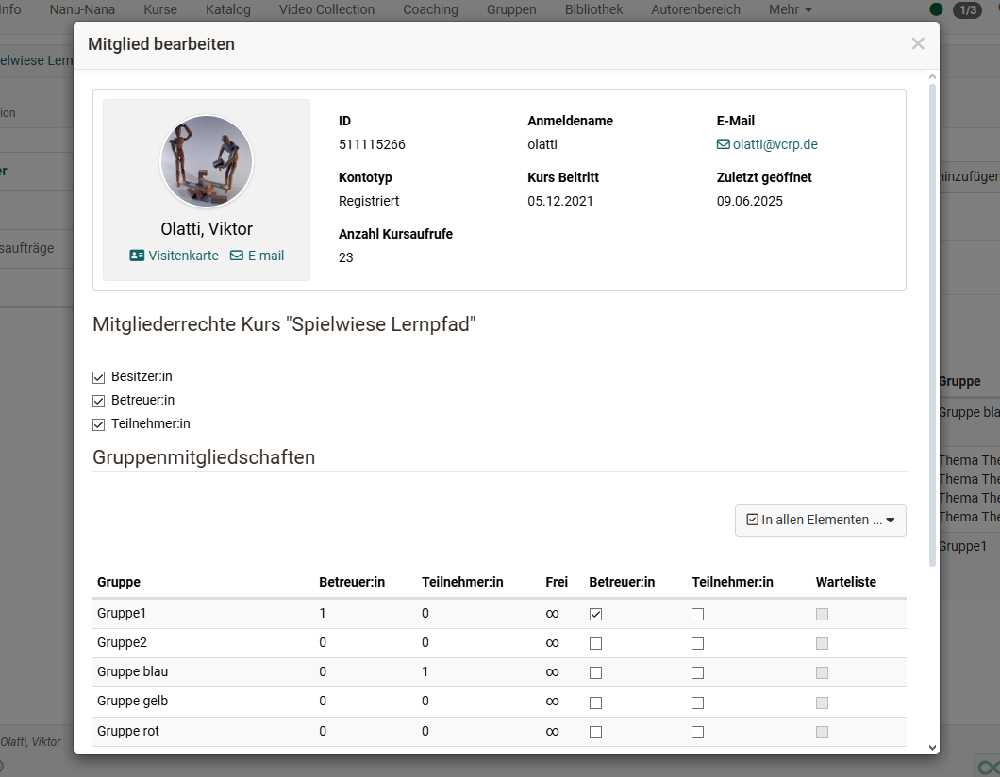{ class="shadow lightbox" }

Wählt man z.B. mehrere Kursmitglieder aus, können sie über den erscheinenden Button „Bearbeiten“ allen im Kurs zur Verfügung stehenden Gruppen als Teilnehmer:innen oder als Betreuer:innen zugeordnet werden.

{ class="shadow lightbox" }

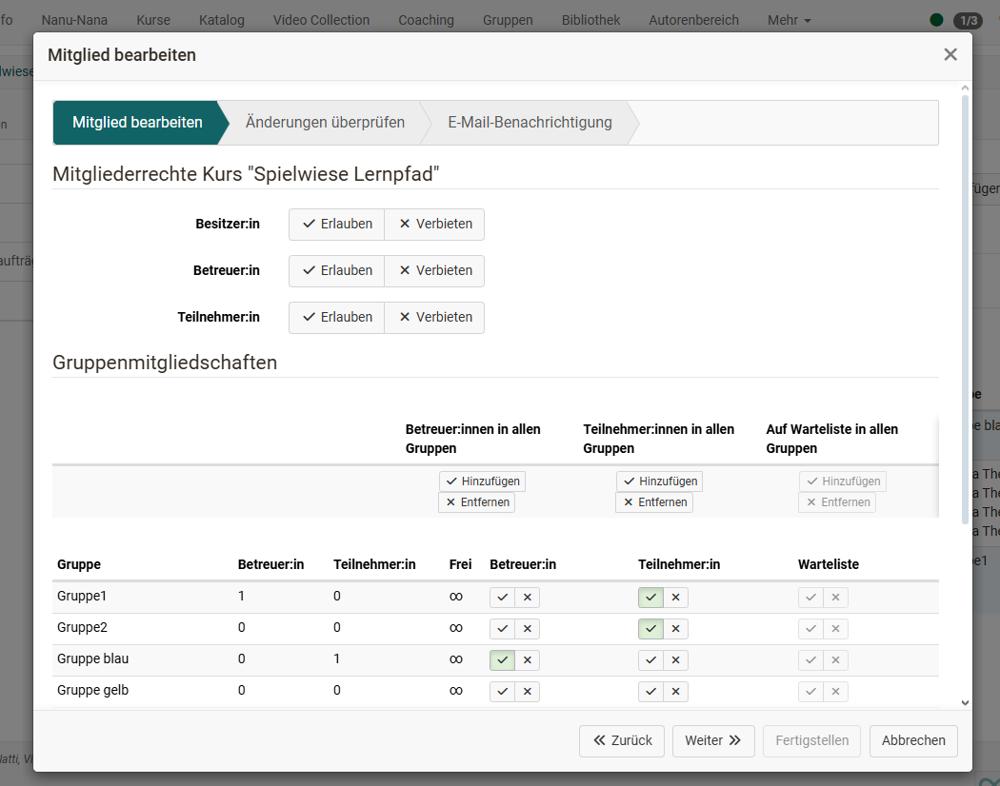{ class="shadow lightbox" }

Die Änderungen werden anschliessend zur Überprüfung nochmals angezeigt und eine E-Mail-Benachrichtigung kann ebenfalls verschickt werden.

[Zum Seitenanfang ^](#group_membership)

## 3c) Von Personen mit OpenOlat-Systemrollen zugeordnet

Auch bestimmte Personen, die nicht selbst Gruppenbetreuer:in einer Gruppe sind, können auf administrativer Ebene Personen zu Gruppen hinzufügen. Hierzu zählen Personen mit der OpenOlat Rolle Gruppenverwalter:in und Benutzerverwalter:in bzw. OpenOlat Administrator:innen mit Zugriff auf diese Bereiche.

### Gruppenmitgliedschaft in der Benutzerverwaltung hinzufügen {: #add_groupmembers_in_usermanagement}

Benutzerverwalter:innen können nach Aufruf der Kartei einer bestimmten Person im Tab „Gruppen“ die vorhandenen Gruppenmitgliedschaften einsehen und neue hinzufügen.

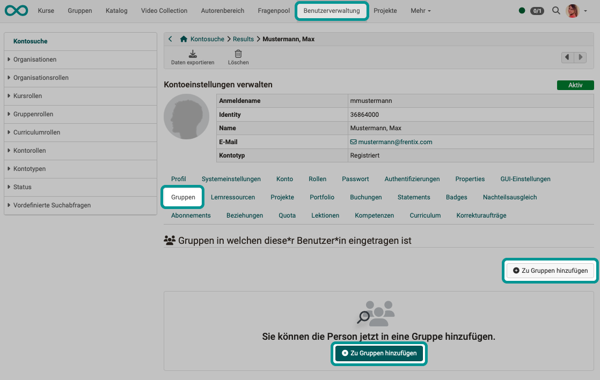{ class="shadow lightbox" }

### Gruppenmitgliedschaft in der Gruppenverwaltung hinzufügen

Gruppenverwalter:innen verfügen im Gruppenbereich zusätzlich über den Tab „Gruppenverwaltung“ und sehen dort alle Gruppen. Ähnlich wie bei den eigenen Gruppen können hierüber auch Personen in die Gruppen eingetragen werden.

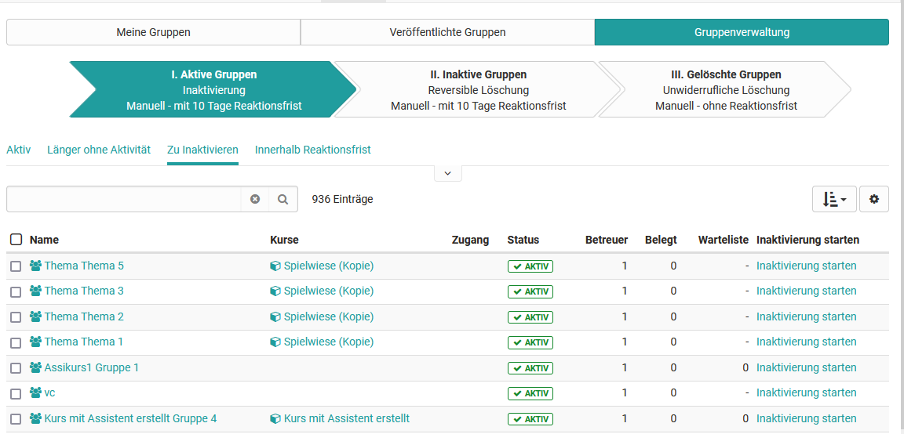{ class="shadow lightbox" }

[Zum Seitenanfang ^](#group_membership)

## 4d) Automatisch erstellte Gruppenmitgliedschaften - managed {: #add_groupmembers_automatically}

Werden in einem anderen System (z.B. einer HR-Software) bereits bestimmte Personen in Gruppen zusammengefasst, können diese Gruppenmitgliedschaften auch in OpenOlat abgebildet werden. Dazu benötigt es allerdings eine Middleware (Syncher), die dann automatisiert Benutzer:innen bestimmten OpenOlat-Gruppen zuordnen kann.

Bei Fragen zu automatisch zugewiesener Gruppenmitgliedschaft wenden Sie sich bitte an frentix: [contact@frentix.com](mailto:contact@frentix.com)

[Zum Seitenanfang ^](#group_membership)

---

## Mitgliedschaftsanfragen annehmen oder ablehnen [:octicons-tag-16:{ title="ab Release 20.3 (OO-9156)" }](https://track.frentix.com/issue/OO-9156){:target="_blank"} {: #reservation}

Wurden Sie einem Kurs, einer Gruppe oder einem Bildungsprodukt mit Reservierungspflicht zugewiesen, erscheint im Gruppenbereich automatisch die Hinweisbox **"Anfragen zur Mitgliedschaft akzeptieren"**. Die Box ist klappbar und zeigt eine Kartenansicht mit je einem Eintrag pro Gruppe.

Die Hinweisbox wird eingeblendet, solange ausstehende Anfragen vorliegen. Sie informiert Sie darüber, dass Sie zu einer Gruppe eingeladen wurden, und fordert Sie auf, die Mitgliedschaftsanfrage anzunehmen oder abzulehnen.

**Beispielansicht** der Hinweisbox einer eingeladenen Person:
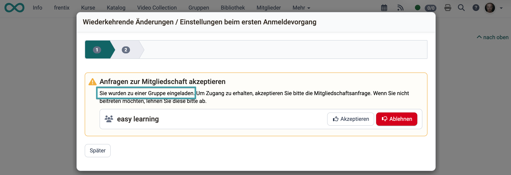{ class="shadow lightbox" }

Für jede ausstehende Anfrage stehen folgende Aktionen zur Verfügung:

- **Akzeptieren** (Haken-Symbol): Nimmt die Mitgliedschaftsanfrage an. Sie werden als Mitglied in die Gruppe aufgenommen.
- **Ablehnen** (X-Symbol, rot): Lehnt die Mitgliedschaftsanfrage ab.
- **Details**: Öffnet eine Lightbox mit der Beschreibung und der Mitgliedschaftsliste der Gruppe.

!!! note "Hinweis"

    Die Hinweisbox erscheint auch beim ersten Login, wenn sowohl Kurs- als auch Gruppenanfragen ausstehend sind. In diesem Fall sehen Sie beide Panels (Kurs und Gruppe) gleichzeitig. Mit der Aktion "Später" können Sie die Bearbeitung auf einen späteren Zeitpunkt verschieben.

Mitgliedschaftsanfragen können auch direkt auf der Infoseite eines Kurses oder Bildungsprodukts angenommen oder abgelehnt werden. Die Hinweisbox ist dort nicht kollabierbar.

Für Administrator:innen: [Systemweite Konfiguration der Einladung >](../../manual_admin/administration/Modules_Groups.de.md#data_privacy)

[Zum Seitenanfang ^](#group_membership)

---

## Weiterführende Informationen {: #further_information}

[Gruppe erstellen >](Create_Groups.de.md) 
[Gruppenwerkzeuge nutzen >](Using_Group_Tools.de.md) 
[Gruppe verlassen > ](Leave_a_Group.de.md) 
[LTI-Zugang zu einer Gruppe konfigurieren > ](LTI_Share_groups.de.md) 
[Systemweite Konfiguration der Gruppen >](../../manual_admin/administration/Modules_Groups.de.md)  ...für OpenOlat Administratoren

[Zum Seitenanfang ^](#group_membership)