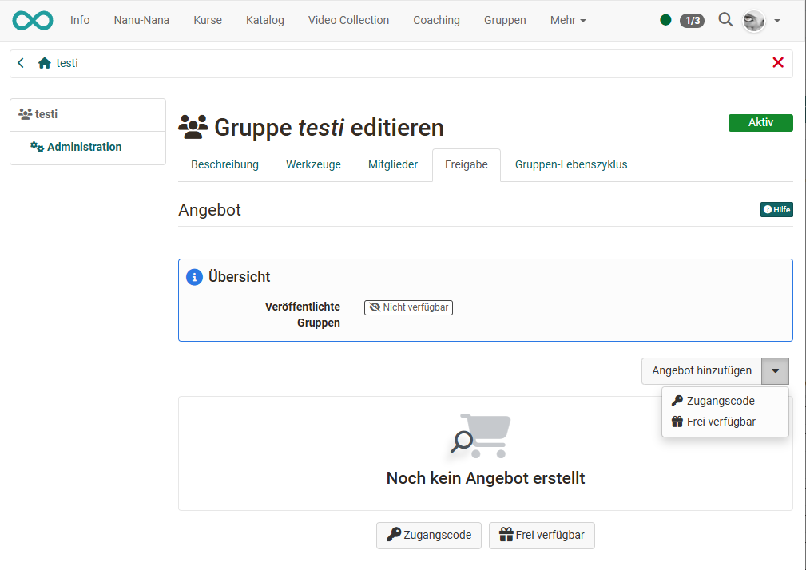
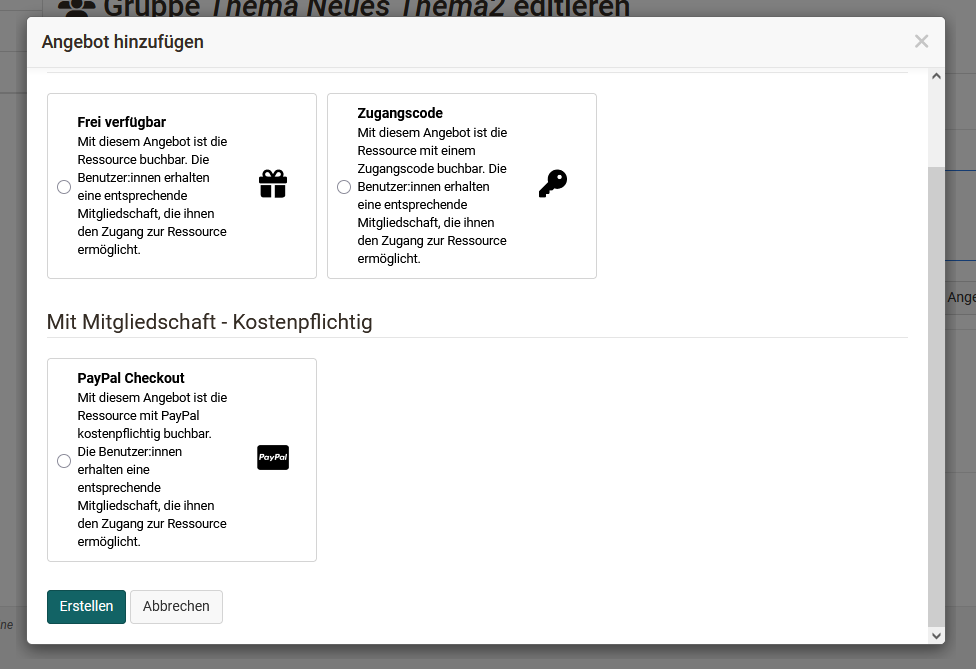
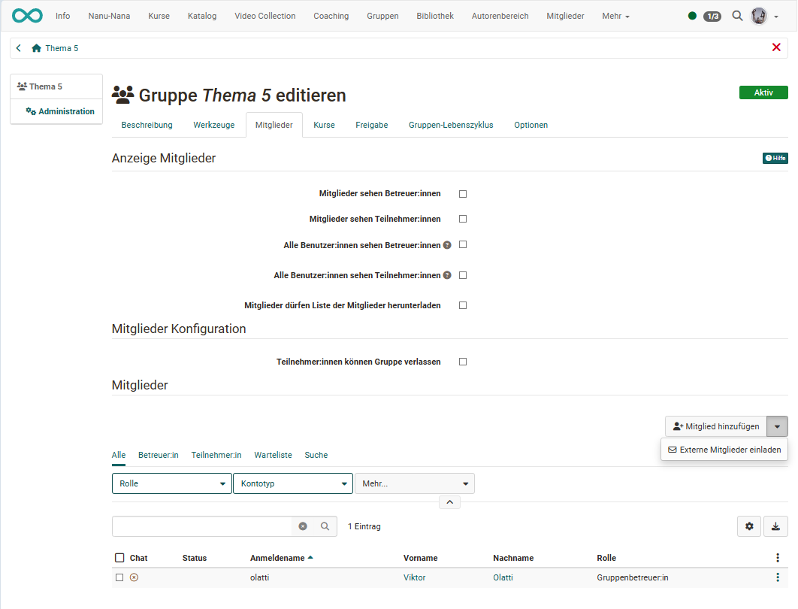
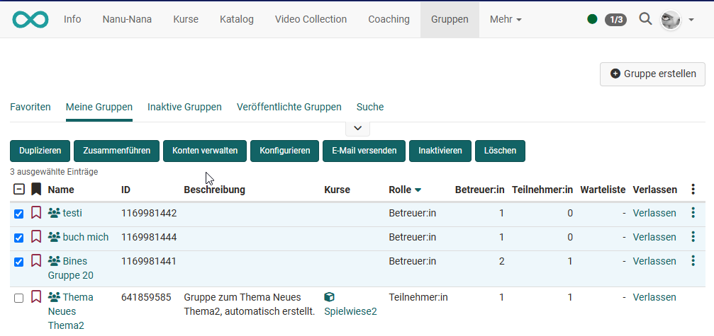
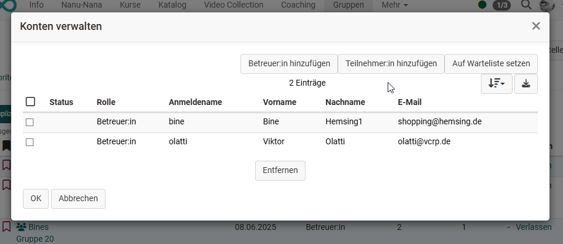
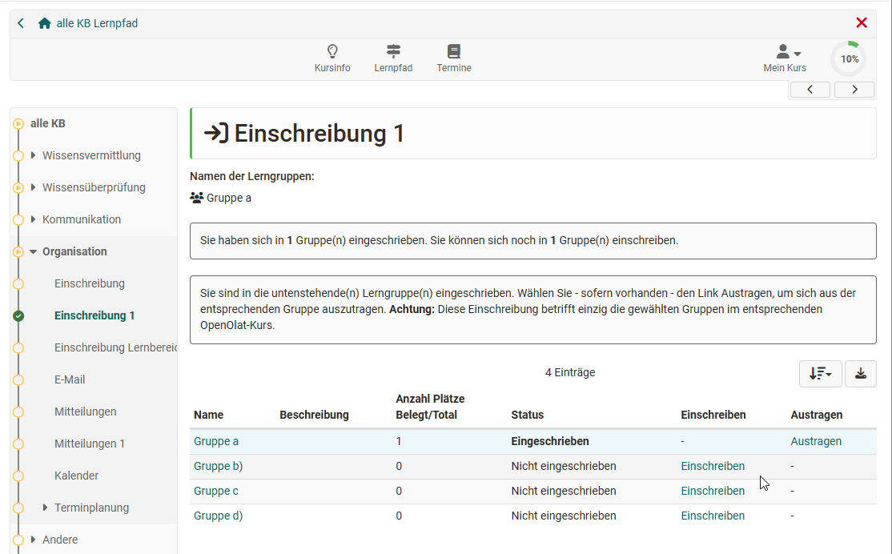
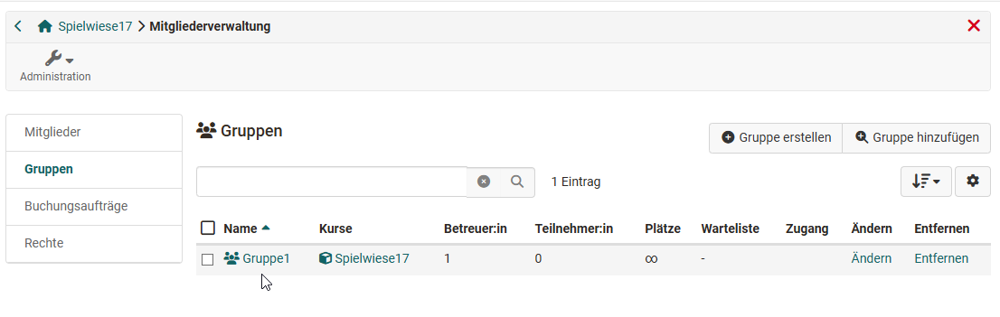
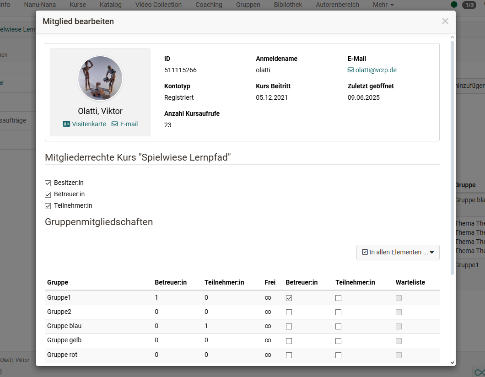
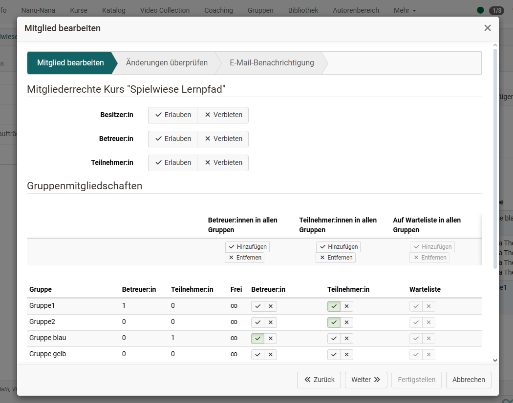
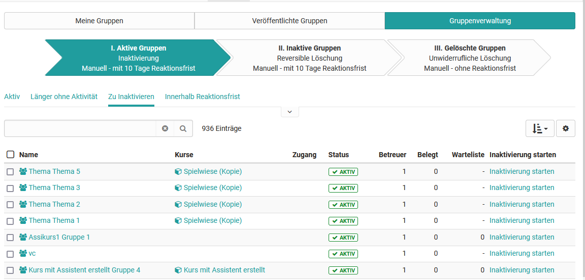

# Become a group member {: #group_membership}

There are various ways in which people can become a member of a group. The following questions arise:

**Who adds the member to the group?**

Possible options are:

1)	The person adds themselves
2)	The group coach adds members
3)	Administrative roles such as user managers, membership managers add people
4)	Automatic assignment via an external system

**Where does the assignment take place?**

Possible options are:

* a)	Directly in the group
* b)	In a course associated with the group
* c)	In other OpenOlat system areas
* d)	Outside OpenOlat

Both aspects can be combined as follows:

## 1a) The user adds themselves to the specific group. {: #by_yourself}

{ class="shadow lightbox" }

For this, the group coach must set up an **"offer"** directly in the group under `Administration > Sharing`.

{ class="shadow lightbox" }

Several options are available for the offer:

**"Freely available"** creates a booking without a password. Interested users join the group directly after booking. With the **"Access code"** option, a password is set for access and the user must enter the previously communicated password when booking. This is useful if not everyone should be given access to a group, but people should add themselves. Depending on the configuration by the system administrators, the **"PayPal Checkout"** option is also available. With this offer, the resource can be booked for a fee via PayPal.

{ class="shadow lightbox" }

**Where do users find groups they can book?**

Users find groups with offers under "Published groups". Click on **"Join"** to book an offer and become a group member.

{ class="shadow lightbox" }

**Overbooking** {: #overbooking}

If the group size has been limited, participants who want to join a group in which all places are already taken can be placed on a waiting list. (See [Create groups](Create_Groups.md#foreseen-number-of-participants)).

In the event of overbooking, corresponding notices appear, e.g.:

{ class="shadow lightbox" }

[To the top of the page ^](#group_membership)

## 2a)  Group coaches add people directly to the group {: #add_groupmember}

As a group coach, select or create the desired group and go to the "Administration" tab of the group. In the "Members" tab, additional participants and coaches can then be added.

{ class="shadow lightbox" }

OpenOlat authors additionally have the "bulk search" available when adding members. This way, people whose OpenOlat ID or email address is known can be added directly and quickly.
Authors also have the option of inviting "external members" who do not yet have an OpenOlat account into the group. To do this, the specific email addresses of the persons must be entered.

### Adding a person to several groups at once  {: #add_several_groupmembers}

Group coaches can also add a person directly to several groups, e.g. if an assignment to several groups is necessary for a study programme. To do this, go to the group area and select all groups to which the person is to be added. The prerequisite is that you are also a coach of the respective groups. Several buttons appear.

{ class="shadow lightbox" }

Select **"Manage accounts"** here. A pop-up menu opens in which the members of all selected groups are listed together. Use the corresponding buttons to add further participants or coaches to all selected groups or to place them on the waiting list.

{ class="shadow lightbox" }

The group membership may then still need to be confirmed. If you look in the member administration in one of the courses, you may find a corresponding note. Whether such confirmation by the new group members is required can be specified by administrators.
{ class="shadow lightbox" }

[To the top of the page ^](#group_membership)

## 1b) The user adds themselves to a group within a course

Courses and groups can be linked to each other. If this is the case, people can also add themselves to a group at certain points within the course.

Specifically, this works via the course elements ["Enrolment"](../learningresources/Course_Element_Enrolment.md) and ["Topic Assignment"](../learningresources/Course_Element_Topic_Assignment.md). With these course elements, an OpenOlat group is created automatically. When people select a topic or enrol in a group, they are automatically added to the corresponding group.

{ class="shadow lightbox" }

[To the top of the page ^](#group_membership)

## 2b) Course owners add people to a course-related group

Groups can also be linked to courses. If this is the case, course owners or persons with the right to use the course's "member administration" can also create and add groups there.

{ class="shadow lightbox" }

Via the displayed group name, you can access the group and then, as described under 2a), add people as a group coach.

Another option in the course is via the course's member list: `Member administration > Members`. Here you can assign one or more course members to course-specific groups.

If you select several course members, for example, they can be assigned as participant or coach to all groups available in the course via the "Edit" button that appears.

The changes are then displayed again for review and an email notification can also be sent.

[To the top of the page ^](#group_membership)

## 3c) Assigned by persons with OpenOlat system roles

Certain people who are not group coaches of a group themselves can also add group members at an administrative level. This includes people with the OpenOlat role of group manager and user manager or OpenOlat administrators with access to these areas.

### Adding group membership in the user administration {: #add_groupmembers_in_usermanagement}

User managers can view existing group memberships and add new ones after opening the profile of a specific person in the "Groups" tab.

{ class="shadow lightbox" }

### Adding group membership in the group administration

Group managers additionally have the "Group administration" tab in the group area and see all groups there. Similar to their own groups, people can also be added to the groups via this tab.

{ class="shadow lightbox" }

[To the top of the page ^](#group_membership)

## 4d) Automatically created group memberships - managed {: #add_groupmembers_automatically}

If certain people are already grouped together in another system (e.g. HR software), these group memberships can also be mapped in OpenOlat. However, this requires middleware (Syncher), which can then automatically assign users to specific OpenOlat groups.

If you have any questions about automatically assigned group membership, please contact frentix: [contact@frentix.com](mailto:contact@frentix.com)

[To the top of the page ^](#group_membership)

---

## Accept or decline membership requests [:octicons-tag-16:{ title="from Release 20.3 (OO-9156)" }](https://track.frentix.com/issue/OO-9156){:target="_blank"} {: #reservation}

If you have been assigned to a course, group or educational product with a reservation requirement, the notification box **"Accept membership requests"** automatically appears in the group area. The box is collapsible and shows a card view with one entry per group.

The notification box is displayed as long as there are pending requests. It informs you that you have been invited to a group and prompts you to accept or decline the membership request.

**Example view** of the notification box for an invited user:
{ class="shadow lightbox" }

The following actions are available for each pending request:

- **Accept** (checkmark icon): Accepts the membership request. You are added as a member of the group.
- **Decline** (X icon, red): Declines the membership request.
- **Details**: Opens a lightbox with the description and the membership list of the group.

!!! note "Note"

    The notification box also appears on first login if both course and group requests are pending. In this case you see both panels (course and group) at the same time. Use the "Later" action to postpone processing to a later time.

Membership requests can also be accepted or declined directly on the info page of a course or educational product. There, the notification box is not collapsible.

For administrators: [System-wide configuration of the invitation >](../../manual_admin/administration/Modules_Groups.md#data_privacy)

[To the top of the page ^](#group_membership)

---

## Further information {: #further_information}

[Create groups >](Create_Groups.md) 
[Using group tools >](Using_Group_Tools.md) 
[Leave a group >](Leave_a_Group.md) 
[Configure LTI Share for groups >](LTI_Share_groups.md) 
[System-wide configuration of the groups >](../../manual_admin/administration/Modules_Groups.md)  ...for OpenOlat administrators

[To the top of the page ^](#group_membership)
