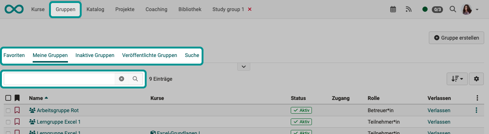
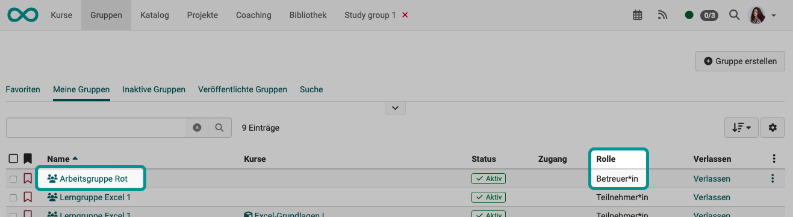
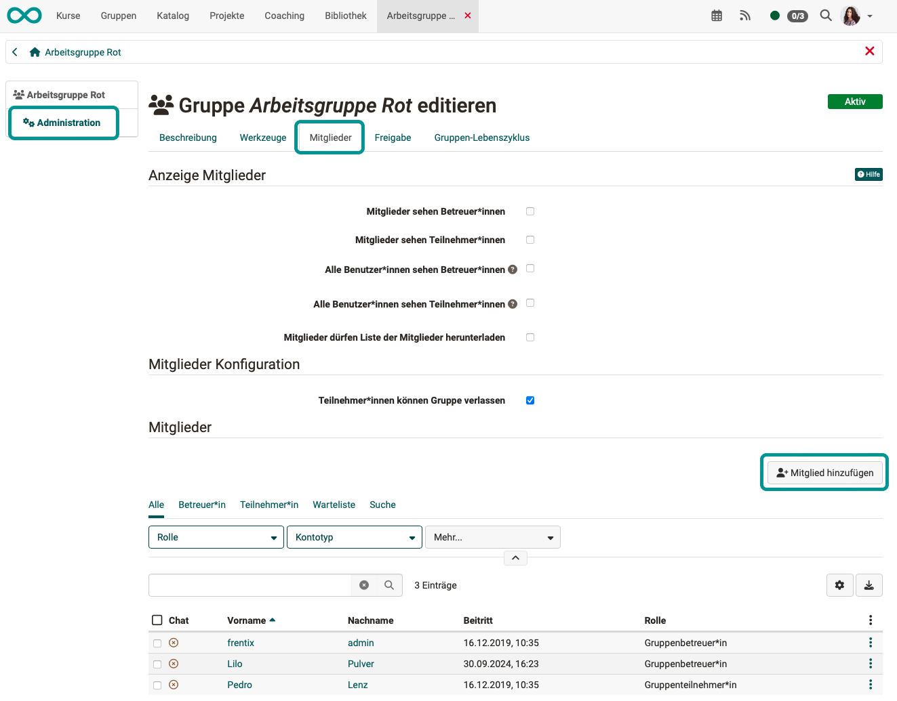
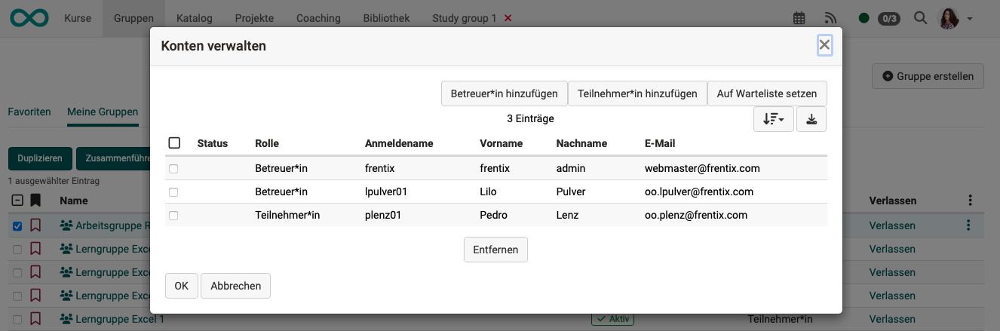
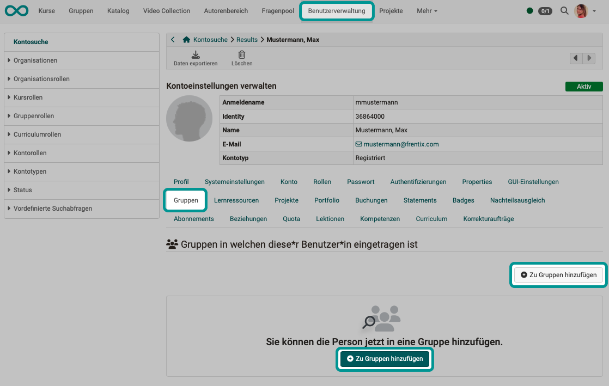
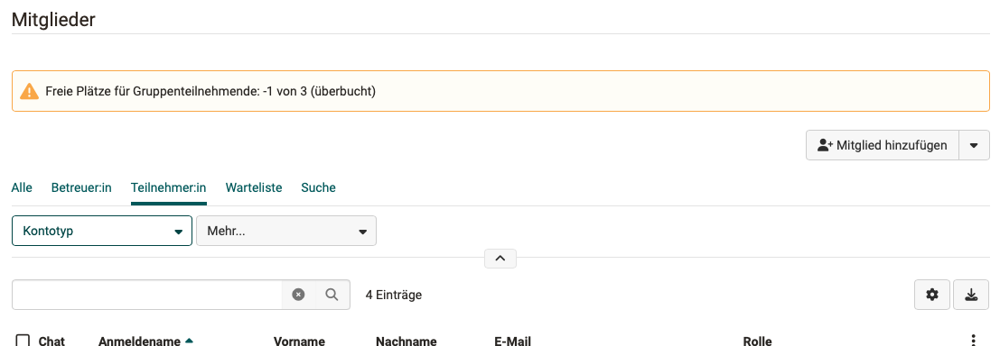

# Become a group member {: #group_membership}

There are basically 3 ways to become a group member in OpenOlat:

* You can be invited to an OpenOlat group by coaches and other authorized persons and made a member,
* Your group membership can be created automatically,
* or you can register yourself as a group member.

The way in which you can become a group member depends on which group it is and how the group is configured by the creator.

---

## Become a group member through others {: #by_others}

### Who can make someone a group member? 

* Group coaches (You become one automatically when you create a group, or the role is assigned to you).
* User manager
* Other administrative roles (administrator, etc.)

[To the top of the page ^](#group_membership)

### How can group coaches make someone a group member? {: #add_groupmember}

**Step 1:** 
Navigate to the desired group via the main menu. Use the search or the tabs with pre-sorted lists of existing groups.

{ class="shadow lightbox" }

**Step 2:** 
Click on the group name to select the group to which a member is to be added. Make sure that you are the group administrator this group, otherwise the "Administration" option will not be available to you in the next step. 

{ class="shadow lightbox" }

**Step 3:** 
Select "Administration" on the left and then the "Members" tab. There you will find the "Add member" button.

{ class="shadow lightbox" }

[To the top of the page ^](#group_membership)

---

### How do you make someone a group member in several groups at the same time? {: #add_several_groupmembers}

**Step 1:** 
Navigate to the desired group via the main menu.

**Step 2:** 
Select the checkboxes in front of all groups to which the person is to be added. Make sure that you yourself are a member of all selected groups as a coach.

{ class="shadow lightbox" }

**Step 3:** 
As soon as at least one checkbox is selected, the "Manage accounts" button appears above the list. If you click this button, a pop-up opens in which the members of all selected groups are listed together. Use the two buttons to add further participants and coaches to all selected groups.

{ class="shadow lightbox" }

**Step 4:** 
The group membership of members who have been added several times at the same time may still need to be confirmed. If you look in the member administration in one of the courses, you may find a corresponding note. Whether such confirmation is required by the new group members can be specified by the administrator.

{ class="shadow lightbox" }

[To the top of the page ^](#group_membership)

---

### Add group membership in the user administration {: #add_groupmembers_in usermanagement}

If you have authorization for user administration, you can also view the existing group memberships and add new ones in a tab.

{ class="shadow lightbox" }

[To the top of the page ^](#group_membership)

---

## Automatically created group memberships {: #add_groupmembers_automatically}

If certain people are already grouped together in another system (e.g. HR software), these group memberships can also be mapped in OpenOlat. However, this requires middleware (Syncher), which can then automatically assign users to specific OpenOlat groups.

If you have any questions about automatically assigned group membership, please contact frentix.

[To the top of the page ^](#group_membership)

---

## Assign yourself as a group member {: #by_yourself}

### Groups in course element "Enrolment" {: #add_groupmembership_in_course_element_enrolment}

If authors use the [course element “Enrolment”](../learningresources/Course_Element_Enrolment.md), learning groups can be created there that are initially without participants. When the course is active, they can then register themselves as members of one (or more) of the groups offered.

{ class="shadow lightbox" }

[To the top of the page ^](#group_membership)

---

### Offer {: #offer}

**Create offer** 
Groups are treated like learning resources in some respects. An offer can also be created for groups under **Group > Administration > Sharing tab**.
Joining a group can be offered with an access code or "Freely available".

**Where can users find offers for groups?** 
Users can find groups with offers under **"Published groups"**. Click on **"Join"** to book an offer and become a group member.

{ class="shadow lightbox" }

[To the top of the page ^](#group_membership)

---

### Overbooking {: #overbooking}

If the group size has been limited, participants who wish to join a group in which all places are already taken can be placed on a waiting list. (See [Create groups >](Create_Groups.md#foreseen-number-of-participants)).

In the event of overbooking, corresponding notices appear, e.g:

{ class="shadow lightbox" }

[To the top of the page ^](#group_membership)

---

### Entry in the group administration

With the appropriate rights (e.g. administrator), you can of course always add yourself to a group as a participant.

The procedure is the same as described above. 
(["How can group coaches make someone a group member?"](#addgroupmember), Step 3)
 

**Select group > Administration > Tab members > Button "Add member"**

[To the top of the page ^](#group_membership)

---

## Founding a group {: #found_a_group}

### Who can create a group?

Administrators can define system-wide in **Administration > Modules > Groups** whether the creation of new groups is permitted for course authors and/or participants.

### Creating a group

If you have been granted this permission, you will also find the "Create group" button under the "Groups" menu item in the main menu. 
[More about creating groups >](Create_Groups.md)

{ class="shadow lightbox" }

### Add members to my group

If you create a group, you automatically become the group administrator. In this role, you will have the "Administration" menu option for your group. There you can add further people (make them group members) and configure the rights of group members in the "Members" tab. 

[See above "How can group facilitators make someone a group member?" ^](#add_groupmember)

[To the top of the page ^](#group_membership)

---

## Further information {: #further_information}

[Create groups >](Create_Groups.md) 
[Using group tools >](Using_Group_Tools.md) 
[Leave a group > ](Leave_a_Group.md) 
[Configure LTI Share for groups > ](LTI_Share_groups.md) 
For administrators: [System-wide configuration of the groups >](../../manual_admin/administration/Modules.md) 

[To the top of the page ^](#group_membership)

