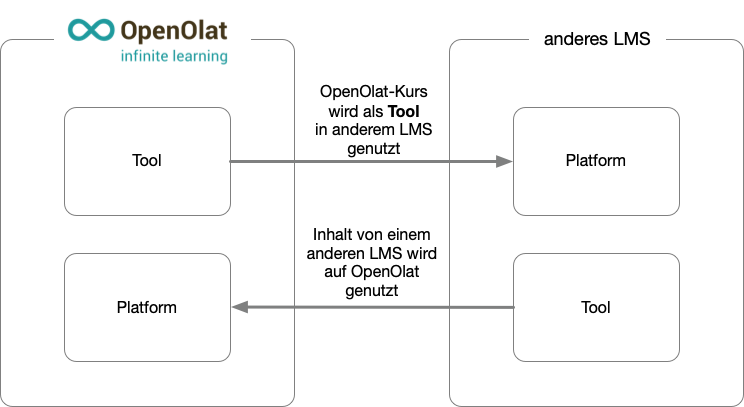

# LTI-Zugang zu einer Gruppe konfigurieren

:octicons-tag-24: Release 15.5 

Mit LTI lassen sich nicht nur Inhalte (Kurse) auf einem anderen LMS nutzen. Via LTI können auch Daten über die Kursteilnehmer:innen und Betreuer:innen ausgetauscht werden (LTI-Services für das Provisioning von Namen und Rollen, sowie LTI-Services "Assignments and Grades"). 

So lassen sich z.B. Noten sicher mit dem Prüfungsamt via API austauschen. Es können auch Stärken und Schwächen der abgelieferten Arbeit mit den Studierenden diskutiert werden, wenn der besuchte Kurs von einem anderen LMS stammt und die Kommunikationsinfrastruktur des eigenen LMS dort nicht zur Verfügung steht.

## Richtung des Austauschs

Die Informationen zu Gruppen und Mitgliedern können grundsätzlich in beiden Richtungen ausgetauscht werden:

* von OpenOlat (= Tool) zum anderen LMS (= Platform)
* vom anderen LMS (= Tool) zu OpenOlat (= Platform)

{ class="lightbox" }

## Voraussetzungen

Für die Konfiguration muss ein Administrator-Zugang in beiden Systemen gewährleistet sein.
(In OpenOlat kann dies auch die Rolle Systemadministrator:in sein.) 
Vorzugsweise erfolgt die Konfiguration auf beiden Systemen gleichzeitig, da bestimmte Dialoge in beiden Systemen direkt aufeinanderfolgend zu konfigurieren sind.

## Ablauf der Konfiguration

1. Setup "External Tool" in Moodle
2. Setup "externe Plattform" in OpenOlat
3. LTI-Freigabe des Kurses in OpenOlat
4. Einbinden des externen Tools (=OpenOlat) im Moodle-Kurs
5. Verbindungstest

Der ausführliche Ablauf einer Konfiguration ist beschrieben unter [LTI-Zugang zu einem Kurs konfigurieren](https://docs.openolat.org/de/manual_user/learningresources/LTI_Share_courses/?h=lti).

## Lernerdaten in der LTI Konfiguration

    
Screen

	

**Vorname/Name übertragen:**  
Wenn Sie diese Checkbox ankreuzen, wird der Vor- und Nachname des Benutzers an die externe Lernapplikation weitergegeben. Ansonsten kann der Benutzer die externe Lernapplikation anonym nutzen.

**E-Mailadresse übertragen:** 
Markieren Sie die Checkbox, wird die E-Mailadresse des Benutzers an die externe Lernapplikation weitergegeben.

**Zusätzliche Attribute:**  
In dieses Eingabefeld können Sie weitere Parameter eingeben, die an die Lernapplikation übermittelt werden sollen. So kann der Lernapplikation beispielsweise mitgeteilt werden, dass die Anfrage von der Lernplattform OpenOlat übermittelt wird. (Die externe Lernapplikation muss die weitergegebenen Informationen verarbeiten können, weshalb eine Absprache mit dem Anbieter nötig ist). Sie haben die Wahl zwischen statischen Text-Attributen (für alle Benutzer ist der Wert identisch) oder zusätzlichen dynamischen Benutzerattributen (pro Benutzer unterschiedlich). Sie können beliebig viele Zusatzattribute definieren, die LTI-Ressource muss allerdings wissen, dass es diese Attribute gibt, da diese nicht im Standard definiert sind.

**OpenOlat Rollen:** 
In diesem Bereich können Sie definieren, welche Rolle die einzelnen Benutzer einnehmen, wenn Sie die LTI-Ressource starten. Es werden dabei die drei OpenOlat-Kursrollen Besitzer, Betreuer und Teilnehmer unterstützt. Für jede Rolle kann genau definiert werden, welche Rollen dafür auf Seiten der LTI-Ressource angewendet werden soll. Die folgenden LTI-Rollen können konfiguriert werden: Lerner, Instruktur, Administrator, Assistent Lehrperson, Inhaltersteller und Mentor.

**Punkte übertragen:** 
Wählen Sie diese Checkbox, wenn die LTI-Ressource Punkte erzeugen und mit dem LTI-Standard an OpenOlat übermitteln soll. Dies ist optional. Übermittelte Punkte erscheinen beim Benutzer auf der Startseite des LTI-Bausteins, sowie auf dem Leistungsnachweis. Bitte beachten Sie, dass LTI gemäss Standard nur einen Wert zwischen 0 und 1 liefern kann.

Wird die Option „Punkte übertragen“ aktiviert, kann die LTI-Seite als bewertbares Kurselement zum Kurs hinzugefügt werden und erscheint dann im Bewertungswerkzeug. Zusätzlich erscheinen die übermittelten Punkte beim Benutzer auf der Startseite des LTI-Bausteins.

**Skalierungsfaktor:** 
Geben Sie hier den optionalen Schwellenwert an, ab dem das LTI.Element als bestanden gilt. Dieser Schwellenwert bezieht sich auf das skalierte Endresultat und nicht auf die von LTI übermittelten Rohdaten! Im obigen Beispiel wäre ein Schwellwert von "5" gleichbedeutend mit "50%".

## Daten zur Gruppe per LTI übertragen

!!! warning "Achtung"

    Dieser Artikel ist noch in Bearbeitung.

??? Werden Informationen zu Gruppen über den Parameter "Zusätzliche Attribute" ausgetauscht?

Die Informationen zu Gruppen werden als dynamische Benutzerattribute im Parameter "Zusätzliche Attribute" übergeben. Da es keine standardisierten Attribute sind, ist eine Absprachen zwischen den Administrator:innen der beiden LMS erforderlich.

Beispiel: ...

**Wieviel weiss das andere LMS von den OpenOlat-Benutzerdaten?** 
Grundsätzlich kann das andere LMS nur soviel über die Benutzer und Gruppen erfahren, wie seitens OpenOlat freigegeben wurde.
Was freigegeben ist, bestimmen 

* einerseits die Administrator:innen (Administration > Externe Werkzeuge > LTI 1.3)
* andererseits die Kursautor:innen (Kursadministration > Einstellungen > Tab Seiteninhalt) 

**Wieviel erfährt OpenOlat über Benutzer/Gruppen anderer LMS?** 
In umgekehrter Richtung gilt das gleiche Prinzip: Auf dem anderen LMS wird bestimmt, welche Daten frei gegeben werden. Die 

???**Gruppen ohne Kurszugehörigkeit**

??? Soll ein OpenOlat-Kurs auf einem anderen LMS genutzt werden, muss OpenOlat z.B. in diesem Kurs erworbene Punkte eindeutig bestimmten Kursteilnehmer:innen zuordnen können. Deshalb benötigt OpenOlat die Daten der Kursteilnehmer:innen. 

??? Mit LTI 1.3 können aber auch unabhängig von einem Kurs Daten zu Benutzer:innen und Gruppen übertragen werden. Beispielsweise, können so z.B. lediglich die Ergebnisse einer Prüfung übertragen werden.

xxxx

Gruppen Deployment???

xxxx

##  Links

Benutzerhandbuch: [LTI-Zugang zu einem Kurs konfigurieren](https://docs.openolat.org/de/manual_user/learningresources/LTI_Share_courses/?h=lti)

Benutzerhandbuch: [Kursbaustein "LTI-Seite“](http://docs.openolat.org/de/manual_user/learningresources/Course_Element_LTI_Page/)

Benutzerhandbuch: [LTI Deep Linking](../administration/LTI_Deeplinking.de.md)

Administrationshandbuch: [LTI 1.3 Integrationen im Überblick](http://docs.openolat.org/de/manual_admin/administration/LTI_Integrations/)

Administrationshandbuch: [LTI - Externe Werkzeuge](http://docs.openolat.org/de/manual_admin/administration/LTI_External_tools/)

Administrationshandbuch: [LTI - Externe Plattformen](http://docs.openolat.org/de/manual_admin/administration/LTI_External_platforms/)
