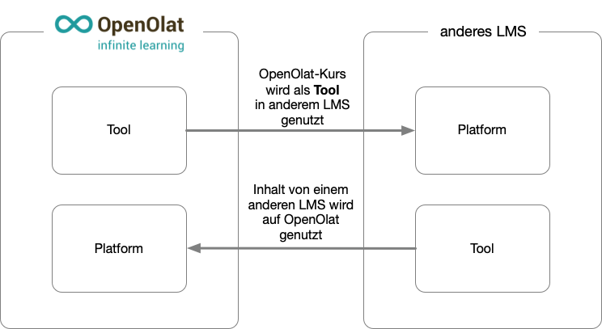

# Configure LTI access to a group [:octicons-tag-16:{ title="from Release 15.5 (OO-5206)" }](https://track.frentix.com/issue/OO-5206) {: #LTI_access_to_a_group}

With LTI, it is not only possible to use content (courses) on another LMS. LTI can also be used to exchange data about course participants and coaches (LTI services for the provisioning of names and roles, as well as the LTI "Assignments and Grades" services).

This allows, for example, grades to be exchanged securely with the examination office via API. Strengths and weaknesses of the submitted work can also be discussed with the students if the course attended originates from another LMS and the communication infrastructure of your own LMS is not available there.

## Direction of the exchange

Information about groups and members can generally be exchanged in both directions:

* from OpenOlat (= tool) to the other LMS (= platform)
* from the other LMS (= tool) to OpenOlat (= platform)

{ class="shadow lightbox" title="Tool and platform roles between two systems" }

If OpenOlat is the platform, you embed the external tool in a course via the course element "LTI page". Which data of the persons OpenOlat transfers to the tool, such as name, e-mail address and roles, is set in the course element: [Course element "LTI page"](../learningresources/Course_Element_LTI_Page.md). The following sections describe OpenOlat as the tool.

## Requirements

The external platform is registered in the system administration of OpenOlat, which requires the System administrator role in OpenOlat. On the other side, administrator access to the other LMS is required as well. Who may create the LTI share of a group is set in the system administration: [Who can add deployments?](../../manual_admin/administration/LTI_Integrations.md#deployments) 
Preferably, the configuration is carried out on both systems at the same time, as certain dialogs in both systems must be configured directly one after the other.

## Configuration procedure

1. Set up "External Tool" in Moodle
2. Set up "external platform" in OpenOlat
3. LTI share of the group in OpenOlat
4. Embedding the external tool (= OpenOlat) in the Moodle course
5. Connection test

The detailed procedure for a configuration is described under [Configure LTI access to a course](../learningresources/LTI_Share_courses.md).

## Transferring group data via LTI

An OpenOlat group is shared for LTI access in the same way as a course. Sharing is configured with the "Add deployment" button under: 
`Group > Administration > Tab "Share" > Section "LTI 1.3 access configuration"`

In the deployment dialog you select the previously configured "Platform" and enter the "Deployment ID", as when sharing a course. OpenOlat provides the other details and only displays them: the "Tool URL" of the group in the format `https://<OpenOlat-URL>/auth/BusinessGroup/<Group-ID>`, the "Initiate login URL", the "Redirection URL" and, in the "Public Key" field, the key of the platform. The detailed procedure including the counterpart configuration in the external LMS is described under [Configure LTI access to a course](../learningresources/LTI_Share_courses.md) and applies to groups in the same way.

The same deployment ID of a platform can be shared for several groups and courses. Within the same group, it can be used only once per platform; a second attempt ends with the message "Deployment ID must be unique for a specific platform and group." OpenOlat recognizes which group to open from the address the platform sends with the call, as with courses: [One deployment ID for several courses](../learningresources/LTI_Share_courses.md#deployment_id_several_courses) [:octicons-tag-16:{ title="from Release 21.1 (OO-9092)" }](https://track.frentix.com/issue/OO-9092)

The exchange of member data (names and roles) uses the LTI standard service "Names and Role Provisioning Service" (NRPS). Which member data is transmitted is determined by the system that provides the connection as the platform. System administrators manage the basic LTI 1.3 settings in the system administration: `Administration > External tools > LTI`

## Groups without course affiliation

A group can be shared via LTI independently of a course. This is useful when you do not want to share an entire course but only exchange data about users and their group membership. For example, only the results of an assessment can be transferred without sharing the associated course.

## Further information {: #further_information}

[LTI 1.3 Integrations >](../../manual_admin/administration/LTI_Integrations.md) 
[Configure LTI access to a course >](../learningresources/LTI_Share_courses.md) 
[Course Element "LTI Page" >](../learningresources/Course_Element_LTI_Page.md) 
[LTI - External tools >](../../manual_admin/administration/LTI_External_tools.md) 
[LTI - External Platforms >](../../manual_admin/administration/LTI_External_platforms.md) 
[LTI - Deep Linking >](../../manual_admin/administration/LTI_Deeplinking.md) 
[LTI - Role mapping >](../../manual_admin/administration/LTI_Role_Mapping.md)

[To the top of the page ^](#LTI_access_to_a_group)
