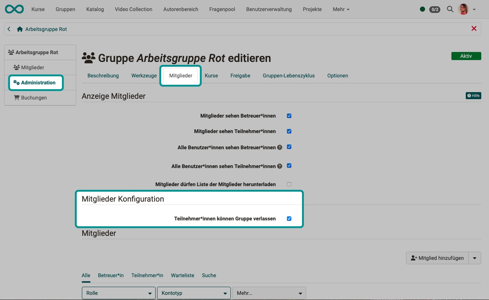
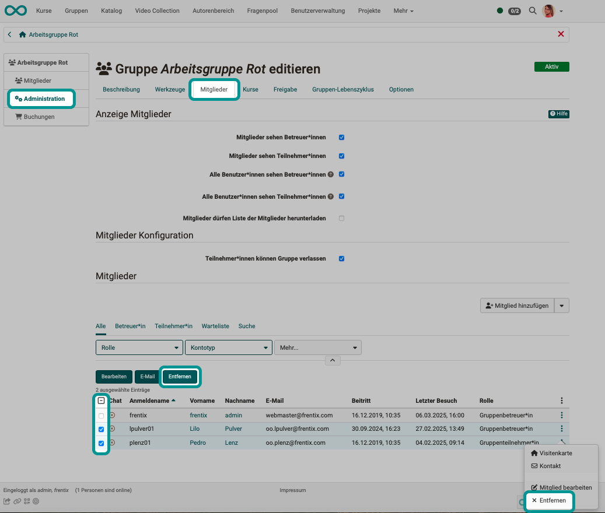
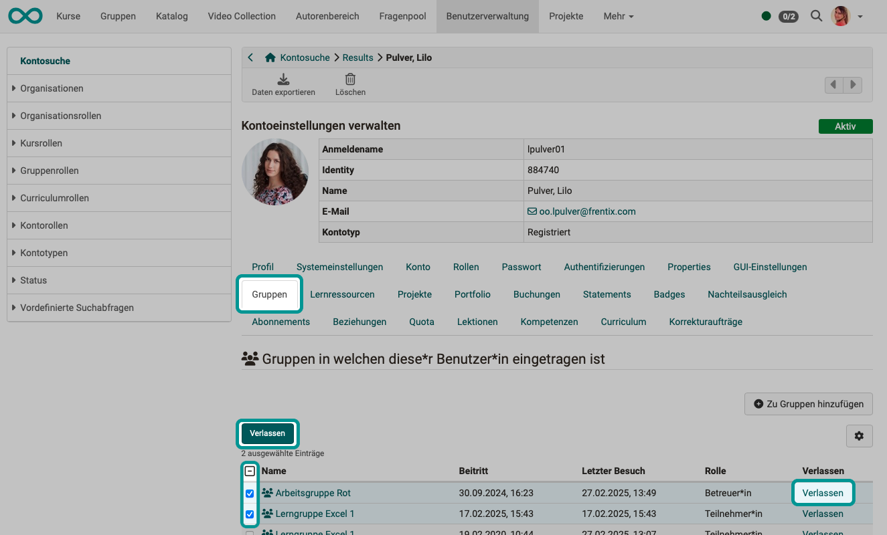

# Gruppe verlassen {: #leave_group}

Eine Gruppenmitgliedschaft kann über verschiedene Wege beendet werden.

## Gruppe aus Eigeninitiative verlassen {: #own_initiative}

Es gibt Gruppen, in denen eine Mitgliedschaft freiwillig sein soll, z.B. in Interessengruppen. Manche Gruppen sollen aber auch nicht aus Eigeninitiative verlassen werden können, wie z.B. eine Ausbildungsklasse. 

Ob den Gruppenmitgliedern das selbstständige Verlassen einer Gruppe möglich ist, können Gruppenbetreuer:innen vorab festlegen. Wählen Sie die Gruppe. Unter **Administration** im **Tab "Mitglieder"** finden Sie die Option, mit der Sie Teilnehmer:innen ein Verlassen der Gruppe aus Eigeninitiative ermöglichen können. 

{ class="shadow lightbox" }

[Zum Seitenanfang ^](#leave_group)

---

## Gruppenmitgliedschaft durch Gruppenbetreuer:in beenden {: #removed_by_group_coach}

Wählen Sie als Gruppenbetreuer:in die Gruppe, finden Sie unter **Administration** im **Tab "Mitglieder"** die Liste der Teilnehmer:innen.

Um eine **einzelne Person** aus der Gruppe zu entfernen, können Sie auf die 3 Punkte am Ende einer Zeile anklicken. Dort finden Sie die Option "Entfernen".

Möchten Sie **mehrere Gruppenmitglieder** gleichzeitig aus der Gruppe entfernen, können Sie die betreffenden Zeilen in der ersten Spalte markieren. Über der Liste erscheint dann u.a. der Button "Entfernen".

{ class="shadow lightbox" }

[Zum Seitenanfang ^](#leave_group)

---

## Gruppenmitgliedschaft in der Benutzerverwaltung beenden {: #removed_by_user_manager}

Suchen Sie in der Benutzerverwaltung den/die Teilnehmer:innen, dessen/deren Mitgliedschaft in einer Gruppe beendet werden soll und wählen Sie den **Tab "Gruppen"**.

Um die Person **aus einer einzelnen Gruppe** zu entfernen, klicken Sie am Ende einer Zeile auf den Link "Verlassen".

Möchten Sie die Person gleichzeitig **aus mehreren Gruppen entfernen**, können Sie die betreffenden Zeilen in der ersten Spalte markieren. Über der Liste erscheint dann der Button "Verlassen".

{ class="shadow lightbox" }

[Zum Seitenanfang ^](#leave_group)

---

## Gruppenmitgliedschaft durch den Gruppenlebenszyklus beenden {: #removed_by_grouplifecycle}

Wurde ein Gruppenlebenszyklus eingerichtet, können damit Gruppen inaktiviert und dann in einem weiteren Schritt gelöscht werden. 

Auf **inaktivierte Gruppen** können die Gruppenmitglieder nur noch im Lesemodus zugreifen. Sie sind aber weiterhin als Gruppenmitglieder eingetragen.

Wird die Gruppe **gelöscht** (in den Status "Gelöscht" versetzt), dann verlieren die Gruppenmitglieder ihren Zugriff. Durch eine administrative Rolle kann in der Gruppenverwaltung aber der Status "Gelöscht" wieder auf "Inaktiv" oder "Aktiv" zurück gesetzt werden. Erst wenn eine Gruppe unwiderruflich gelöscht wird, kann die Gruppe nicht wieder hergestellt werden. 

[Zum Seitenanfang ^](#leave_group)

---

## Was passiert mit in Gruppen entstandenen Beiträgen? {: #contributions}

Beim **Verlassen einer Gruppe** wird der/die Teilnehmer:in aus Gruppe entfernt, aber in den Gruppenwerkzeugen **erstellte Inhalte bleiben erhalten**. Z.B.:

* in einen Gruppenordner hochgeladene Dokumente
* in einem Gruppenforum geschriebene Beiträge
* in einem Gruppenchat geschriebene Texte

Beim **Löschen einer Gruppe** wird der Status der Gruppe auf "Gelöscht" gesetzt. Die Gruppe wird ehemaligen Gruppenmitgliedern nicht mehr angezeigt, ist aber für administrative Rollen weiter in der Liste aller Gruppen ersichtlich (mit dem Status "Gelöscht").

* alle Teilnehmer:innen werden entfernt und haben keinen Zugang mehr
* Verknüpfungen zu Kursen werden entfernt
* die Inhalte bleiben erhalten
* in einem Gruppenchat geschriebene Texte können als Log-Datei (Excel-Tabelle) heruntergeladen werden

[Zum Seitenanfang ^](#leave_group)

---

## Was passiert, wenn man als Gruppenersteller:in/Gruppenbetreuer:in die Gruppe verlässt? {: #group_coach}

Durch das Erstellen einer neuen Gruppe wird die erstellende Person zum Gruppenbetreuer/zur Gruppenbetreuerin. Bleibt die Person das einzige Gruppenmitglied und löscht sie die eigene Mitgliedschaft in der Gruppe, so wird auch ihr Zugriff auf diese Gruppe gelöscht. (Die Gruppe ohne Mitglieder muss dann z.B. durch Administrator:innen gelöscht werden.)

Sind neben dem/der Gruppenbetreuer:in, die ihre Mitgliedschaft beendet, weitere Gruppenteilnehmer:innen vorhanden, von denen aber niemand die Rolle "Gruppenbetreuer:in" besitzt, dann besteht die Gruppe ohne Gruppenbetreuer:in weiter. Eine Gruppe ohne Gruppenbetreuung kann z.B. für informellen Austausch weiterhin sinnvoll sein.

(Gibt es weitere Gruppenbetreuer:innen, gehen die Aufgaben der Gruppenbetreuung auf die verbliebenen Gruppenbetreuer:innen über.)

[Zum Seitenanfang ^](#leave_group)

---

## Weitere Informationen {: #further_information}

[Gruppe erstellen >](Create_Groups.de.md) 
[Gruppenmitglied werden > ](Group_Membership.de.md) 
[Gruppenwerkzeuge nutzen >](Using_Group_Tools.de.md) 
[LTI-Zugang zu einer Gruppe konfigurieren > ](LTI_Share_groups.de.md) 
Für Administrator:innen: [Systemweite Konfiguration der Gruppen >](../../manual_admin/administration/Modules.de.md) 

[Zum Seitenanfang ^](#group_membership)

