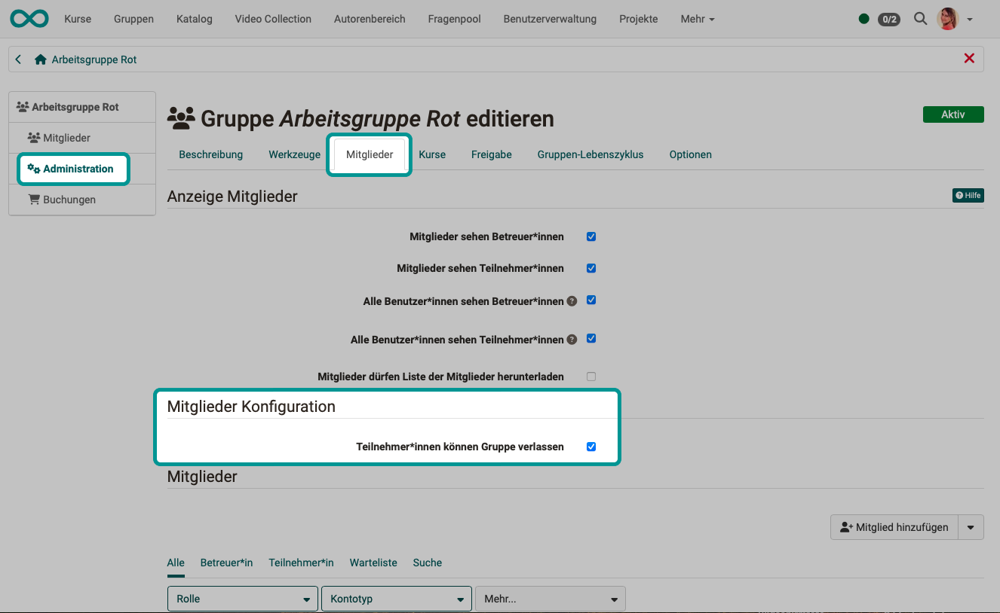
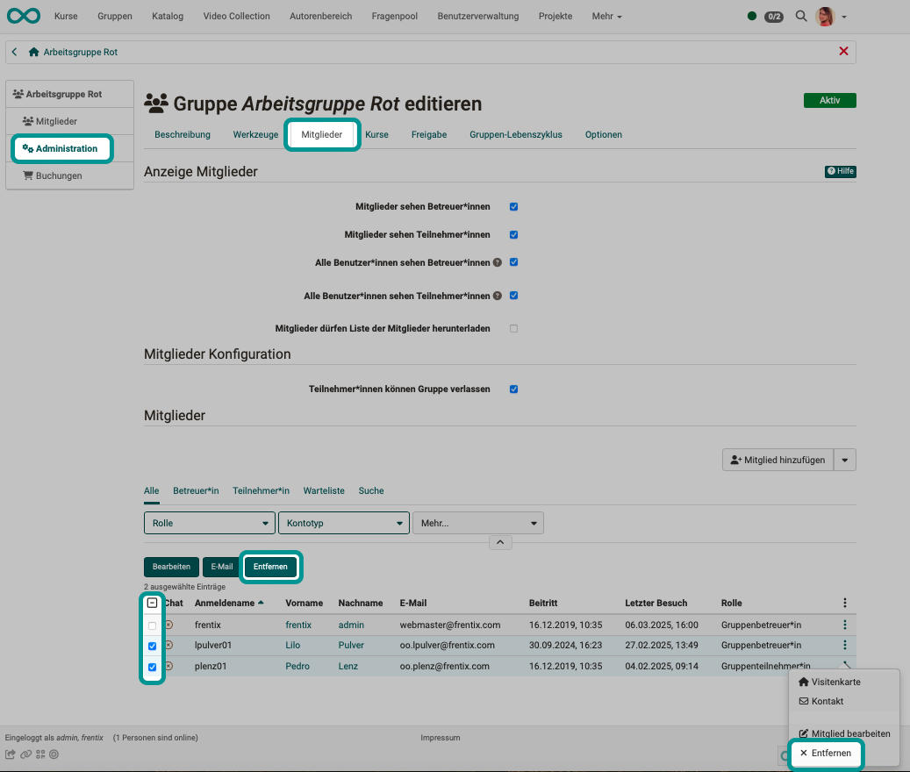
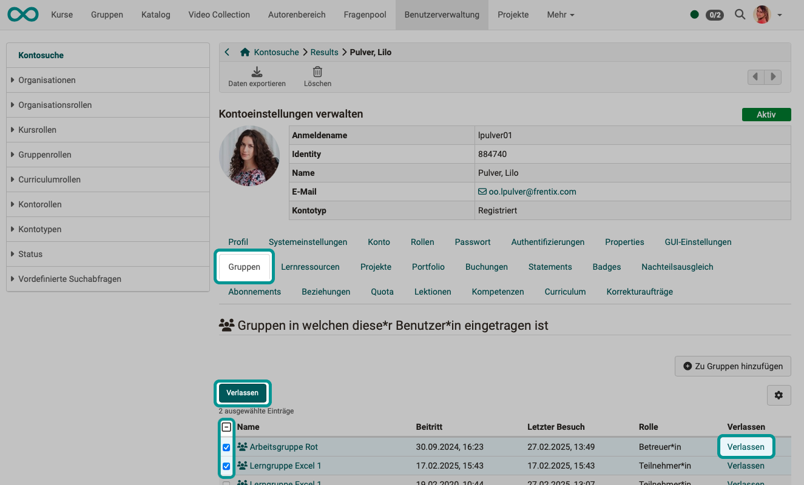

# Leave a group {: #leave_group}

Group membership can be terminated in various ways.

## Leave group by own initiative {: #own_initiative}

There are groups in which membership should be voluntary, e.g. interest groups. However, some groups should not be able to be left on one's own initiative, such as a training class.

Group supervisors can determine in advance whether group members can leave a group independently. Select the group. Under **Administration** in **Tab "Members"** you will find the option with which you can allow participants to leave the group on their own initiative.

{ class="shadow lightbox" }

[To the top of the page ^](#leave_group)

---

## End group membership by group coach

If you select the group as group supervisor, you will find the list of participants under **Administration** in the **Members** tab.

To remove a **individual person** from the group, you can click on the 3 dots at the end of a line. There you will find the option "Remove".

If you want to remove **several group members** from the group at the same time, you can select the relevant rows in the first column. The “Remove” button will then appear above the list.

{ class="shadow lightbox" }

[To the top of the page ^](#leave_group)

---

## End group membership in user management

In the user administration, search for the participant(s) whose membership in a group is to be terminated and select the **"Groups"** tab.

To remove the person **from a single group**, click on the "Leave" link at the end of a line.

If you want to **remove the person from several groups** at the same time, you can select the relevant rows in the first column. The “Exit” button will then appear above the list.

{ class="shadow lightbox" }

[To the top of the page ^](#leave_group)

---

## End group membership by group lifecycle {: #removed_by_grouplifecycle}

If a group life cycle has been set up, groups can be deactivated and then deleted in a further step. 

Group members can only access **inactivated groups** in read-only mode. However, they are still entered as group members.

If the group is **deleted** (set to "Deleted" status), the group members lose their access. However, the "Deleted" status can be reset to "Inactive" or "Active" in the group administration using an administrative role. Only if a group is irrevocably deleted can the group not be restored. 

[To the top of the page ^](#leave_group)

---

## What happens to contributions created in groups? {: #contributions}

When **leaving a group**, the participant is removed from the group, but content **created in the group tools** is retained. E.G:

* documents uploaded to a group folder
* posts written in a group forum
* Texts written in a group chat

When **deleting a group**, the status of the group is set to "Deleted". The group is no longer displayed to former group members, but is still visible to administrative roles in the list of all groups (with the status "Deleted").

* all participants are removed and no longer have access
* links to courses are removed
* the content is retained
* texts written in a group chat can be downloaded as a log file (Excel spreadsheet)

[To the top of the page ^](#leave_group)

---

## What happens if a group creator/group coach leaves the group? {: #group_coach}

By creating a new group, the person creating it becomes the group administrator. If the person remains the only group member and deletes their own membership of the group, their access to this group is also deleted. (The group without members must then be deleted by the administrator, for example).

If there are other group members in addition to the group facilitator who has ended their membership, but none of them have the role of "group facilitator", the group continues to exist without a group facilitator. A group without a group facilitator can still be useful for informal exchanges, for example.

(If there are other group coaches, the tasks of group coaches are transferred to the remaining group coaches).

[To the top of the page ^](#leave_group)

---

## Further information {: #further_information}

[Create group >](Create_Groups.md) 
[Become group member > ](Group_Membership.md) 
[Using group tools >](Using_Group_Tools.md) 
[Configure LTI share groups > ](LTI_Share_groups.md) 
For administrators: [System-wide configuration of the groups >](../../manual_admin/administration/Modules.md) 

[To the top of the page ^](#leave_group)

---
