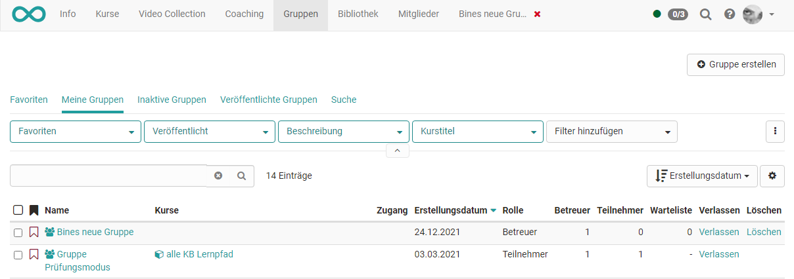

# :fontawesome-solid-user-group: Gruppen

:octicons-device-camera-video-24: **Video-Einführung**: [Arbeit mit Gruppen](<https://www.youtube.com/embed/7LAPedqB9tk>){:target="_blank”} 

!!! note "Quick Links"

    * [Gruppen erstellen](Create_Groups.de.md)
    * [Gruppenmitglied werden](Group_Membership.de.md)
    * [Gruppenwerkzeuge nutzen](Using_Group_Tools.de.md)
    * [Gruppe verlassen](Leave_a_Group.de.md)
    * [Gruppenadministration](Group_Administration.de.md)
    * [LTI Freigabe konfigurieren](LTI_Share_groups.de.md)
  
    Für Berechtigte mit Verwaltungsaufgaben:

    * [Gruppenverwaltung](../area_modules/Group_Management.de.md)

OpenOlat arbeitet mit einem übergreifenden Gruppensystem, das es gestattet,
Gruppen nach Wunsch zu konfigurieren und dem Verwendungszweck anzupassen.
Dieses Kapitel beschreibt, wie Sie Gruppen für verschiedene Verwendungszwecke
konfigurieren und nutzen können.

## Wo findet man die OpenOlat Gruppen?

In der Hauptnavigation finden Sie auch "Gruppen".
Nach Klick darauf sehen Sie z.B. im Tab "Meine Gruppen" alle Gruppen, bei denen Sie als Mitglied eingetragen sind. 

Die Gruppen können gefiltert dargestellt werden, was besonders bei vielen
Gruppen hilfreich ist. Um die Filtermöglichkeiten zu sehen, müssen diese mit Hilfe des kleinen Pfeils aufgeklappt werden.

{ class="shadow lightbox" }

Sie können dort

* Gruppen verlassen
* Gruppen löschen (wenn diese von Ihnen erstellt wurden)
* (Nach Wahl einer Gruppe) die Mitglieder sehen und evtl. mit jemandem Kontakt aufnehmen
* usw.

## Welche Gruppentypen gibt es?

### Lerngruppen innerhalb eines Kurses

Besteht ein Kurs und es sollen dort Gruppenarbeiten durchgeführt werden, können in der Kursadministration (Mitgliederverwaltung) Lerngruppen gebildet werden.

### Gruppen, die mehrere Kurse gemeinsam besuchen

Diese Art Gruppe entspricht einer Klasse, die über längere Zeit zusammen bleibt und gemeinsam verschiedene Kurse besucht. In einen Kurs muss dann nicht jeder/jede Teilnehmer:in einzeln eingebucht werden, sondern es kann die gesamte Gruppe dem Kurs hinzugefügt werden. Wird eine Gruppe gelöscht, die mit einem Kurs verbunden ist, wird lediglich die Gruppe gelöscht, nicht aber der Kurs.

### Interessengruppen

Gruppen können auch völlig unabhängig von Kursen gebildet werden und zum Austausch über gemeinsame Interessen genutzt werden. Zum Beispiel können alle Lehrenden eines Fachgebiets eine gemeinsame Gruppe zum Austausch bilden. Oder Lernende bilden in Eigeninitiative Gruppen zur Prüfungsvorbereitung.

### Managed Groups

Mit Hilfe einer zusätzlichen Software (Syncher) ist es möglich, die Gruppenbildung und Zuweisung der Mitglieder auch automatisch auszuführen. So können in anderen Softwaresystemen bereits gebildete Gruppen in OpenOlat übertragen werden.

!!! note "Hinweis"

    Die Informationen dieses Kapitels richten sich vor allem an Kursteilnehmer:innen, Betreuer:innen und Kursbesitzer:innen (Autor:innen).

    Sind Sie ausserdem mit der Verwaltung der Gruppen beauftragt, stehen Ihnen weitere Aktionen zur Verfügung. Sie finden weitere Informationen dazu im Kapitel [Gruppenverwaltung](../area_modules/Group_Management.de.md).