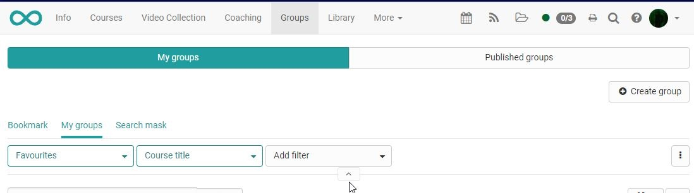

# :fontawesome-solid-user-group: Groups

!!! note "Quick Links"

    * [Create Groups](Create_Groups.md)
    * [Group Administration](Group_Administration.md)
    * [Using Group Tools](Using_Group_Tools.md)
    * [LTI Sharing](LTI_Share_groups.md)

    For authorized persons with administrative tasks

    * [Group Management](../area_modules/Group_Management.md)

OpenOlat works with a comprehensive group system which allows to configure
groups as desired in order to meet different requirements. This chapter describes how to configure and use groups for different purposes.

## Where to find OpenOlat groups?

In the main navigation you will also find "Groups". After clicking on it, you will see all groups where you are registered as a member, in the tab "My groups".

The groups can be displayed in a filtered way, which is especially helpful with many groups. To see the filter options, they must be expanded with the with the help of the small arrow.

{ class="shadow lightbox" }

There you can

* Leave groups
* Delete groups (if you created them)
* See the members of a group (after selecting a group) and get in contact with them
* etc.

## What types of groups are there?

### Learning groups within a course

If a course exists and group work is to be carried out there, learning groups can be created in the course administration (members management).

### Groups that attend several courses together.

This type of group corresponds to a class that stays together for a longer period of time and attends different courses together. In this case, each participant does not have to be enrolled in a course individually, but the entire group can be added to the course. If a group associated with a course is deleted, only the group is deleted, not the course.

### Interest groups

Groups can also be formed completely independently of courses and used to share common interests. For example, all teachers in a subject area can form a joint group for exchange. Or learners form groups on their own initiative to prepare for exams.

### Managed Groups

With the help of additional software (Syncher), it is also possible to carry out group formation and member assignment automatically. In this way, groups already formed in other software systems can be transferred to OpenOlat.

!!! note "Note"

    The information in this chapter is primarily intended for course participants, supervisors and course owners (authors).

    If you are also in charge of managing the groups, further actions are available to you. You will find more information about this in the chapter [Group management](../area_modules/Group_Management.md).