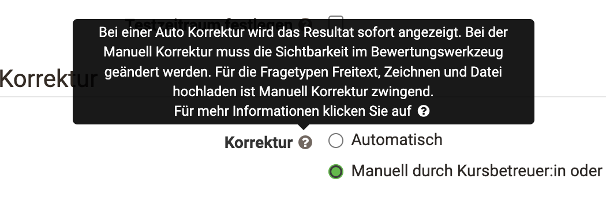
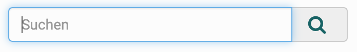
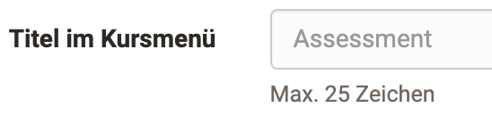

# Hilfe

## Handbuch Link

Rechts oben in der der Hauptmenüleiste besteht jederzeit Zugang zum OpenOlat
Handbuch (hier befinden Sie sich aktuell) und eventuell zu weiteren
Hilfeseiten, je nach Konfiguration durch den System Administrator.  Klicken
Sie einfach auf das Fragezeichen! :fontawesome-solid-circle-question:.

!!! info
	Falls der Link nicht erscheint wurde er bei den Benutzerwerkzeugen in den
	persönlichen [Einstellungen](../personal_menu/Configuration.de.md) ausgeblendet.

## Kontextsensitive Hilfe

{ height=24px }

Bei Ihrer täglichen Arbeit mit OpenOlat steht Ihnen dieses OpenOlat-Handbuch
zur Seite, sowie an wichtigen Stellen im System die  kontextsensitive Hilfe.
Diese Hilfe führt Sie direkt zur relevanten Stelle in OpenOlat Manual und
erklärt Ihnen die Konfigurationsmöglichkeiten für den Ort an dem Sie sich
gerade befinden. Sie erkennen diese Hilfestellung am Fragezeichen-Icon.
Klicken Sie darauf und das Manual öffnet sich in einem neuen Fenster.

## Hilfe in Formularen

Des weiteren finden Sie vor allem in Formularen drei weitere Hilfestellungen,
die Ihnen kurz und knapp benötigte oder weiterführende Informationen zu z.B.
einzelnen Formularfeldern. Wenn Sie dieses Icon
{ class=size16 }
neben einer Feldbeschriftung sehen, fahren Sie mit der Maus darüber um eine
kurze Information zu erhalten. Hier ein Beispiel aus der Konfiguration eines
Tests im Kurseditor:

{ class="shadow" width=400px }

## Hellgrauer Text innerhalb von Feldern...

{ class="shadow" width=150px }

...gibt Hilfestellung **wie** die Felder ausgefüllt werden sollen.

## Hellgrauer Text unterhalb von Feldern...

{ class="shadow" width=420px }

...stellt direkt benötigte Informationen **über** den Feldinhalt zur Verfügung.

## Community, Kursvorlagen und Demokurse

Auf dem [Community Server](https://community.openolat.org) sowie auf dem [Demoserver](https://learn.olat.com "Demoserver") gibt es Demokurse,
die Sie betrachten können.

## Support

Bitte wenden Sie sich an die jeweilige Supportstelle(n) Ihrer OpenOlat
Instanz. Die Supportadresse ist normalerweise im Hilfemenü im Kopfbereich der Seite zu finden oder im Impressum im Kopfbereich oder im Fussbereich der Seite.
