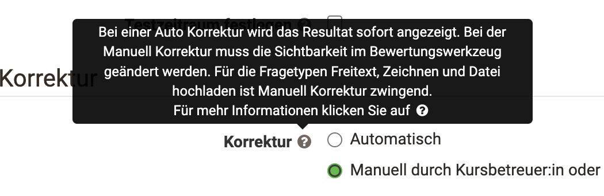
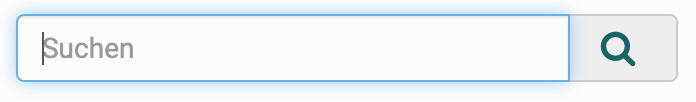
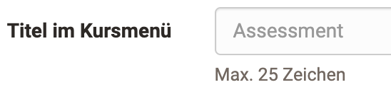

# Hilfe {: #help}

!!! note "Hilfestellungen in OpenOlat"

	* [Sophia >](#help_sophia)
    * [Handbuch Link >](#help_link)
    * [Kontextsensitive Hilfe >](#help_context)
	* [Hilfe in Formularen >](#help_in_forms)
	* [Hellgrauer Text innerhalb von Feldern... >](#help_within_fields)
	* [Hellgrauer Text unterhalb von Feldern... >](#help_below_fields)
	* [Community, Kursvorlagen und Demokurse >](#help_examples)
	* [Support >](#help_support)

## Sophia {: #help_sophia}

**Wer ist Sophia?**

Sophia ist der KI-Hilfe-Assistent im OpenOlat-Benutzerhandbuch (Seitenleiste auf docs.openolat.org) und als Chat-Widget in OpenOlat selbst. Man stellt eine Frage zur Bedienung von OpenOlat in normaler Sprache und erhält eine Antwort mit klickbaren Quellenverweisen auf die passenden Handbuchseiten — inkl. Screenshots und Tabellen aus dem Handbuch, wo hilfreich. Sophia antwortet in der Sprache der Frage (DE/EN) und versteht Rückfragen im Gesprächsverlauf.

**Wie funktioniert Sophia?**

Sophia durchsucht ausschliesslich das indexierte OpenOlat-Benutzerhandbuch (Retrieval-Augmented Generation): Zur Frage werden die relevanten Handbuchseiten gesucht, und ein Sprachmodell formuliert daraus die Antwort mit Quellenangaben. Als Modell kommt gpt-oss-120b zum Einsatz, betrieben bei einem europäischen Inferenz-Anbieter unter europäischem Datenschutzrecht.

**Was kann Sophia nicht?**

- Es erfolgt keine Suche in Kursinhalten, Kursen oder Nutzerdaten — Sophia kennt nur das öffentliche Handbuch, nicht die Inhalte einer OpenOlat-Instanz.
- Fragen ausserhalb von OpenOlat beantwortet Sophia nicht.
- Die Antworten können unvollständig sein; die verlinkten Handbuchseiten sind die verbindliche Referenz. Feedback-Buttons («War das hilfreich?») finden Sie direkt im Chat.

[Zum Seitenanfang ^](#help)

## Handbuch Link {: #help_link}

Rechts oben in der der Hauptmenüleiste besteht jederzeit Zugang zum OpenOlat
Handbuch (hier befinden Sie sich aktuell) und eventuell zu weiteren
Hilfeseiten, je nach Konfiguration durch den System Administrator.  Klicken
Sie einfach auf das Fragezeichen! :fontawesome-solid-circle-question:.

!!! info
	Falls der Link nicht erscheint, wurde er bei den Benutzerwerkzeugen in den
	persönlichen [Einstellungen](../personal_menu/Configuration.de.md) ausgeblendet.

[Zum Seitenanfang ^](#help)

## Kontextsensitive Hilfe {: #help_context}

{ height=24px }

Bei Ihrer täglichen Arbeit mit OpenOlat steht Ihnen dieses OpenOlat-Handbuch
zur Seite, sowie an wichtigen Stellen im System die  kontextsensitive Hilfe.
Diese Hilfe führt Sie direkt zur relevanten Stelle in OpenOlat Manual und
erklärt Ihnen die Konfigurationsmöglichkeiten für den Ort an dem Sie sich
gerade befinden. Sie erkennen diese Hilfestellung am Fragezeichen-Icon.
Klicken Sie darauf und das Manual öffnet sich in einem neuen Fenster.

[Zum Seitenanfang ^](#help)

## Hilfe in Formularen {: #help_in_forms}

Des weiteren finden Sie vor allem in Formularen drei weitere Hilfestellungen,
die Ihnen kurz und knapp benötigte oder weiterführende Informationen zu z.B.
einzelnen Formularfeldern. Wenn Sie dieses Icon
{ class=size16 }
neben einer Feldbeschriftung sehen, fahren Sie mit der Maus darüber um eine
kurze Information zu erhalten. Hier ein Beispiel aus der Konfiguration eines
Tests im Kurseditor:

{ class="shadow" width=400px }

[Zum Seitenanfang ^](#help)

## Hellgrauer Text innerhalb von Feldern... {: #help_within_fields}

{ class="shadow" width=150px }

...gibt Hilfestellung **wie** die Felder ausgefüllt werden sollen.

[Zum Seitenanfang ^](#help)

## Hellgrauer Text unterhalb von Feldern... {: #help_below_fields}

{ class="shadow" width=420px }

...stellt direkt benötigte Informationen **über** den Feldinhalt zur Verfügung.

[Zum Seitenanfang ^](#help)

## Community, Kursvorlagen und Demokurse {: #help_examples}

Auf dem [Community Server](https://community.openolat.org) sowie auf dem [Demoserver](https://learn.olat.com "Demoserver") gibt es Demokurse,
die Sie betrachten können.

[Zum Seitenanfang ^](#help)

## Support {: #help_support}

Bitte wenden Sie sich an die jeweilige Supportstelle(n) Ihrer OpenOlat
Instanz. Die Supportadresse ist normalerweise im Hilfemenü im Kopfbereich der Seite zu finden oder im Impressum im Kopfbereich oder im Fussbereich der Seite.

[Zum Seitenanfang ^](#help)