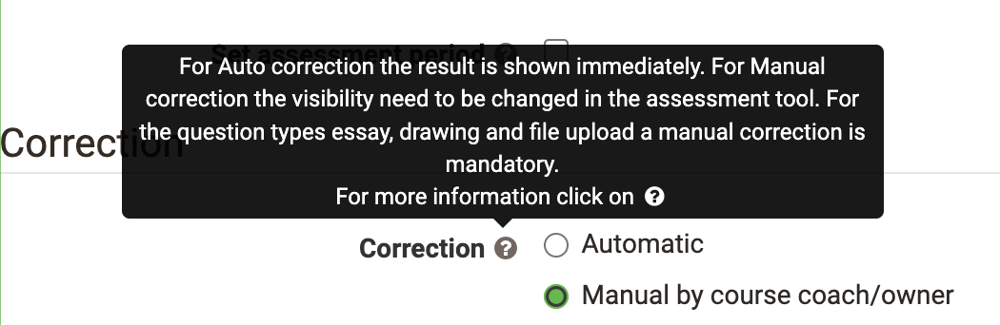
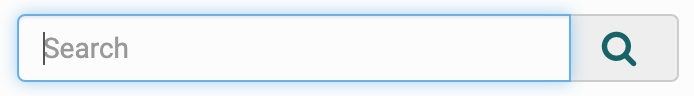
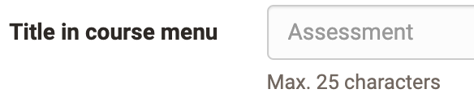

# Help

## Link to the Manual

At the top right of the main menu bar, you can always access the OpenOlat
manual (this is where you are currently located) and possibly to further
help pages, depending on the configuration by the system administrator.  Click
on the question mark! :fontawesome-solid-circle-question:.

!!! info

    If the link does not appear, it has been hidden at the user tools in the
    personal [Settings](../personal_menu/Configuration.md).

## Context sensitive help

{ height=24px }

For your daily work with OpenOlat, this OpenOlat manual is at your disposal
as well as the context sensitive help at important places in the system.
This help leads you directly to the relevant place in the OpenOlat manual and
explains the configuration options for the screen you are at the moment. You can recognize this help by the question mark icon.
Click on it and the manual opens in a new window.

## Help in forms

In addition, you will find three further aids, especially in forms,
which give you briefly and concisely required or more detailed information on e.g.
individual form fields. If you find this icon
{ class=size16 }
next to a field label, move the mouse over it to get a short information. Here is an example from the configuration of a test in the course editor:

{ class="shadow" width=400px }

## Light gray text inside fields...

{ class="shadow" width=150px }

...gives assistance **how** the fields should be filled in.

## Light gray text below fields...

{ class="shadow" width=420px }

...provides directly needed information **about** the field content.

## Community, course templates and demo courses

There are demo courses which you can view on the [Community Server](https://community.openolat.org) as well as on the [Demo Server](https://learn.olat.com "Demoserver").

## Support

Please contact the respective support center(s) of your OpenOlat
instance. The support address can usually be found in the help menu in the header area of the page or in the imprint in the header area or in the footer area of the page.
