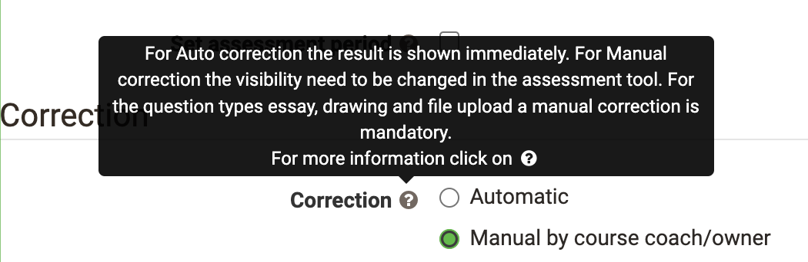
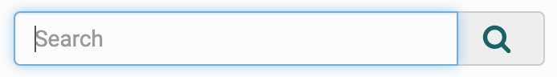
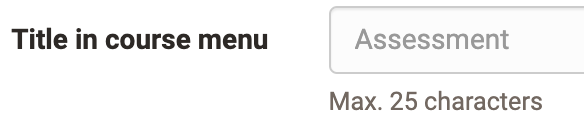

# Help {: #help}

!!! note "Help resources in OpenOlat"

	* [Sophia >](#help_sophia)
    * [Link to the Manual >](#help_link)
    * [Context sensitive help >](#help_context)
	* [Help in forms >](#help_in_forms)
	* [Light gray text inside fields... >](#help_within_fields)
	* [Light gray text below fields... >](#help_below_fields)
	* [Community, course templates and demo courses >](#help_examples)
	* [Support >](#help_support)

## Sophia {: #help_sophia}

**Who is Sophia?**

Sophia is the AI help assistant in the OpenOlat user manual (sidebar on docs.openolat.org) and as a chat widget within OpenOlat itself. You ask a question about using OpenOlat in plain language and receive an answer with clickable links to the relevant manual pages—including screenshots and tables from the manual where helpful. Sophia responds in the language of the question (DE/EN) and understands follow-up questions as the conversation progresses.

**How does Sophia work?**

Sophia searches exclusively the indexed OpenOlat user manual (Retrieval-Augmented Generation): The relevant manual pages are retrieved for the question, and a language model uses them to formulate the answer with source references. The model used is gpt-oss-120b, hosted by a European inference provider in compliance with European data protection laws.

**What can’t Sophia do?**

- It does not search course content, courses, or user data—Sophia only knows the public manual, not the contents of an OpenOlat instance.
- Sophia does not answer questions outside of OpenOlat.
- Answers may be incomplete; the linked manual pages are the authoritative reference. Feedback buttons (“Was this helpful?”) can be found directly in the chat.

[To the top of the page ^](#help)

## Link to the Manual {: #help_link}

At the top right of the main menu bar, you can always access the OpenOlat
manual (this is where you are currently located) and possibly to further
help pages, depending on the configuration by the system administrator.  Click
on the question mark! :fontawesome-solid-circle-question:.

!!! info

    If the link does not appear, it has been hidden at the user tools in the
    personal [Settings](../personal_menu/Configuration.md).

[To the top of the page ^](#help)

## Context sensitive help {: #help_context}

{ height=24px }

For your daily work with OpenOlat, this OpenOlat manual is at your disposal
as well as the context sensitive help at important places in the system.
This help leads you directly to the relevant place in the OpenOlat manual and
explains the configuration options for the screen you are at the moment. You can recognize this help by the question mark icon.
Click on it and the manual opens in a new window.

[To the top of the page ^](#help)

## Help in forms {: #help_in_forms}

In addition, you will find three further aids, especially in forms,
which give you briefly and concisely required or more detailed information on e.g.
individual form fields. If you find this icon
{ class=size16 }
next to a field label, move the mouse over it to get a short information. Here is an example from the configuration of a test in the course editor:

{ class="shadow" width=400px }

[To the top of the page ^](#help)

## Light gray text inside fields... {: #help_within_fields}

{ class="shadow" width=150px }

...gives assistance **how** the fields should be filled in.

[To the top of the page ^](#help)

## Light gray text below fields... {: #help_below_fields}

{ class="shadow" width=420px }

...provides directly needed information **about** the field content.

[To the top of the page ^](#help)

## Community, course templates and demo courses {: #help_examples}

There are demo courses which you can view on the [Community Server](https://community.openolat.org) as well as on the [Demo Server](https://learn.olat.com "Demoserver").

[To the top of the page ^](#help)

## Support {: #help_support}

Please contact the respective support center(s) of your OpenOlat
instance. The support address can usually be found in the help menu in the header area of the page or in the imprint in the header area or in the footer area of the page.

[To the top of the page ^](#help)
