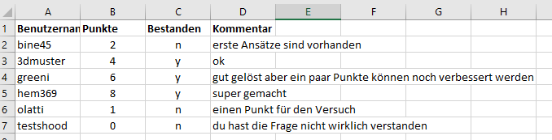
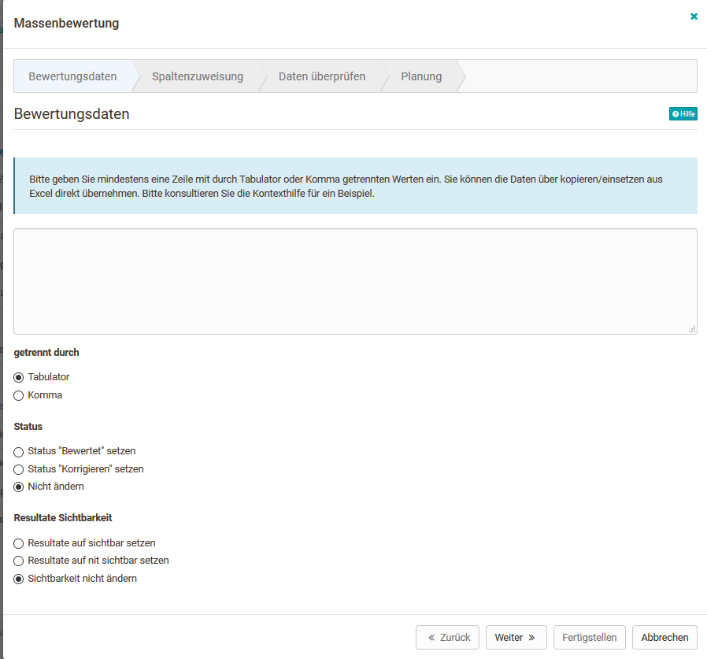
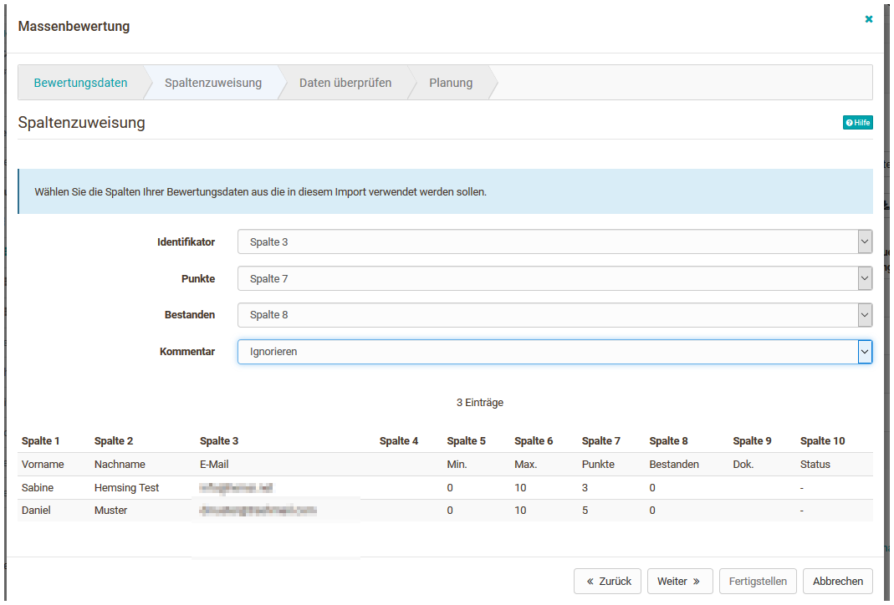

# ... eine Massenbewertung für Einsendeaufgaben erstellen

Mit der Massenbewertung können Sie im [Bewertungswerkzeug
](../course_operation/Assessment_tool_-_overview.de.md)mehrere Kursteilnehmer zu
einem von Ihnen gewünschten Zeitpunkt auf einmal bewerten. Sie benötigen dazu
eine Liste die die Benutzeridentifikation (Benutzername, registrierte E-Mail-
Adresse oder Institutionsnummer/Matrikelnummer), die Anzahl Punkte, Status und
falls gewünscht den Kommentar enthält. Dabei werden die einzelnen Felder durch
Tabulator oder Komma getrennt.

Am einfachsten ist es eine Tabelle aus Excel oder OpenOffice zu verwenden und
diese mit Werten zu füllen.

Massenbewertungen können für die [Assessment
Kursbausteine](../course_elements/Assessment.de.md) Aufgabe,
Gruppenaufgabe und Bewertung vorgenommen werden. Die Massenbewertung für die
Bausteine Aufgabe und Bewertung erfolgt über den Tab „Benutzer“. Die Massen-
Gruppenbewertung erfolgt über den Tab „Gruppen“.

## Erstellung einer Massenbewertung für die Kursbausteine Aufgabe oder Bewertung {: #node}

* [Aufgabe](../course_operation/Assessing_tasks_and_group_tasks.de.md)
* [Bewertung](../course_operation/Assessment_of_course_modules.de.md)  

Verwenden Sie ein externes Tabellenprogramm, erstellen Sie die gewünschten
bzw. benötigten Spalten und tragen Sie die Bewertungen ein. Kopieren Sie
anschließend die Daten der Tabelle in das Eingabefeld der Massenbewertung.

Je nach Konfiguration des Bausteins stehen unterschiedliche Optionen zur
Verfügung.

Ist die Option „Bewertung“ im Baustein nicht aktiviert kann auch keine
Massenbewertung vorgenommen werden.

### Hilfestellung zur Erstellung von Massenbewertungen

Wählen Sie zunächst im Bewertungswerkzeug den Kursbaustein Ihres Kurses aus,
für den eine Massenbewertung durchgeführt werden soll. Er muss so konfiguriert
sein, dass mindestens eine der folgenden Optionen aktiviert wurde:

* Punkte
* Bestanden
* Kommentar
* Dateien

Anschließend können Sie mit der Massenbewertung beginnen.

Am einfachsten ist es, wenn Sie zunächst die gewünschten Tabellenspalten in
der Bewertungsübersicht aktivieren und dann die leere oder nur teilausgefüllte
Tabelle herunterladen. So erhalten Sie eine optimale Tabellenvorlage, die Sie
nur noch entsprechend befüllen müssen.

### Die einzelnen Schritte der Massenbewertung

Beim Kursbaustein Aufgabe kann zusätzlich gewählt werden ob die Abgabe
akzeptiert wurde und es können gezippt Rückgabedateien hochgeladen werden.

#### 1. Bewertungsdaten

Laden Sie hier die außerhalb von OpenOlat erstellten Bewertungsdaten hoch
indem Sie die Infos mit copy+paste in das freie Feld einfügen. Wenn Sie sich
vorher die leere Tabelle exportiert haben, sollte es keine Syntax Probleme
geben.

Eine Datenzeile muss immer folgende Informationen enthalten:

* Benutzeridentifikation (Benutzername, registrierte E-Mail-Adresse oder Institutionsnummer/Matrikelnummer)
* Anzahl Punkte. Teilpunkte können mit Komma oder Punkt eingegeben werden (Achtung: Komma kann nicht verwendet werden wenn Komma als Trennzeichen verwendet wird)
* Status (vgl unten)
* Falls gewünscht, kann an vierter Stelle noch ein Kommentar eingegeben werden.

Sie können Daten entweder über kopieren/einfügen aus Excel o.ä. direkt
übernehmen, oder von Hand eintragen. Wählen Sie "getrennt durch Tabulator"
falls Sie Daten aus einer Excel-Datei übernehmen.

`micki,5,y,Hervorragend`| Dem Benutzer "micki" werden 5 Punkte, der Status „Bestanden“ sowie ein Kommentar hinzugefügt  
---|---  
`micki,,y,Hervorragend`| Wird die Punktezahl nicht benötigt, lassen Sie das Feld frei. Der Platzhalter muss allerdings dennoch eingefügt werden  
`micki,4,y,""`| Um Kommentare zurück zu setzen, können Sie den „“ verwenden, wie dieses Beispiel zeigt  
  
Folgende Eingaben können Sie für den **Bestanden-Status** nutzen:

Bestanden: `y, yes, passed, true, 1, bestanden`

Nicht bestanden: `no, failed, false, 0, nicht bestanden`  
  
Nur für Massenbewertungen des **Aufgabenbausteins**:

Stellen Sie für die einzelnen Studierenden, die eine Rückgabedatei erhalten je
einen Ordner. Legen Sie dort das individuelle Feedback für die jeweilige
Person ab. Zippen Sie die Datei und laden Sie diese im ersten Schritt unter
„Bewertungsdaten“ hoch.

#### 2. Spaltenzuweisung {: #map}

Hier können Sie definieren welche Spalten ihrer extern erstellten Bewertung
für welches Feld stehen (z.B. Identifikator, Punkte, bestanden, Kommentar).

#### 3. Daten überprüfen

Hier wird Ihnen noch einmal angezeigt welche Informationen wie übernommen
werden und ob es Probleme gibt.

#### 4. Planung {: #schedule}

Hier können Sie definieren ob die Bewertung sofort erfolgt oder erst zu einem
bestimmten Datum.

Sie können Daten auch von Hand eintragen. Dazu müssen Sie "getrennt durch
Komma" auswählen, um die Daten korrekt zu übernehmen.

Anschließend erscheinen die vorgenommenen Änderungen in der Bewertungstabelle.

Für die Kursbausteine Aufgabe und Bewertung ist auch eine Massenbewertung für
Gruppen möglich.

Gehen Sie bei der Gruppenbewertung analog vor. Wählen Sie unter dem Reiter
"Gruppen" die gewünschte Gruppe aus und starten Sie im erscheinenden Menü die
Option "Neue Massenbewertung".
