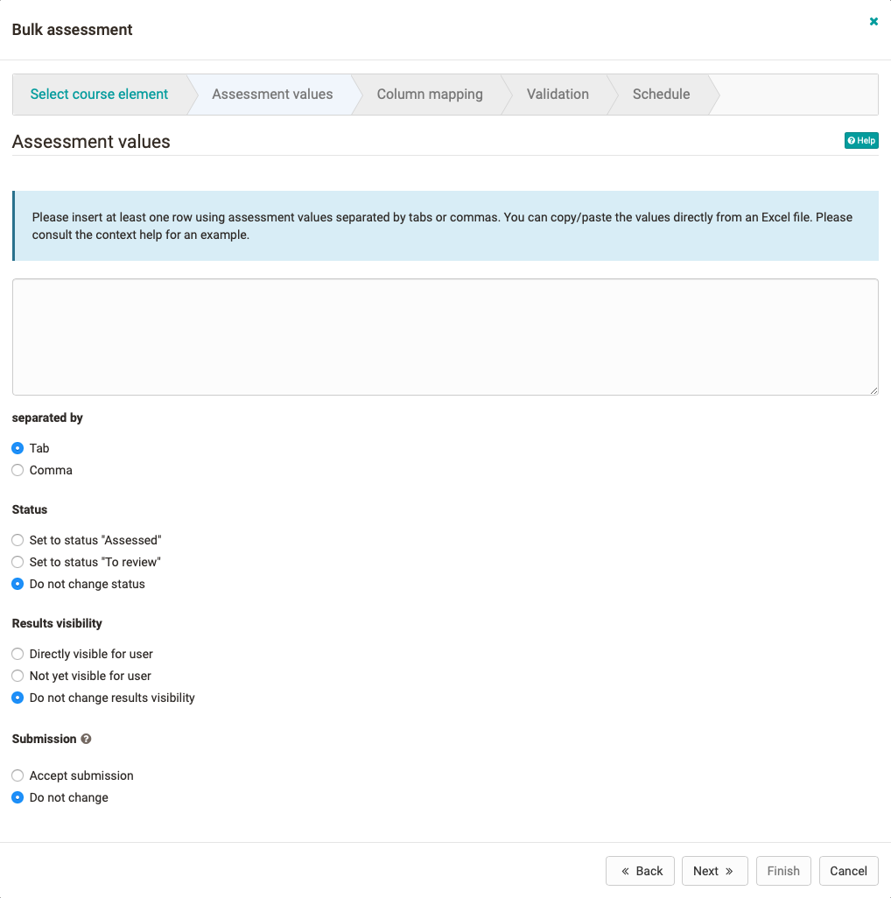
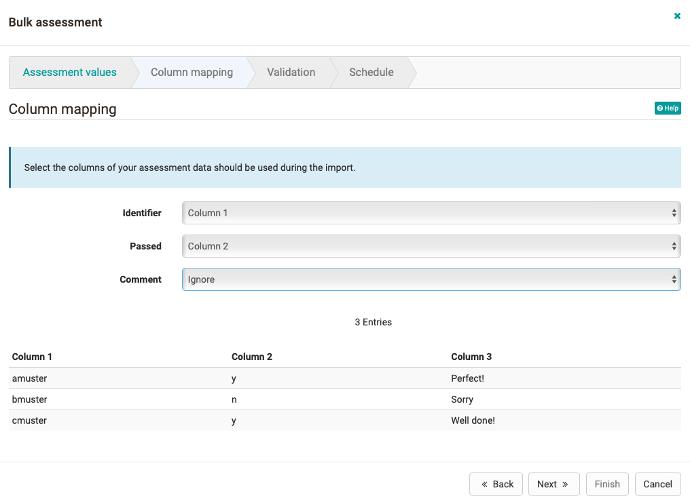

# ... create a bulk assessment for submission tasks

By means of the bulk assessment you can assess several course participants
simultaneously at any given time. All you need is a list of rows with values
separated by tabs or commas. You will always need a user identification (user
name, registered e-mail address or institutional identifier), the score, the
passed status and, if so desired, a comment.

The easiest way is to use a table from Excel or OpenOffice and fill it with
values.

Bulk assessments can be made for the [assessment course elements](../course_operation/Assessment_of_course_modules.md) task, group task and assessment.
Bulk assessment for the modules task and assessment is carried out via the tab
"Users". The bulk assessment for groups is done via the tab "Groups".

## Creation of a bulk assessment for the course elements task or assessment {: #node}
  * [Task](../course_operation/Assessing_tasks_and_group_tasks.de.md)
  * [Assessment](../course_operation/Assessment_of_course_modules.de.md)  

Use an external table processing program, create the required columns and
enter the value assignments. Then copy the table data to the bulk assessment
input field.

Depending on the configuration of the course element, different options are
available. If the "grading" option is not activated in the course element, no
bulk assessment can be carried out.

## How to create a bulk assessment

Select the assessable course element for which a bulk assessment should be
carried out. All course elements are displayed for which at least one of the
following assessment features is configured:

  * Score
  * Passed
  * Comment
  * Files

You can then start bulk assessment.

The easiest way is to first activate the desired table columns in the
evaluation overview and then download the empty or only partially filled
table. In this way you get an optimal Excel table, which you only have to fill
in accordingly.

###  The individual steps of a bulk assessment:

  

With the course element Task you can additionally choose whether the
submission was accepted or not and you can upload zipped return files.

  

#### 1. Assessment data**

Upload the assessment data created outside of OLAT by inserting the
information into the free field with copy+paste. If you have exported the
empty table before, there should be no syntax problems.

A data line must always contain the following information:

  * User identification (user name, registered email address or institution number/matriculation number)
  * Number of points. Subpoints can be entered with commas or dots (Note: commas cannot be used if commas are used as separators)
  * Status (see below)
  * If desired, a comment can be entered in fourth position.

You can either copy/paste data directly from Excel or similar, or enter it
manually. Select "Separated by tabulator" if you want to import data from an
Excel file.

`alesend,5,y,Hervorragend`| The user gets a score of 5, a passed status and a
comment added.  
---|---  
`aalesend,,y,Hervorragend`| If no score is required, you can omit it, but you
still have to use a placeholder.  
`alesend,4,y,""`| Already existing comments can be resetted by adding "".  
  
Use the following entries to set the **passed** **status** :

    
    
    Passed: y, yes, passed, true, 1, passed
    
    
    Failed: n, no, failed, false, 0, failed

  

Only for bulk assessment of the task module:

Create a folder for each individual student who receives a return file. Enter
the individual feedback for each person there. Zip the file and upload it in
the first step under "Assessment values".

#### 2. Column mapping {: #map}

Here you can define which columns of your externally created scoring stand for
which field (for example, identifier, score, passed, comment). If you have not
selected these options, the step can be skipped.

#### 3. Validation

Here you can see again which information is transferred how and if there are
any problems.

#### 4. Schedule {: #schedule}

Here you can define whether the valuation takes place immediately or only on a
certain date.

You can also enter data manually. To do this, you must select "separated by
comma" to accept the data correctly.

The changes made then appear in the valuation table.

  

Bulk assessment for groups is also possible for the course elements Task and
Assessment.

Proceed in the same way for group assessment. Select the desired group under
the "Groups" tab and start the option "New bulk assessment" in the menu that
appears.

  

