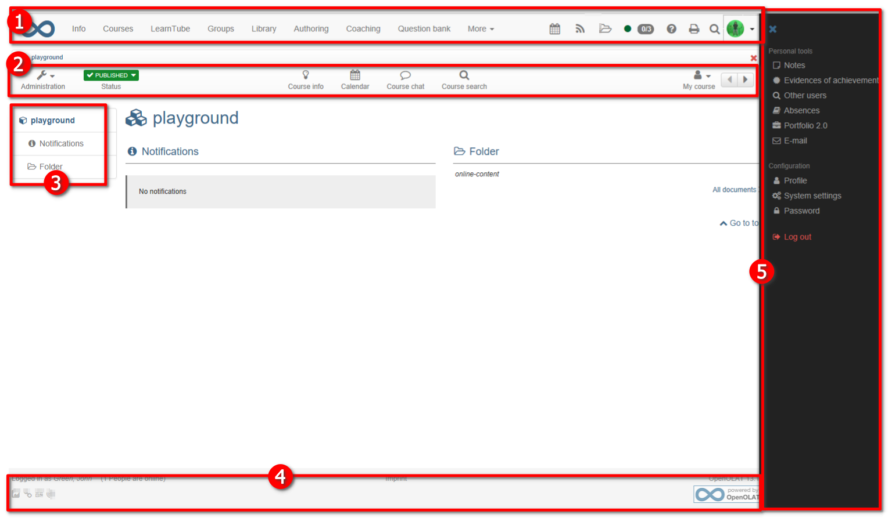

# ... customize the course design with CSS (Expert)

**Specification**

Customize the course design in order to e.g. adopt the corporate design

**Prerquisites**

  * in-depth knowledge of CSS
  * experience with various browser developer tools
  * basic HTML Knowledge

## Introduction

The standard layout of OpenOlat can be modified with the help of CSS. This can
give your course an individual design which will make it easily recognizable.
Should your institution or organization have a corporate design, you can also
use CSS to adapt your course accordingly.

  

**WARNING  
**

Some element selectors (e.g. “p” or “h1”) are often used throughout the
platform. Changes can therefore apply far beyond their original purposes with
unforeseen consequences. For instance, should the font color be changed to
blue, the changes could also apply to blue buttons, thus rendering the text
illegible. Please mind those unexpected consequences before changing the
layout of a course. You should also follow the basics of web design, for
example by keeping a sufficient contrast between the font color and the
background.

## What do I need to customize my course design?

You first need a text editor (such as [Notepad++](https://notepad-plus-
plus.org/)) to create a CSS file and a tool to analyse a website's CSS. This
will help you find the appropriate ID and class selectors. This is done via
the browser option "Examine element". In Firefox and Chrome this tool is
already integrated. Right-click in the web page and select "Examine Element
(Q)" or "Examine (Ctrl+Shift+I)".

## Saving and choosing a CSS file

To be able to use your css file for the design of your OpenOlat course, you
must create a subfolder "courseCSS" in the course folder and store the course
CSS file there. To ensure that the file is also used, the desired file is
selected in the OpenOlat course menu "Layout". If you want to return to the
standard OpenOlat layout later, select the option "Standard", or simply delete
your CSS from the file folder.

## What concrete changes can be made?

The possibilities for change are manifold: Here are a few examples:

### Customize the background

To customize the background of a course, you need to use the ID selector
"#o_body" and declare the property "background", "background-color" or
"background-image". So you can define both the background image and the
background color for this path. The desired background color can simply be
stored in the course storage folder and linked appropriately.

The code could for instance look like this:  
  
#o_body {  
background-color: red; /* creates a red background */  
background-image: url(bild.svg); /* linkes to an image that is used as
background */  
background-position: center; /* sets the image centered */  
}

Usually it makes sense to link either a background color or a background
image. Place the image in a suitable location in the course storage folder.

Furthermore, it is recommended to use the following CSS settings in order to
make other sections of the website transparent:

#o_main_wrapper, #o_main_wrapper #o_main_container {  
background: transparent;  
}

#o_main_wrapper #o_main_container #o_main_left {  
background:transparent; margin-right: 15px;  
}

#o_main_wrapper #o_main_container #o_main_center {  
background:transparent;  
}

#o_footer_wrapper, #o_footer_container {  
background: transparent;  
}

  

**Course element "Single page"  
**

It may be usefull from time to time to change the background of a specific
HTML page to adjust to the overall design of a course. It is also possible to
do so with CSS. For instance, the following code can be inserted to the HTML
in order to make the background of the page transparent:  
  
body {  
background-color: transparent;  
}

## Further ID and class selectors

Here are some sections of a course's site with the appropriate ID or class
selectors:

 **  
**

 **  
**

 **1\. Upper menu:** CSS ID selector: „#o_navbar_container“

 **1a. Change the logo  
**

You can change or adjust the logo of the upper menu with the class selector
".o_navbar-brand". For example, you can declare the following properties as
follow:

  * display: none; (will not display the default logo)
  * background: rgba(0, 0, 0, 0) url("logo-k-town.png"); (will change the default logo for the file "logo-k-town.png")

 **2\. Course menu:** CSS class selektors: „.o_toolbar .o_tools_container“

 **3\. Left menu:** CSS ID selector: „#o_main_left_content“

 **4\. Footer:** CSS ID selector: „#o_footer_container“ and
"#o_footer_wrapper"

 **5\. User menu (folding menu on the right):** CSS ID selector
"#o_offcanvas_right"

  

Should you wish to change the font of titles in OpenOlat, then you should use
the element selector **h2**. Two other element selectors can also be modified
to adjust to your design: **p** (paragraph) and **a** (hyperlinks). Many CSS
properties may apply to those element selectors. Here are some examples:

  *  **color: red;** (changes the color of the font, here in red. The hex code "#ffffff" or RGB value "rgb(87 , 53, 4)" can alternatively be used.
  *  **font-family: verdana;** (changes the font family)  

  *  **font-weight: bold;** (defines the weight of the font, here "bold")  

  *  **text-transform: uppercase;** (changes the text to uppercase/all caps)  

## Further links

 **[W3school:](http://www.w3schools.com/css/default.asp)** Useful resource on
CSS selectors, elements and properties  
 **[Notepad++:](https://notepad-plus-plus.org/)** Free text editor adjusted
for programming and markup languages such as CSS
