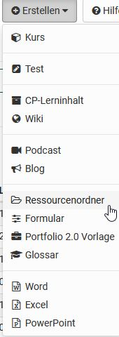
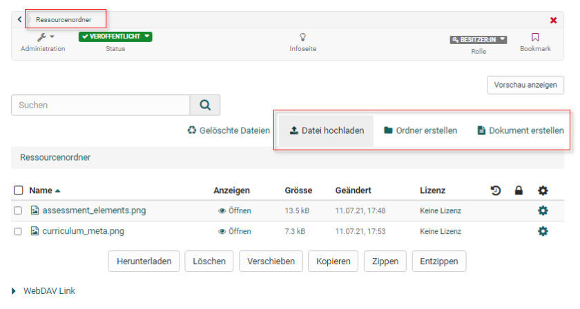
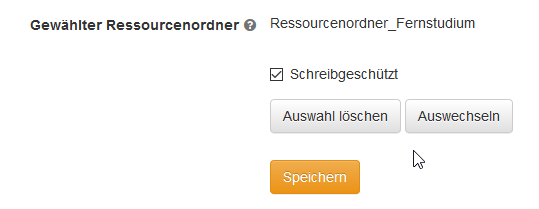

# ... dieselben Dateien in mehreren Kursen einsetzen

Wenn Sie ein Lehrszenario mit mehreren Kursen, z.B. einen Studiengang umsetzen
wollen und dabei viele Dateien in allen Kursen verwendet werden sollen, bietet
es sich an, diese Dateien zentral in der Lernressource [Ressourcenordner](../learningresources/index.de.md#ressourcenordner)
abzulegen und dann in den gewünschten Kursen einzubinden. Das hat den Vorteil,
dass Sie Änderungen an den Dateien nur einmal vornehmen müssen und diese
automatisch in allen verlinkten Kursen sichtbar werden. Typische Beispiele für
derartige Dateien sind grundsätzliche Rahmenbedingungen, AGBs,
organisatorische Infos, Infos zur generellen Betreuung bzw. Ansprechpartnern aber auch kursübergreifende Lehrmaterialien. 

### Was Sie benötigen

* Autorenrechte
* Lernressource "[Ressourcenordner](../learningresources/index.de.md#ressourcenordner)"
* Mehrere Lernressourcen "Kurs"
* Ihre übergreifenden Dateien

## Vorgehensweise

### Ressourcenordner erstellen  

1. Gehen Sie hierfür in den [Autorenbereich](../area_modules/Authoring.de.md)und wählen Sie
„Erstellen“ -> „Ressourcenordner“.

    {class="thumbnail-lg"}
  
2. Vergeben Sie einen passenden Namen für die Lernressource und füllen Sie das
allgemeine Beschreibungsformular nach Bedarf aus. Da der Ressourcenordner eher für die interne Organisation verwendet wird, ist es nicht nötig hier Infos zu hinterlegen. Die Beschreibung der Lernressource
dient hier eher Ihrer eigenen Organisation. 
Anschliessend landen Sie in den "Einstellungen" der Lernressource "Ressourcenordner" und können hier weitere Konfigurationen vornehmen.  
  
3. Klicken Sie in der Krümelleiste auf den Namen Ihres Ressourcenordners um
weitere Einstellungen vornehmen zu können und vor allem ihre Dateien über den entsprechenden Link hochzuladen. 
Alternativ können Sie HTML-Dateien hier auch
direkt erstellen.

    {class="thumbnail-lg"}

Nutzen Sie [**WebDAV**](../basic_concepts/Using_WebDAV.de.md)wenn Sie viele Dateien hochladen
wollen.  
  
### Ressourcenordner in Kurse einbinden  

1. Öffnen Sie den gewünschten Kurs und wählen Sie in der "Administration" im
Untermenü "Einstellungen" den Reiter "Optionen".

    {class="thumbnail-lg"}
  
2. Klicken Sie unter "Gewählter Ressourcenordner" auf "auswechseln".

    {class="thumbnail"}  
  
3. Hier können Sie nun Ihren im Vorfeld erstellten Ressourcenordner auswählen und
so mit dem Kurs verlinken. Wenn Sie einen Ressourcenordner ausgewählt haben, erscheint sein Name sowie
der Button "Auswahl löschen", mit dem Sie ihn wieder abwählen können.

    {class="thumbnail"}
  
4. Standardmässig sind die Dateien des Ressourcenordners innerhalb von Kursen
schreibgeschützt. Das macht Sinn, da man die Dateien ja zentral ändern und
aktualisieren möchte. Ist es jedoch notwendig (einzelne) zentrale Dateien noch
einmal im Kurs und zwar nur für den jeweiligen Kurs zu überschreiben, können
Sie den Schreibschutz im Menü "Optionen" des Kurses entfernen.

    {class="thumbnail"}  
  
Wiederholen Sie das Vorgehen für alle Kurse, die Zugriff auf die im Ressourcenordner hinterlegten Dateien bekommen sollen.

### Zugriff auf die Dateien organisieren  

1. Um auf die Dateien des Ressourcenordners innerhalb des Kurses zuzugreifen,
gehen Sie in den Ablageordner des Kurses. Hier finden sie den automatisch
angelegten Unterordner „_sharedfolder“.

    {class="thumbnail-lg"}
  
2. Diese Dateien können Sie nun wie alle anderen Dateien des Ablageordners über
den Kursbaustein "[Einzelne Seite](../learningresources/Course_Element_Single_Page.de.md)" im Kurseditor hinzufügen.

!!! Info "Achtung"

    Sie können lediglich _einen_ Ressourcenordner pro Kurs einbinden. Überlegen Sie deshalb im Vorfeld genau, welche Dateien Sie über einen kursübergreifenden Ressourcenordner statt des kursbezogenen Ablageordners organisieren möchten.
