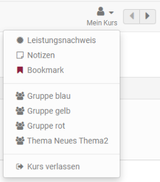
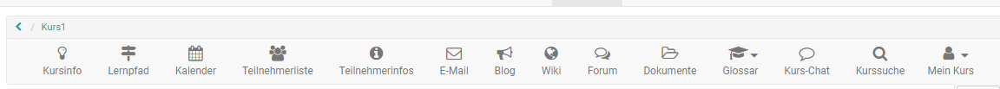
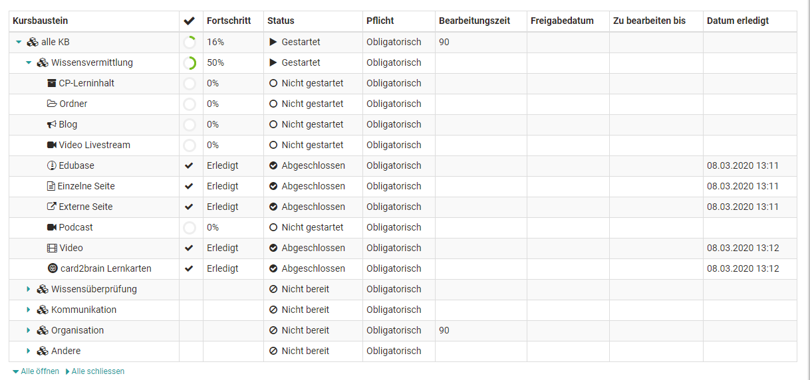

#  [Zusätzliche Kursfunktionen](Additional_Course_Features.de.md)

Im Kurs stehen Usern eine Reihe von weiteren Kursfunktionen zur Verfügung, die
der Besitzer des Kurses nach Bedarf ein- und ausschalten kann. So kann eine
Toolbar mit diversen weiteren Funktionen aktiviert werden. Die Tools sind dann
entweder über das Menü "Mein Kurs" oder direkt in der Toolbar aufrufbar. In
der Toolbar sind die Tools unabhängig von bestimmten Freigaben innerhalb der
Kursstruktur.

##  Menü "Mein Kurs"

Das Dropdown-Menü "Mein Kurs" bietet Zugriff auf personalisierte Bestandteile
des Kurses. Abhängig von der Konfiguration des Kurses werden eventuell nicht
alle Einträge angezeigt.

  * Notizen: Hier können Sie kursspezifische Notizen eintragen, die nur Sie als Kursteilnehmer lesen können.
  * Der Leistungsnachweis zeigt Ihre Bewertungen im Kurs in Tabellenform an und gibt, sofern aktiviert, Zugriff auf das Zertifikat des Kurses
  * Bookmark: Aktivieren Sie den Bookmark, dann erscheinen diese Kurse im Menü "Kurse" im Tab "Favoriten".

sites/manual_user/docs/learning_activities/Additional_Course_Features.de.md §Groups.de.md§ 481
  * [Gruppen:](../display/OO161DE/Gruppen.html) Hier sehe Sie alle _kursspezifischen_ Gruppen in denen Sie Mitglied sind.
  * Mit "Kurs verlassen" können Sie sich aus dem Kurs austragen.

Die "Kurs verlassen" Funktion beendet sofort ihre Kurs- oder
Gruppenmitgliedschaft, abhängig davon auf welche Weise Sie Zugriff zum Kurs
haben. Im Anschluss daran haben Sie keinen Zugriff mehr auf den Kurs, bzw.
müssen den entsprechenden Kurs- oder Gruppenbetreuer kontaktieren um wieder
Kurszugriff zu erhalten.

Die Möglichkeit, sich aus einem Kurs auszutragen muss zuvor vom Kursbesitzer
aktiviert worden sein und gilt nur für Kursteilnehmer, nicht für Betreuer oder
Besitzer.

### Leistungsnachweis & Zertifikat

Ein Leistungsnachweis ist eine Bestätigung einer erfolgten Leistungskontrolle
und zeigt beispielsweise absolvierte Tests oder abgegebene und bewertete
Aufgaben an. Wenn der Besitzer des Kurses den Leistungsnachweis eingeschaltet
hat, es im Kurs bewertbare Kursbausteine gibt, Sie bereits einen Test oder
eine Aufgabe absolviert haben und bewertet wurden, ist Ihr Leistungsnachweis
im Dropdown-Menü "Mein Kurs" aufrufbar. Falls für diesen Kurs ein Zertifikat
ausgestellt wurde finden Sie dies ebenfalls unter "Leistungsnachweis" zum
herunterladen.

Bei automatisch ausgestellten Zertifikaten nach erfolgreichem Abschluss eines
Kurses erhalten Sie eine automatisch generierte Benachrichtigung per E-Mail.

Alle Ihre Leistungsnachweise und Zertifikate finden Sie auch unter
„[Leistungsnachweise](viewpage.action%EF%B9%96pageId=108593349.html#Pers%C3%B6nlicheWerkzeuge-
_leistungsnachweise)". Der Leistungsnachweis öffnet sich immer in einem neuen
Fenster, das sich auch als Druckformat eignet.

  

  

## Weitere Elemente der Toolbar

sites/manual_user/docs/learning_activities/Additional_Course_Features.de.md §Info_page.de.md§ 481
Standardmäßig ist die [Kursinfo ](../catalog/Info_page.de.md)in der
Toolbar sichtbar. Folgende weitere Tools können ebenfalls über die Toolbar
aufrufbar sein:

  * Lernpfad: Übersicht der erledigten und offenen Kurselemente
  * Kalender: Zugriff auf den kursspezifischen Kalender
  * Teilnehmerliste: Übersicht der Kursmitglieder
  * Teilnehmerinfos: Hier kann der Lehrende zentrale Kursinfos hinterlegen (Mitteilung)
  * E-Mail: Vom Lehrenden vorkonfigurierte Möglichkeit E-Mails an Kursbesitzer, Betreuer und/oder Teilnehmer zu versehenden
  * Blog: Zugriff auf einen zentralen Kurs-Blog
  * Wiki: Zugriff auf ein zentrales Wiki für den Kurs
  * Forum: Zugriff auf ein zentrales Kurs-Forum
  * Dokumente: Zugriff auf einen zentralen Dokumenten Ordner
  * Glossar: Zugriff auf das Glossar des Kurses

sites/manual_user/docs/learning_activities/Additional_Course_Features.de.md §Chat.de.md§ 481
  * [Kurs-Chat:](../personal/Chat.de.md) Für den synchronen Austausch der Kurs-Mitglieder
  * Kurssuche: Durchsuchen Sie den Kurs nach Schlüsselbegriffen

### Lernpfad

Hier erhalten Kursteilnehmende bei Lernpfad Kursen rasch einen Überblick, was
sie bereits erledigt haben und welche Dinge im Kurs noch bearbeitet bzw.
aufgerufen werden müssen.

### Kurskalender

Der Kalender geht in einem neuen Fenster auf. Termine im Kurskalender
eintragen dürfen nur Kursbesitzer. Kurskalender werden automatisch zu Ihrem

sites/manual_user/docs/learning_activities/Additional_Course_Features.de.md §Personal_Menu.de.md§ 481
[personlichen Kalender](../personal/Personal_Menu.de.md)
hinzugefügt. Wählen Sie dazu den Kurskalender in der Kalenderliste des
persönlichen Kalenders aus. Informationen zur Kalenderliste sowie weiterer
Kursfunktionen finden Sie im Kapitel

sites/manual_user/docs/learning_activities/Additional_Course_Features.de.md §Calendar.de.md§ 481
[Kalender](../personal/Calendar.de.md).

### Glossar

Wenn der Kursbesitzer ein Glossar zur Begriffsklärung in den Kurs eingebunden
hat, sehen Sie das Glossar Dropdown-Menü oben in der Kurstoolbar. Sie können
das Glossar in einem neuen Fenster öffnen, oder die Begriffe im Kurs
einblenden. Wenn im Kurs (beispielsweise im Wiki) ein Begriff erwähnt wird,
der im Glossar steht, wird Ihnen die Definition angezeigt, wenn Sie mit der
Maus über den Begriff fahren. Das Glossar kann auch ausgedruckt werden.

Eventuell können Sie die Glossareinträge auch bearbeiten, sofern diese Option
vom Lehrenden aktiviert wurde. Weitere Infos dazu finden Sie

sites/manual_user/docs/learning_activities/Additional_Course_Features.de.md §Using_Additional_Course_Features.de.md§ 481
[hier](../course_operation/Using_Additional_Course_Features.de.md).

  

Kurs-Chat

Klicken Sie auf den Link „Kurs-Chat“ um das Chatfenster zu öffnen. Dabei sind
Sie zuerst immer anonym im Chatraum. Sie finden rechts vom Textfeld die
Möglichkeit, Ihren Anonymous zu ändern bzw. Ihren  Benutzernamen anzeigen zu
lassen. Allgemeine Chat-Funktionen sind im Kapitel „Persönliches Menü,

sites/manual_user/docs/learning_activities/Additional_Course_Features.de.md §Chat.de.md§ 481
Volltextsuche und Chat“ unter dem Punkt [„Chat"](../personal/Chat.de.md)
detailliert beschrieben.

