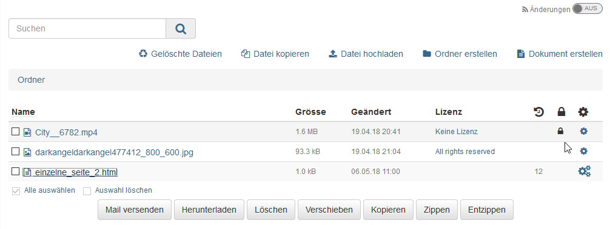

# Arbeiten mit Kursbausteinen

Im Folgenden finden Sie eine Liste mit den wichtigsten Kursbausteinen, aus
denen Ihr Kurs aufgebaut sein kann. Wahrscheinlich werden in Ihrem Kurs nicht
alle Bausteine verwendet, da es zur didaktischen Erstellung von Lernumgebungen
und Kursen gehört, die Funktionalitäten und Kursbausteine gezielt auszuwählen.
Möglicherweise werden in Ihrem Kurs auch mehrere Kursbausteine desselben Typs
angeboten oder die Kursbausteine sind anders benannt als in dieser
Aufstellung.

Bei herkömmlichen Kursen können Sie sich an den abgebildeten Icons
orientieren, um den Kursbausteintyp zu erkennen. Bei Lernpfad Kursen werden
keine Icons angezeigt.

  

Umfangreichere Beschreibungen zur Funktionsweise der folgenden Bausteine
finden Sie auf separaten Seiten:

  * [Aufgabe](Arbeiten+mit+Aufgaben+und+Gruppenaufgaben.html)
  * [Forum](Arbeiten+mit+Foren.html)
  * [Gruppenaufgabe](Arbeiten+mit+Aufgaben+und+Gruppenaufgaben.html)
  * [Selbsttest](Arbeiten+mit+Tests.html)
  * [Test](Arbeiten+mit+Tests.html)
  * [Themenvergabe](Arbeiten+mit+der+Themenvergabe.html)
  * [Wiki](Arbeiten+mit+Wiki.html)

  * 1Bewertung
  * 2Blog
  * 3 Checkliste
  * 4Einschreibung
  * 5E-Mail
  * 6Fragebogen, Umfrage
  * 7Kalender
  * 8Ordner
  * 9 Podcast 
  * 10Terminplanung
  * 11Teilnehmer Ordner
  * 12Teilnehmerliste
  * 13Video
  * 14Virtuelle Räume

## Bewertung

Hier erhalten Sie Punkte oder ein "bestanden" bzw. "nicht bestanden" von Ihrem
Dozenten. Auch Kommentare und Feedbackdokumente sowie ein Rubrik-Feedback
können Sie auf diesem Weg erhalten. Der Baustein wird häufig verwendet, wenn
Aktionen bewertet werden, die nicht zuvor online in OpenOlat eingereicht
wurden z.B. Präsenz-Referate oder reale Produkte.

## Blog

Ähnlich wie der Podcast dient auch der Blog dazu, neue Inhalte zur Verfügung
zu stellen. In den Beiträgen können neben Text auch Bilder oder Filme
eingebunden sein.

Jeder OpenOlat-Benutzer darf Blogeinträge mit 1-5 Sternen bewerten und
kommentieren.  Um einen Kommentar zu verfassen oder bestehende Kommentare zu
lesen, klicken Sie auf den Link „Kommentare“. Sie sehen zudem die Bewertungen
der anderen Blogleser.

Blogeinträge _erstellen_ können Sie nur, wenn der Kursbesitzer Sie dazu
berechtigt hat. Klicken Sie auf „Neuen Eintrag erstellen“ und verfassen Sie
den Blogeintrag.

 Blogeintrag erstellen und editieren

 **Titel:** Geben Sie einen Titel ein, der den Blogeintrag beschreibt. Dieses
Feld ist obligatorisch.

 **Beschreibung:** Die Beschreibung ist fakultativ und wird als Vorschau eines
Artikels oder Eintrags verwendet. Es kann sich somit auch um eine kurze
Einleitung oder Zusammenfassung handeln.

 **Inhalt:** Der Inhalt ist der eigentliche Blogeintrag. Dieses Feld sollte
also unbedingt ausgefüllt werden. Formatierungen und Bilder sind erlaubt.

 **Datum und Zeit der Veröffentlichung:** Das Datum und die Zeit der
Veröffentlichung werden dafür verwendet, den Eintrag für andere Benutzer
sichtbar zu machen oder zu verbergen. Liegt der Zeitpunkt der Veröffentlichung
in der Vergangenheit, so wird der Eintrag sichtbar. Liegt er hingegen in der
Zukunft, so handelt es sich um eine geplante Veröffentlichung des Eintrags.

Sie können den Eintrag durch Klicken auf "Veröffentlichen" für andere
zugänglich machen (ab dem angegebenen Datum). Wenn Sie an Ihrem Eintrag zu
einem späteren Zeitpunkt weiterschreiben wollen, klicken Sie auf "Entwurf
speichern". "Abbrechen" verwirft Ihre Änderungen und schliesst das
Formularfenster. Entwürfe erscheinen in der Liste der Einträge gelb
hinterlegt. Geplante Veröffentlichungen sind grün gekennzeichnet. Alle anderen
Einträge sind öffentlich und für andere sichtbar.

Sie können den neuen Eintrag entweder direkt veröffentlichen, das Datum der
Veröffentlichung wählen oder den Eintrag als Entwurf speichern.

Abonnieren Sie den RSS-Feed des Blogs, um keine neuen Einträge zu verpassen.

##
Checkliste

Erreichte Ziele, fehlende Aufgaben, richtige oder falsche Lösungen -
Checklisten machen dies sichtbar und dadurch für den Betreuer auch bewertbar.

Als informationelle Arbeitshilfe, die Benutzer dabei unterstützt z.B. kleinere
Aufgaben zu erledigen oder Informationen gesichert zu behalten, erlaubt die
Checkliste das Führen von z.B. To Do- oder Prüflisten. So können z.B. auch
Aufgaben ausserhalb von OpenOlat dokumentiert werden. Sollte dies der Fall
sein, finden Sie eventuell Informationen zur Bewertung auf der Startseite der
Checkliste.

Wenn eine Checkliste mit einem Abgabedatum versehen wurde, kann diese im
Anschluss nicht mehr bearbeitet werden. Unterhalb des Abgabedatums und der
Bewertungsinformation befindet sich die tatsächliche Liste mit allen
Checkboxen, inklusive eventueller Informationen und Dateien zum Download.
Erscheint eine Checkbox ausgegraut, so kann sie entweder nur vom Betreuer
abgehakt werden, oder das Abgabedatum ist bereits abgelaufen.

## Einschreibung

Mit Hilfe des Kursbausteins "Einschreibung" können Sie sich in eine oder
mehrere Gruppen eines Kurses eintragen. Gruppen können in OLAT für
unterschiedliche Zwecke verwendet werden, z.B. für Arbeitsgruppen oder zur
Verteilung von Kursteilnehmenden.

Wählen Sie den Link „Einschreiben“, um Mitglied einer Gruppe zu werden.
Abhängig von der Konfiguration können Sie sich entweder nur in eine Gruppe
einschreiben, oder in mehrere gleichzeitig. Die Einschreibung bewirkt, dass
nun rechts im Dropdown-Menü "Mein Kurs" die Links zu den entsprechenden
Kurs-[Gruppe](Gruppen.html)n in denen Sie Mitglied sind, sichtbar werden.

Bei einigen Gruppen ist die Anzahl Mitglieder limitiert. Ist die Gruppe voll,
gibt eventuell eine Warteliste. Je nach Konfiguration. Wenn der
Gruppenadministrator das so eingestellt hat, rücken Sie automatisch nach,
sobald sich ein Gruppenmitglied aus der Gruppe austrägt.

Oft können Sie sich am selben Ort, wo Sie sich eingeschrieben haben, wieder
aus der Gruppe austragen. Sollte dies nicht der Fall sein, so hat der
Gruppenadministrator das Austragen untersagt und Sie müssen Ihn kontaktieren,
wenn Sie sich aus Versehen eingeschrieben haben.

## E-Mail

Diese Funktion ist eine Art Kontaktformular. Je nach Konfiguration können hier
E-Mails an alle Kursbesitzer, alle Betreuer alle Teilnehmenden oder
Teilnehmende aus bestimmten Gruppen verschickt werden. Füllen Sie die Felder
„Betreff“ und „Nachricht“ aus und senden Sie die E-Mail über OpenOlat.

## Fragebogen, Umfrage

Fragebögen werden für Evaluationen oder Meinungsumfragen verwendet. Jede
Umfrage kann nur einmal ausgefüllt werden. Die Resultate werden normalerweise
anonymisiert gespeichert. Der Fragebogen erscheint direkt beim Aufruf des
entsprechenden Kursbausteins. Sie können einen Fragebogen bzw. eine Umfrage
auch zwischenspeichern. Füllen Sie einfach die bereitgestellten Felder aus.

## Kalender

Der Kursbaustein „Kalender“ bietet eine alternative Sicht auf den
[Kurskalender](../../pages/viewpage.action%EF%B9%96pageId=108593252.html#Zus%C3%A4tzlicheKursfunktionen-
_kurskalender), welcher, wenn aktiviert, oben in der Kurstoolbar aufgerufen
werden kann. Das Startdatum z.B. die jeweilige Semesterwoche kann vom
Lehrenden bei Bedarf vorgegeben werden.

## Ordner

Im Kursbaustein "Ordner" können Lehrende Dateien zum Download bereitstellen.
Standardmässig sind Ordner Kursbausteine so konfiguriert, dass nur Besitzer
und Betreuer Dateien hochladen dürfen und Kursteilnehmer lediglich das Recht
haben, Dateien zu lesen bzw. herunterzuladen.

Abonnieren Sie den Ordner, um bei neuen Dokumenten benachrichtigt zu werden.
Änderungen erfahren Sie per E-Mail oder unter „Abonnements“ in OpenOlat.

Wenn der Ordner dazu eingesetzt wird, dass Kursteilnehmer ebenfalls Dateien
hochladen dürfen, finden Sie in der Leiste über den Dateien, die
entsprechenden Funktionen. Sie können dann auch Dateien löschen, Unterordner
einrichten. Wenn Sie verhindern möchten, dass jemand Ihre Dateien löscht,
können Sie in der Tabellenansicht auf das Icon
„[Metadaten](Volltextsuche.html#Volltextsuche-_metadata)“ klicken und die
Datei sperren. Gesperrte Dateien sind mit einem Schloss gekennzeichnet.

  

Achtung nicht verwechseln: Neben den Download Ordnern in Kursen stehen
Lernenden auch [Persönliche
Ordner](../../pages/viewpage.action%EF%B9%96pageId=108593736.html) zur
Verfügung, die kursunabhängig für das individuelle Lernen genutzt werden
können. Ferner gibt es den Kursbaustein "Teilnehmer Ordner" (siehe unten).

##  Podcast

Ein Podcast stellt Informationen in Form von Audio- oder Videodateien bereit.
Diese so genannten Episoden können Sie einerseits direkt in OpenOlat anhören
oder betrachten, andererseits können Sie Podcasts abonnieren, die Episoden in
lokale Portale wie iTunes laden und auf Ihr mobiles Endgerät kopieren.

Um neue Episoden zu erstellen, müssen Sie vom Lehrenden dazu berechtigt
werden. Klicken Sie dann auf "Episode hinzufügen" und erstellen Sie den neuen
Podcast.

 Episode erstellen oder bearbeiten

Geben Sie einen Titel ein, der die Episode möglichst präzise beschreibt.
Dieses Feld ist obligatorisch. Die Beschreibung ist fakultativ. Bedarf die
Mediadatei zusätzlicher Bemerkungen, können diese hier angegeben werden.

Eine Episode enthält immer genau eine Audio- oder Video-Datei. Wählen Sie
diese auf ihrem Computer aus, damit sie danach hochgeladen werden kann. Dies
kann je nach Grösse der Datei eine gewisse Zeit dauern. Beachten Sie, dass nur
Flash-kompatible Formate erlaubt sind (d.h. FLV, MP3, MP4, M4V, M4A und AAC).

Durch Klicken auf Veröffentlichen wird die Episode dem Podcast hinzugefügt und
ist für andere zugänglich.

Jeder OpenOlat-Benutzer darf jedoch Episoden kommentieren und mit 1-5 Sternen
bewerten. Um einen Kommentar zu verfassen oder bestehende Kommentare zu lesen,
klicken Sie auf den Link „Kommentare“.

Abonnieren Sie den RSS-Feed des Podcasts, um keine neuen Episoden zu
verpassen.

Portfolioaufgabe

  

Stellt Ihnen Ihr Dozent ein vorstrukturiertes Portfolio mit Aufgabenstellungen
bzw. Aktionsaufforderungen bereit, können Sie sich diese hier abholen. Klicken
Sie auf „Portfolioaufgabe abholen“, um die Aufgabe anzusehen und die
geforderten Aufgaben in der vordefinierten Mappe zu lösen. Wenn der Lehrende
kaum Strukturierungen und Einschränkungen festgelegt hat, können Sie die Mappe
nach Belieben gestalten, ansonsten bildet die vorgegebene Strukturierung den
Rahmen für die weitere Bearbeitung. Möglicherweise hat der Lehrende einen
Abgabetermin definiert, den Sie beachten sollten.

In der Portfolioaufgabe können Sie beispielsweise Ihren Lernprozess
dokumentieren und reflektieren bzw. Bearbeitungen über einen längeren Zeitraum
vornehmen.

Sobald Sie die Portfolioaufgabe im Kurs abgeholt haben, finden Sie diese auch
in Ihrem [persönlichen
Menü](../../pages/viewpage.action%EF%B9%96pageId=108593349.html) unter
„Portfolio 2.0“ - „Meine Portfolio Mappen“.

Um die fertige Bearbeitung einzureichen, publizieren Sie die Aufgaben und
geben Sie den Bereich [frei](Von+mir+freigegeben.html). Weitere Informationen
zur Bearbeitung einer Portfolioaufgabe finden Sie
[hier](Portfolioaufgabe%EF%B9%95+abholen+und+bearbeiten.html).

## Terminplanung

Auf diesem Weg kann Ihnen Ihre Lehrperson diverse Termine zur Auswahl oder
direkt zur Einschreibung bereitstellen. Sie können den oder die für Sie
passenden Termine auswählen indem Sie auf das ? klicken. Je nach Konfiguration
kann es eine Deadline für den Eintrag geben.

  

## Teilnehmer Ordner

  

Hier können Lernende den Dozenten Dateien zur Verfügung stellen und auch über
den Rückgabeordner individuelle Rückmeldungen vom Lehrenden erhalten. Sofern
vom Administrator ein entsprechender Dokumenteneditor aktiviert wurde, ist
auch die Erstellung von unterschiedlichen Dateiformaten wie Word, Excel oder
PowerPoint Dateien direkt in OpenOlat möglich. Jeder Kursteilnehmer sieht hier
nur seinen eigenen individuellen Ordner. Einreichungen von anderen Lernenden
sind im Teilnehmer Ordner, im Gegensatz zum Kursbaustein "Ordner" (siehe
oben), nicht sichtbar.

Punkte oder bestanden/nicht bestanden werden hierüber nicht abgewickelt.

  

## Teilnehmerliste

Die Teilnehmerliste gibt einen Überblick über die Personen, die Zugang zum
Kurs haben. Je nach Einstellung werden die Kursbesitzer (Kursadministratoren),
Betreuer und oder die Teilnehmer angezeigt. Über die Teilnehmerliste hat man
auch Zugriff auf die Visitenkarte der angezeigten Personen. Je nachdem welche
Informationen die OpenOlat Mitglieder dort hinterlegt haben, erhält man
weitere Informationen und kann auch per synchronen Chat Kontakt aufnehmen. Je
nach Einstellung können Sie auch allen oder ausgewählten Teilnehmenden E-Mails
schicken oder die gesamte Teilnehmerliste herunterladen bzw. drucken.

  

## Video

Über den Kursbaustein Video erhalten Sie Zugriff auf ein Video und können je
nach Einstellung dieses Video auch kommentieren und per Sternchen bewerten.
Handelt es sich um ein interaktives Video, sind auch weitere Aktionen wie die
Beantwortung von Quizfragen oder der Aufruf von Verlinkungen möglich.

## Virtuelle Räume

Mit den Kursbausteinen [Adobe Connect](Kursbaustein+Adobe+Connect.html),
[GoToMeeting](Kursbaustein+GoToMeeting.html),
[Vitero](Kursbaustein+vitero.html) [BigBlueButton
](Kursbaustein+BigBlueButton.html)und
[OpenMeetings](Kursbaustein+OpenMeetings.html) können in OpenOlat
unterschiedliche [Virtuelle Klassenzimmer](Virtuelle+Klassenzimmer.html) für
synchrone Meetings, Video-Konferenzen oder Webinare zum Einsatz kommen.
Welcher Kursbaustein eingebunden wird, und welche Funktionalitäten damit zur
Verfügung stehen, hängt davon ab welche Konfiguration ihr OpenOlat
Systemadministrator ausgewählt hat.

Ein virtueller Raum ermöglicht Ihnen, gleichzeitig (synchron) online mit
mehreren Personen zusammen zu arbeiten, die geographisch von Ihnen getrennt
sind. Funktionen von virtuellen Räumen sind unter anderem Live Chat, Audio und
Video, Desktop- und Dokumentsharing. Wird ein virtueller Raum mittels eines
Kursbausteins betreten, öffnet sich ein neues Browserfenster, in dem die
virtuelle Sitzung stattfindet.

Damit Sie alle Funktionalitäten benutzen können, benötigen Sie ein Headset und
eine angeschlossene Kamera. Unter Umständen muss, abhängig vom eingesetzten
System, noch weitere Software temporär heruntergeladen werden.

