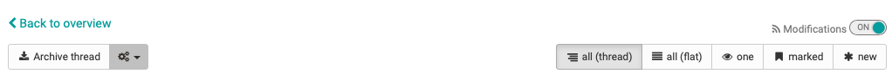
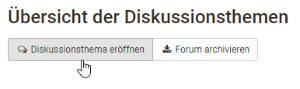
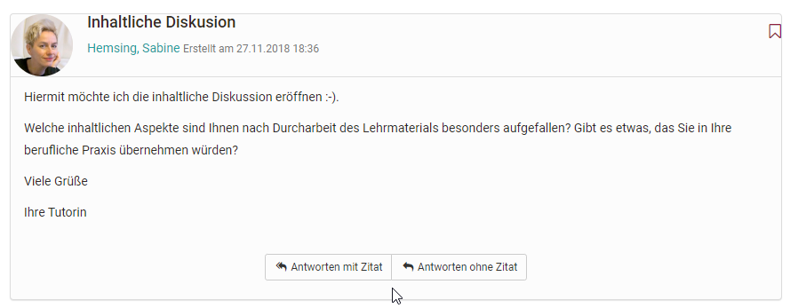
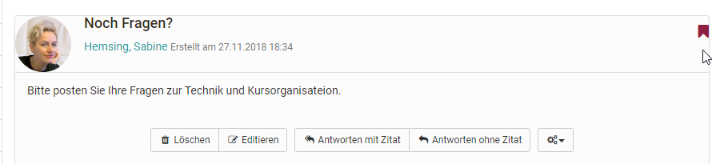
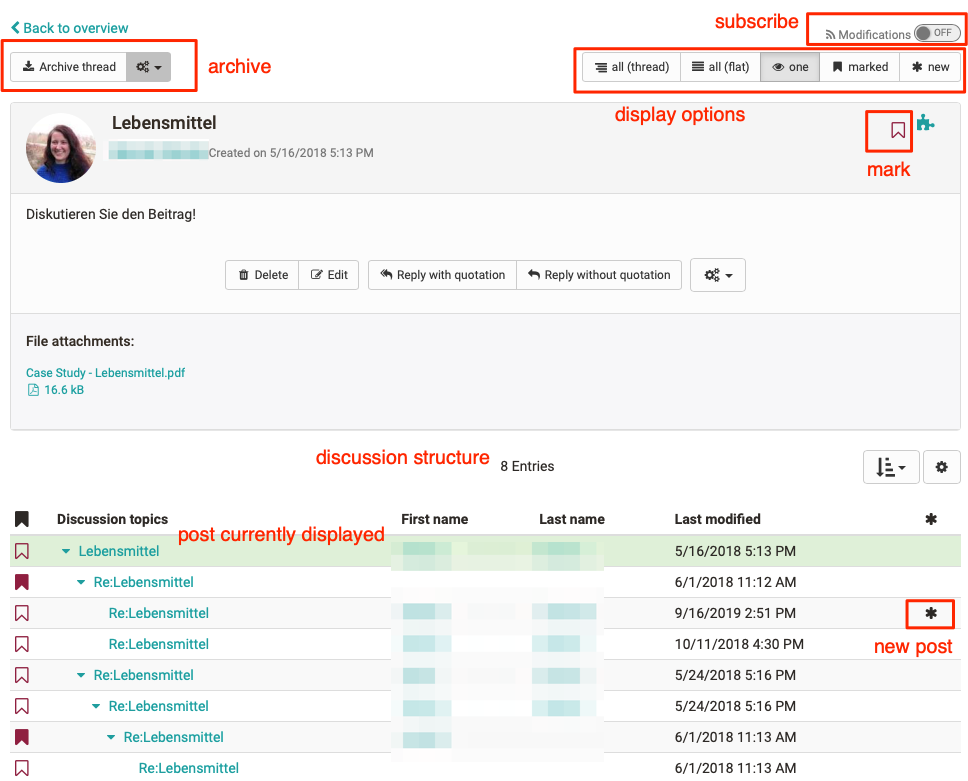

# Working with Forums

## What can a forum be used for?

Forums are the central tools for asynchronous discussion in online courses and
also in Olat groups. Forums can be used for the exchange between the course
participants, for organizational arrangements or the technical discussion with
the teacher. Some online methods also use specific forums, e.g. for pro-contra
discussions, the structured collection of ideas on specific aspects
(brainstorming), etc.

## How can learners use a forum?

The following options are available in a forum thread:

In forums participants can...

### Opening a Topic

If you want to write a new message in your forum just select "Open new topic."
Title and contribution are mandatory. Be sure to use a meaningful title and
change it appropriately for Reply postings.

With the help of the forum editor you can create and format your post and also
attach files. Depending on the configuration by the course owner, you may also
be able to publish your post under a pseudonym.

### Answering Forum Contributions

If you want to reply to an existing message in a forum just open its topics by
clicking on its title. Then select "Reply with quotation" if you want the
initial contribution to appear below your reply or if you want to respond
directly to individual passages of the contribution. Select "Reply without
quotation" if you only want your message to appear.

#### Mark Forum Message

Individual forum messages can be marked. In order to do that, click on the
little flag in the right upper corner of a message. The topic overview shows
the number of marked messages per topic. In the forum overview you can see how
many posts have been marked per topic. In this way, individual contributions
can be found more easily or marked for a later answer.

### Archiving a Forum

When archiving a forum any contributions will be zipped along with their
attachments before storing them in your personal folder.

### Subscribing to a Forum

In order to be kept informed on new forum entries you should select
"Subscribe" in the overview of topics. Then you will get a notification by
e-mail or in your "[Subscriptions](Personal+menu+and+general+components.html)"
in the "Personal Tools" section. It does not matter whether a new post was
posted by a registered OpenOlat user or a guest.

A notification is only sent if a new post has been created, but not if an
existing post has been modified.

You can also attach files to your posting, e.g. if your post is more extensive
or if you refer to a specific file. As a rule of thumb: Postings longer than
one DIN A4 page should be attached and only briefly torn out in the posting
itself. You can also edit or delete your posting at a later date if no one has
yet replied to your post.

It is possible that course participants may receive additional moderation
rights in a forum from the coach. You can find out exactly what this means in
the chapter "[Communication and
Collaboration](../course_elements/Communication_and_Collaboration.md)".

### What display options are available for forum threads?

There are different display options:

* all (thread)
* all (flat)
* one
* marked
* new

Users can display all posts below each other (all), with or without
indentation. The initial post appears first and the other posts are displayed
according to the discussion structure. In the case of extensive forums with
many posts, it is advisable to use the "new" button to display only the new
posts. The "one" view is particularly interesting for more complex
discussions. Here the entire thread structure is displayed and can be easily
understood. It is helpful that individual parts can be faded in and out. In
addition, you can also quickly recognize new forum posts in this view by the
asterisk.

Upload a photo in the "[Profile](../personal/Personal_Menu.md)" so that your photo
appears next to your forum posts instead of the standard profile picture.

###

File Dialog

The file discussion is a combination of forum and file sharing. Thus, forum
discussions can be created in courses for specific documents, e.g. for a draft
of a seminar paper, a picture, a concept or a content-related document. A
forum is automatically created for each uploaded file.

To participate in a discussion, click on the "Show" link next to the file
name. Now you have the same options for opening discussion topics or answering
posts as in the forum.

#### Uploading files

By default, participants cannot upload files. However, this option can be
activated by the course owner in the course editor. If you have this option
select "Upload file" to upload your own file. Who has uploaded which file and
when can be recognized by the columns first name, last name or date.
