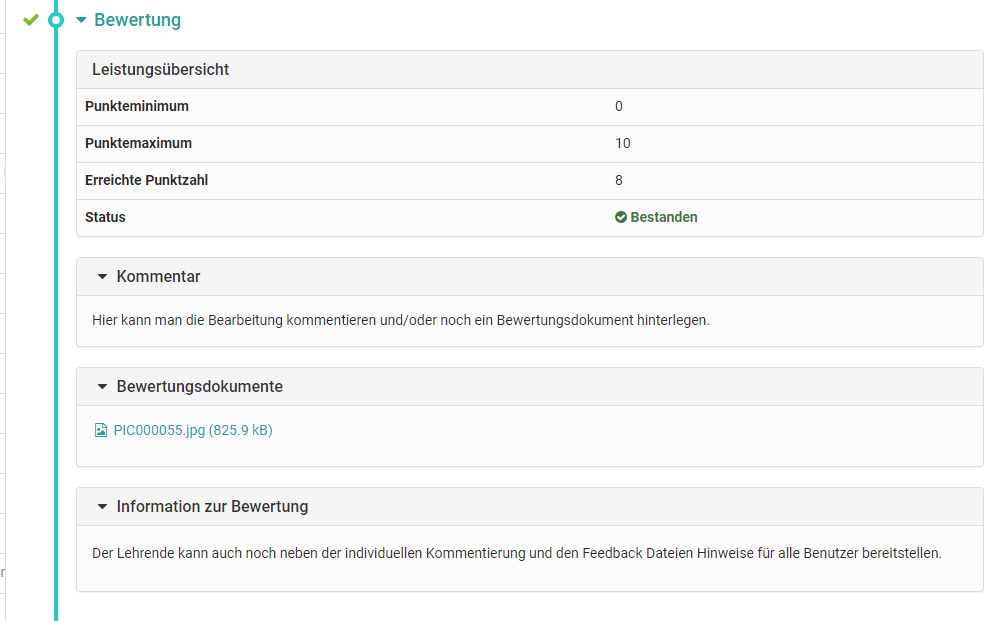

# Arbeiten mit Aufgaben und Gruppenaufgaben

Über die Kursbausteine **Aufgabe** und **Gruppenaufgabe** werden
Übungsaufgaben bereitgestellt, die Sie elektronisch abgeben können. Über diese
Bausteine können Sie auch Feedbacks zu Ihren Einsendungen, Punkte und
Musterlösungen erhalten und Ihnen kann angezeigt werden, ob Sie die Aufgabe
bestanden haben oder nicht. Möglicherweise sehen Sie nicht alle der genannten
Dinge, da nicht alle Optionen für Ihre Aufgabe verwendet werden.

Abonnieren Sie den jeweiligen Aufgabenbaustein um schnell per Mail über
Änderungen informiert zu werden.

### „Zuweisung Aufgabenstellung“:  Zugewiesene Aufgabe herunterladen

Je nach Konfiguration stehen im Schritt Aufgabenstellung eine oder mehrere
Aufgaben zur Auswahl oder eine Aufgabe wird Ihnen automatisch zugewiesen. Wenn
bei mehreren Aufgaben der Titel der Aufgabendatei verlinkt ist, können Sie die
Aufgabenstellung vor der Auswahl ansehen. Wenn Sie nur die Schaltfläche
„Wählen“ haben, können Sie die Aufgabe nicht im Vorfeld ansehen. Eine
automatische Zuweisung einer Aufgabe erfolgt direkt sobald Sie die Aufgabe vor
Ablauf einer eventuellen Abgabedeadline anklicken.

Wenn Sie eine Aufgabe gewählt haben oder Ihnen eine Aufgabe automatisch
zugewiesen wurde, klicken Sie auf „Aufgabe herunterladen“, um die
Aufgabenstellung herunterzuladen bzw. anzeigen zu lassen. Wenn Sie auf den
Dateinamen der Aufgabenstellung klicken wird die Aufgabe angezeigt. Die
Aufgabe können Sie dann jederzeit wiederholt herunterladen.

Es ist auch möglich, dass Ihr Dozent die Aufgabenstellung nicht in dem
Kursbaustein „Aufgabe“ hinterlegt hat, sondern einen anderen Ort z.B. eine
Einzelseite oder eine externe Seite gewählt hat oder die Aufgabenstellung
mündlich in Präsenz oder in einem Online-Meeting gestellt hat. In diesem Fall
erscheint der Abschnitt „Zuweisung Aufgabenstellung“ nicht.

### „Abgabe“: Lösung abgeben

Wenn Sie Ihre Aufgabe gelöst haben laden Sie diese im Schritt „Abgabe“ hoch.
Eventuell ist die Anzahl der abzugebenden Dateien und der Zeitraum für die
Abgabe eingeschränkt.

Falls von Ihrem Betreuer entsprechend konfiguriert, können Sie die Lösung der
Aufgabe auch direkt online erstellen. Standardmässig besteht hier die
Möglichkeit eine HTML Datei zu erstellen. Klicken Sie dazu auf die
Schaltfläche „Dokument erstellen“. Geben Sie einen Namen an, und erstellen Sie
dann den Inhalt. Das Dokument kann zwischengespeichert werden, und bleibt
solange für Sie bearbeitbar bis Sie über die Schaltfläche „Endgültige Abgabe“
Ihre Aufgabe einreichen. Sie erhalten eine Bestätigung, dass Sie Dokumente
abgegeben haben.

Sind in der Administration ergänzende Dokumenteneditoren aktiviert, können
auch noch weitere Dateiformate erstellt werden. Beispielsweise können bei
Verwendung von Only Office oder der Verknüpfung mit einem kommerziellen MS
Office 365-Abonnement auch Word, Excel oder PowerPoint Dateien erstellt und
abgegeben werden.

Im Abgabe-Schritt, der nun mit einem grünen Häkchen als erledigt markiert
wird, erhalten Sie eine Übersicht über abgegebenen Dateien. Sie können sich
die Dateien zwar noch ansehen aber keine Änderungen mehr vornehmen.

### „Rückgabe und Feedback“: Beurteilung herunterladen

Wenn Sie noch _keine_ Einreichung vorgenommen haben, und der Betreuer keine
Rückmeldung bereitgestellt hat, ist dieser Bereich leer.

Wenn Sie eine Bearbeitung eingereicht haben und der Betreuer noch keine
Rückmeldung erstellt hat, erscheint die entsprechende Information:

Sobald Ihr Betreuer ein Feedback erstellt hat finden Sie im Schritt „Rückgabe
und Feedback“ die Feedback Information.

Wenn Ihre Bearbeitung nicht ausreichend war und der Betreuer eine
Überarbeitung einfordert erscheint ebenfalls eine entsprechende Anzeige und
Sie haben die Möglichkeit, eine neue Bearbeitung im Schritt „Überarbeitung“
einzureichen. Eventuell wird dafür eine Deadline gesetzt.

### „Überarbeitung“: Aufgabe überarbeiten

Wenn Sie eine Überarbeitung vornehmen müssen, gehen Sie wie unter „Abgabe“
erläutert vor. Im Abschnitt "Überarbeitung" kann es auch sein, dass Ihr
Betreuer Ihnen Ihre Arbeit mehrfach zur Korrektur zurückgibt.

Sobald er die Aufgabe als gelöst ansieht, wird er die Überarbeitungsperiode
schliessen. Zu jedem Zeitpunkt sehen Sie welche Dokumente von Ihnen und Ihrem
Betreuer abgegeben wurden und können diese einsehen.

### „Musterlösung“ betrachten

Ihr Dozent kann der Aufgabe eine Musterlösung anfügen, welche zu einem von ihm
festgelegten Zeitpunkt sichtbar wird, aber immer erst nachdem ihre Lösung vom
Betreuer akzeptiert wurde. Klicken Sie auf den Dateinamen bzw. den Button
„Musterlösungen herunterladen“, um die Musterlösung anzuschauen oder
herunterzuladen.

### „Bewertung“ vom Betreuer lesen

Die Bewertung kann folgende individuelle Informationen beinhalten: Eine
Leistungsübersicht mit dem Status und Informationen zum Punktestand, ein
Kommentarfeld sowie Bewertungsdokumente. Darüber hinaus kann der Betreuer hier
auch noch allgemeine Informationen hinterlassen.

## Gruppenaufgabe

Die Ansicht für OLAT Aufgaben und Gruppenaufgaben ist dieselbe. Sämtliche
Entscheidungen und Einsendungen die während des Workflows getroffen werden,
gelten jedoch immer für die gesamte Gruppe. Deshalb ist es wichtig, sich in
der Gruppe abzustimmen _bevor_ eine endgültige Abgabe erfolgt. Gleichzeitig
sollte man darauf achten, keine Deadline zu verpassen.

Die Rückmeldungen des Betreuers werden für die gesamte Gruppe ebenfalls hier
bereitgestellt. Bei Bedarf kann der Betreuer aber auch individuelle Punkte
oder Feedbacks innerhalb einer Gruppenaufgabe verteilen.

