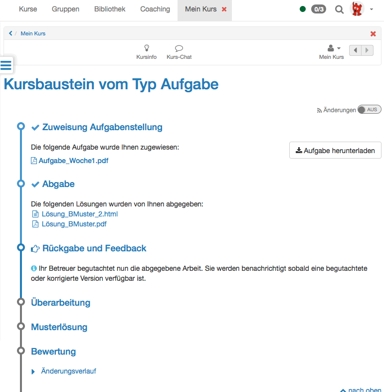
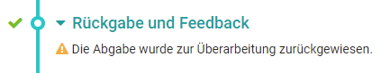

# Working with Tasks and Group Tasks

The course modules **Task** and **Group Task** provide exercises that you can
hand in electronically. Via these course elements you can also receive
feedback on your submissions, points and sample solutions and you can be shown
whether you have passed the task or not. You may not see all of the above
because not all options are used for your assignment.

Subscribe to the respective task module to be quickly informed about changes
via e-mail.
 

## "Task Assignment": Download assigned Task

According to the configuration there are either one or more tasks at your
disposal in the step "Assignment" or a task will be assigned to you
automatically. If the title of a task file is linked along with several tasks
it is possible to first have a look at a task before selecting it. If there is
only the „Select" link it is not possible to have a look at it first. A task
is automatically assigned as soon as you click on the task before a possible
deadline.

If you have selected a task or a task has been assigned to you automatically,
click on "Download task" to download or display the task. If you click on the
file name of the task, the task will be displayed. You can then download the
task repeatedly at any time.

It is also possible that your coach has not stored the task in the course
element "Task", but has chosen another location, e.g. a single page or an
external page, or has placed the task orally in presence or in an online
meeting. In that case the section "Assignment of tasks" will not appear.

### "Task Submission": Submit Solution

When you have completed your task, upload it in the " Submission" step.
Possibly the number of files to be submitted and the time period for
submission is limited.

If configured accordingly by your coach, you can also create the solution of
the task directly online. By default you have the possibility to create a HTML
file. To do this, click on the "Create document" button. Enter a name and then
create the content. The document can be saved temporarily and remains editable
until you submit your task via the "Final submission" button. You will receive
a confirmation that you have submitted documents.

If additional document editors are activated in the administration, other file
formats can also be created. For example, when using Only Office or a
commercial MS Office 365-abonnement , Word, Excel or PowerPoint files can also
be created and submitted.

In the submission step, which is now marked as completed with a green
checkmark, you will receive an overview of the submitted files. You can still
view the files, but you can no longer make any changes.

### "Return and feedback": Download Review

If you have not yet submitted a solution and the coach has not provided
feedback, this area is empty.

If you have submitted a solution and the coach has not yet provided a
confirmation, the corresponding information appears:

Once your coach has created a feedback you will find the feedback information
in the step "Return and Feedback".

If your editing was insufficient and the coach requests a revision, a
corresponding message will also appear and you will have the opportunity to
submit a new editing in the "Revision" step. A deadline may be set for this.

### "Revision": Revise Solution

If you need to make a revision, proceed as explained under "Submission". In
the "Revision" section, your coach may also return your work to you several
times for correction.

As soon as the task is considered solved, the revision period is closed. At
any time, you can see which documents have been submitted by you and your
coach and can view them.

### View "Sample Solutions"

Your coach can attach a sample solution to the task, which will become visible
at a time he/she determines, but always only after the coach has accepted the
solution. Click on the file name or the button "Download sample solutions" to
view or download the sample solution.

### Read "Grading " from coach

The assessment may include the following individual information: A performance
overview with the status and information on the score, a comment field and
evaluation documents. In addition, the supervisor can also leave general
information here.

## Group task

The view for OpenOlat tasks and group tasks is the same. However, all
decisions and submissions made during the workflow always apply to the whole
group. That's why it is important to coordinate within the group before a
final submission is made. At the same time you should take care not to miss a
deadline.

The coach's feedback is also provided here for the entire group. If necessary,
the coach can also distribute individual points or feedback within a group
task.

