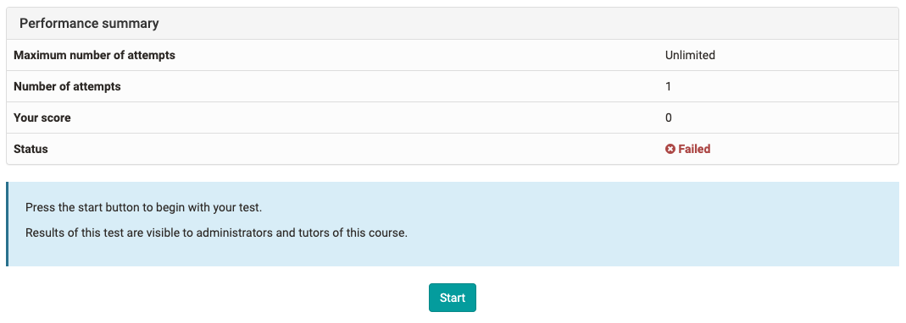

# Working with Tests

As a rule, tests in OpenOlat are used to verify knowledge. Here are a few
examples for the use of tests:

* Tests for knowledge verification after a knowledge transfer phase
* Tests to check the current level of knowledge before a course, in order to determine where there are still deficits or to define which aspects of the course should be particularly addressed
* Tests to check your own level of knowledge on a topic, to identify preferences and interests
* Tests in the sense of quizzes as a playful component
* Tests as online exams

The coach can use various [question types](../tests/Test_question_types.md) in tests.
Depending on the type of question you can tick one or more answers, move
elements by drag & drop, insert text and/or numbers, add files, make markers
or (very simple) drawings. Per OpenOlat course several tests can be used for
different purposes.

## How to edit a test

To start editing a test press "Start". Answer the questions displayed and then
click "Submit answer" for each question. If generally visible, you can see in
the left navigation which questions have already been answered, which
questions have only been viewed and which have not yet been clicked on.

Depending on your settings, you can use the "Next question" button and/or a
link in the left-hand navigation to navigate further or the next question will
be displayed automatically. Whether you can skip questions or see an answering
progress also depends on the configuration of the coach. If set, you may
interrupt the test and continue at a later time or generally cancel it without
saving results.

When you have completed editing and want to finish the test, click on the
"Finish test" button. There will be another security question and if you
confirm that you want to save your test it will be saved and will be visible
for the course author.

Depending on the question types you have used the test will be evaluated
automatically or it still has to be evaluated manually by your coach. A
corresponding info will be displayed. The course author also determines when
and how detailed you will be informed about your test results.

In the section "Performance summary" you will get further information e.g.

If you have further attempts to process the test, you can run through the test
again with "Start". Previous runs are retained.

{class="size24"}
Self-Test

In OpenOlat there are two different course elements for tests: "Tests" and
"Self-tests".  Contrary to tests, results of self-tests will be stored
anonymously. Self-tests are suitable for practicing and can be taken as often
as you like. Also, for self-tests, the results are automatically displayed
after the test is completed.

The handling of self-tests is otherwise identical to the handling of tests
(see above).
