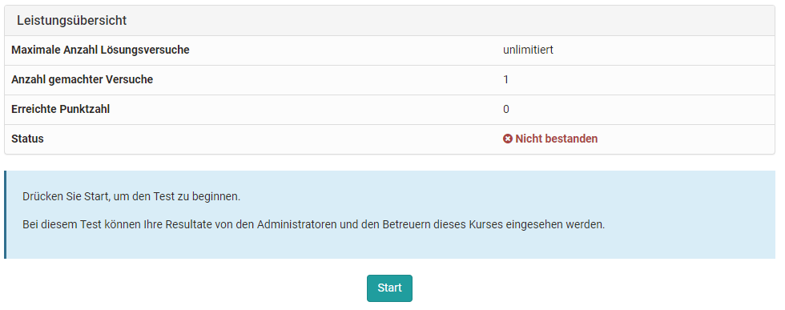

# Arbeiten mit Tests

In der Regel dienen Tests in OpenOlat der Wissensüberprüfung.  Hier ein paar
Beispiele für den Einsatz von Tests:

  * Tests zur Wissensüberprüfung nach einer Phase der Wissensvermittlung
  * Tests zur Überprüfung des aktuellen Wissensstandes vor einem Kurs, um zu ermitteln wo noch Defizite bestehen bzw. um zu definieren auf welche Aspekte im Kurs besonders eingegangen werden soll
  * Tests zur Überprüfung des eigenen Wissensstandes zu einem Thema, zur Identifikation von Vorlieben und Interessen
  * Tests im Sinne von Quiz als spielerische Komponente
  * Tests als Online-Klausur

In Tests können vom Lehrenden diverse [Fragetypen
](Test+Fragetypen.html)verwendet werden. Je nach Fragetyp können Sie eine oder
mehrere Antworten ankreuzen, Elemente per drag & drop verschieben, Texte
und/oder Zahlen einfügen, Dateien hinzufügen, Markierungen vornehmen oder
(sehr einfache) Zeichnungen vornehmen.  Pro OpenOlat Kurs können auch mehrere
Tests für unterschiedliche Zwecke zum Einsatz kommen.

## So bearbeiten Sie einen Test:  

Um mit der Bearbeitung eines Tests zu beginnen drücken Sie „Start“.
Beantworten Sie die angezeigten Fragen und klicken Sie anschließend bei jeder
Frage auf „Antwort speichern“. Sofern generell sichtbar, kann man in der
linken Navigation sehen, welche Fragen bereits beantwortet wurden, welche
Fragen nur angeschaut wurden und welche noch gar nicht angeklickt wurden.

Je nach Einstellung können Sie über den Button „Nächste Frage“ und/oder einem
Link in der linken Navigation weiter navigieren oder es wird automatisch die
nächste Frage angezeigt. Ob Sie Fragen überspringen können oder Sie einen
Beantwortungsfortschritt sehen, ist ebenfalls von der Konfiguration des
Lehrenden abhängig. Je nach Konfiguration dürfen Sie den Test unterbrechen und
zu einem späteren Zeitpunkt fortfahren oder generell abbrechen ohne dass
Resultate gespeichert werden.

Wenn Sie fertig sind mit der Bearbeitung und den Test abschließen wollen,
klicken Sie auf den Button „Test beenden“. Es erfolgt noch einmal eine
Sicherheitsabfrage und wenn Sie diese bestätigen, wird der Test gespeichert
und ist für die Lehrenden sichtbar.

Je nach verwendeten Fragetypen wird der Test automatisch ausgewertet oder muss
noch manuell vom Lehrenden bewertet werden. Eine entsprechende Info wird
angezeigt. Der Besitzer des Kurses stellt auch ein, wann und wie detailliert
Sie über Ihre Testresultate informiert werden.

Im Bereich „Leistungsübersicht“ erhalten Sie weitere Informationen z.B.

Wenn Ihnen weitere Versuche zur Bearbeitung des Tests zur Verfügung stehen,
können Sie mit „Start“ den Test noch einmal durchlaufen. Bisherige Durchläufe
bleiben dabei erhalten.

**Selbsttest**

In OpenOlat gibt es zwei unterschiedliche Kursbausteine für Tests: „Tests“ und
„Selbsttests“. Im Gegensatz zum Test werden im Selbsttest die Testresultate
anonymisiert gespeichert. Selbsttests eignen sich für Übungszwecke und können
unlimitiert absolviert werden. Auch werden bei Selbsttests die Ergebnisse nach
Beenden des Tests automatisch angezeigt.

Der Umgang mit Selbsttests ist ansonsten identisch mit der Handhabung der
Tests (siehe oben).

