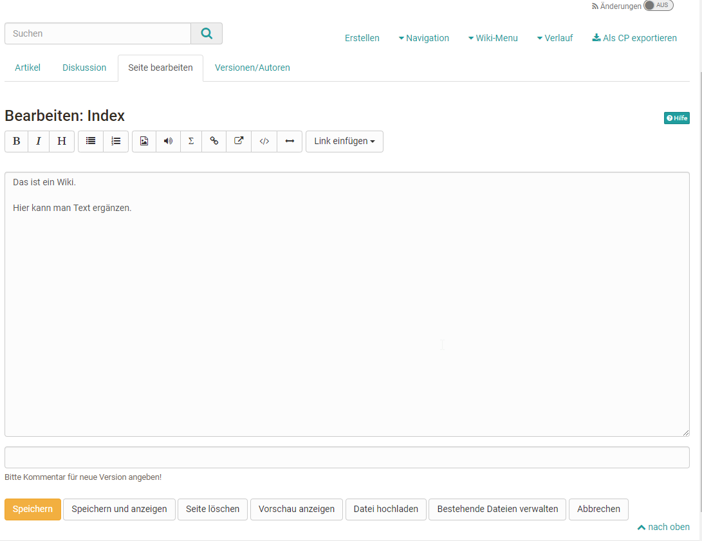
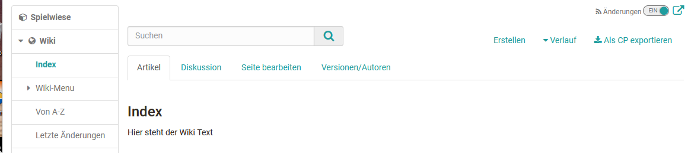
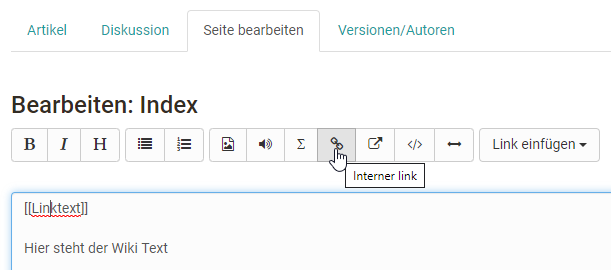

# Arbeiten mit Wiki

Wikis können für die kooperative Erstellung von Texten verwendet werden. Die
einzelnen Seiten werden dabei in Form eines Hypertextes mit verlinkten Seiten
umgesetzt.

Wird ein Wiki in einem OpenOlat Kurs verwendet erscheint automatisch in der
linken Kursnavigation das Wiki-Menü sowie weitere Wiki Links. Über den Link
„Von A-Z“ rufen Sie das Inhaltsverzeichnis mit der Anzeige aller Wiki-Seite
auf. So sehen Sie auf einen Blick, welche Seiten bereits erstellt wurden.

Im Hauptbereich sehen Sie die jeweiligen Wiki Beiträge (Artikel), können die
Wiki Seiten bearbeiten (Seite bearbeiten), zu den einzelnen Wiki Seiten
Diskussionen führen und sich die Bearbeitungshistorie (Versionen/Autoren)
ansehen. Sie können auch ein Wiki als Content Package (CP) exportieren und
sich über Änderungen informieren lassen.  

  

## Neue Wiki-Seiten erstellen

Eine neue Wiki-Seite kann einfach über den Button "Erstellen" angelegt und
anschließend mit Inhalten befüllt werden. Zu beachten dabei ist jedoch, dass
die so erstellte Seite zunächst noch keine Verbindung zu der gesamten Wiki-
Struktur besitzt. Um eine Verbindung herzustellen, sollten entsprechende
Verlinkungen im "Wiki-Menu" und/oder auf der "Index" Seite des Wikis angelegt
werden.

Ein anderer Weg eine neue Wiki Seite zu erstellen ist, auf der Seite auf der
die Verlinkung zur neuen Wiki Seite erscheinen soll, eine passende interne
Verlinkung zu erstellen. Dafür können Sie entweder den entsprechenden Button
des Wiki Editors verwenden oder die passende Syntax direkt eintragen.

Die Wiki-Syntax für neue interne Verlinkungen sind zwei öffnende eckige
Klammern + Seitennamen+ zwei schliessende eckige Klammern. Also zum Beispiel:
`[[Linkname]]`.

Die entsprechende Seite wird beim ersten Aufruf des Links dann automatisch
angelegt.

##  Inhalte einer Wiki-Seite ändern

Um Inhalte einer Wiki-Seite zu bearbeiten wählen Sie den Tab „Seite
bearbeiten“ der gewünschten Wiki Seite. Es erscheint der Wiki-Editor mit
diversen Formatierungsmöglichkeiten. Hier können Sie auch Bilder, Medienlinks,
mathematische Formeln, interne und externe Links in Ihr Wiki einbinden. Neben
den Buttons im Editor existieren weitere Formatierungsmöglichkeiten, die Sie
direkt im Text als Syntaxelemente einfügen können.

Im nachfolgenden wird die Wiki-Syntax genauer erklärt.

## Wiki Syntax

Ihre Eingaben können Sie mit der folgenden Wiki-Syntax formatieren.

 **Achtung:**  
Es empfiehlt sich, Sonderzeichen in Wikiwords zurückhaltend einzusetzen. Nicht
erlaubt ist der Doppelpunkt (:). Beachten Sie auch, dass ein Leerzeichen am
Anfang einer Zeile als ein Formatierungsbefehl interpretiert wird
(Preformatted Text).

Syntax | Ergebnis (Formatierung)  
---|---  
 **Textgestaltung**|  
  
'''Fetter Text '''|  **Fetter Text**  
''Kursiver Text''|  _Kursiver Text_  
==Level 2 Überschrift==|

## Level 2 Überschrift  
  
* Liste| 

  * Liste

  
# Nummerierte Liste|

  1. Nummerierte Liste

  
  
 **  
**

 **Links**  
  
[[Interner link]]| Interner link  
[[Link | Text]]|
[Text](https://testing.frentix.com/test8/help/RepositoryEntry/82673665#linkandtext)  
Externe Adressen werden automatisch in einen Link umgewandelt, wenn Sie die
volle Adresse angeben: [http://www.openolat.org](http://www.openolat.org/).
Möchten Sie statt des Links einen anderen Begriff angeben, setzen Sie die URL
und den Begriff gemeinsam in eckige Klammern, getrennt durch ein Leerzeichen.  
[http://www.openolat.org](http://www.openolat.org/)|
[http://www.openolat.org](http://www.openolat.org/)  
[[http://www.openolat.org](http://www.openolat.org/) Die Website von
OpenOlat]| [Die Website von OpenOlat](http://www.openolat.org/)  
  
 **  
**

 **Tabellen**  
  
{|  
|Zelle 1  
|Zelle 2  
|}| Zelle 1 Zelle 2  

  

  
  
  
{|  
|Zelle 1  
|Zelle 2  
|-  
|Zelle 3  
|Zelle 4  
|}|

Zelle 1 Zelle 2

Zelle 3 Zelle 4

  
  
  
{| border="1"  
|Zelle 1  
|Zelle 2  
|-  
|Zelle 3  
|Zelle 4  
|}|

| Zelle 1| Zelle 2  
---|---  
Zelle 3| Zelle 4  
  
 **Bilder und andere Dateien**  
  
---  
Um z.B. Bilder ins Wiki einzufügen, müssen Sie diese zuerst in OpenOlat
hochladen (via Button " _Datei hochladen"_ ). Sobald sich mindestens eine
Datei im Wiki befindet, erscheint das Drop-Down Menu _"Datei einfügen"_ ,
womit sich Bilder etc. bequem einfügen lassen.  
[[Image:openolat_logo_72.png]]|

  
  
Beim Einfügen des Bildes bestehen folgende optionale
Formatierungsmöglichkeiten:  
Bildlegende: geben Sie eine Bildlegende an.  
[[Image:openolat_logo_72.png|Das ist das OpenOlat-Logo.]]|

  
Das ist das OpenOlat-Logo.  
  
Ausrichtung: mit dem Zusatz "left" oder "right" geben Sie an, wie das Bild
ausgerichtet werden soll.  
[[Image:openolat_logo_72.png|right]]|

  
  
Bildgrösse: geben Sie in Pixeln an, wie gross das Bild angezeigt werden soll.  
[[Image:openolat_logo_72.png|120px]]|

  
  
Miniaturbild: Wenn Sie den Zusatz "thumb" und eine kleine Bildgrösse wählen,
wird das Bild als Miniaturbild eingefügt. Auf Klick auf das Bild wird es in
voller Grösse angezeigt.  
[[Image:openolat_logo_72.png|thumb|20px]]|

  
  
Mehrere Formatierungsmöglichkeiten können auch gleichzeitig verwendet werden.  
[[Image:olat_logo.png|right|30px|thumb|Das ist das OpenOlat-Logo. ]]|

  
Das ist das OpenOlat-Logo.  
  
[[Media:any.pdf]]|
[any.pdf](https://testing.frentix.com/test8/help/RepositoryEntry/82673665#pdf)  
  
 **  
**

 **Mathematische Formeln (LaTeX)**  
Damit OpenOlat die Formeln schneller und schöner darstellt, können Sie jsMath-
Schriften auf Ihrem Rechner installieren.  
Den Downloadbereich und eine Anleitung dazu finden Sie unter:  
[__ http://www.math.union.edu/~dpvc/jsMath/download/jsMath-
fonts.html](http://www.math.union.edu/~dpvc/jsMath/download/jsMath-fonts.html)  
  
<math>Formel hier eingeben</math>| Die Syntax der in OpenOlat verwendeten
mathematischen Notation finden Sie unter:  
[__
http://meta.wikimedia.org/wiki/Help:Formula](http://meta.wikimedia.org/wiki/Help:Formula)  
  
Inline Modus:  
\\(x^2\\)

\\[x^2\\]  

|

  
x2

x2  
  
  
 **Unformatierter Text**  
<nowiki>Hier den unformatierten Text eingeben</nowiki>| Hier den
unformatierten Text eingeben  
  
Um eine Datei anzuhängen, laden Sie diese zuerst über „Datei hochladen“ hoch.
Navigieren Sie an die Stelle auf der Wiki-Seite, an der die Datei erscheinen
soll. Anschliessend wählen Sie die Datei über „Datei einfügen“ aus und
bestätigen mit „Speichern“. Links zu anderen Wiki-Seiten werden über die
Schaltfläche „Link einfügen“ erstellt. Weitere Formatierungsmöglichkeiten
finden Sie eine Zeile darüber.

Links auf Dateien in Ordner-Kurselementen in OpenOlat erstellen Sie, in dem
Sie auf das Metadaten-Icon

klicken, und dann den **Externen Link zu dieser Ressource** kopieren. Bitte
beachten Sie, dass nur auf Dateien verlinkt werden kann, die sich innerhalb
eines Unterordners in einem Ordner-Kurselement befinden.

Das Wiki kann über den entsprechenden Link von allen Beteiligten als IMS-
Content-Packaging exportiert und gespeichert werden. Autoren können ein
exportiertes CP auch in OpenOlat wieder importieren.

Soll ein Wiki direkt als Wiki exportiert werden, ist dies nur vom Besitzer des
Wikis direkt in der Lernressource über die Menüs "Kopieren" bzw. "Inhalt
exportieren" möglich. Kursteilnehmer haben diese Option nicht.

Beim Löschen von Seiten werden auch alle Versionen mitgelöscht. Sie können
also keine gelöschten Seiten wiederherstellen.

