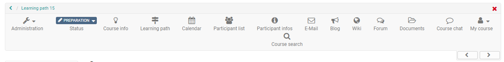

# Learning Activities in Courses

  * [Working With Course Elements](../learningresources/Course_Elements.md)
    * [Working with Forums](../learningresources/Working_with_Forums.md)
    * [Working with Tasks and Group Tasks](../learningresources/Working_with_Tasks_and_Group_Tasks.md)
    * [Working with Tests](../learningresources/Working_with_Tests.md)
    * [Working with Topic Assignment](../learningresources/Working_with_Topic_Assignment.md)
    * [Working with Wiki](../learningresources/Working_with_Wiki.md)
  * [Additional Course Features](../learningresources/Additional_Course_Features.md)
  * [Exams](../learningresources/Exams.md)
  * [Course Problems and Error Messages](../help/Course_Problems_and_Error_Messages.md)

In this chapter learning activities within a course will be explained from the
participant's point of view.

In addition to the course elements, learners also have access to tools in the
toolbar. Depending on which tools have been activated by the course creator,
learners can access the course calendar here, get an overview of the course
participants, retrieve course messages, send e-mails, postings in the forum,
retrieve documents, chat, and use the glossary, wiki, or blog.

  
There are two types of courses in OpenOlat, conventional courses and learning
path courses. The respective possibilities and activities may differ.

Set a bookmark. You will find the corresponding icon either on the bottom
right just underneath the "Start / Book course" button on the info page, in
the course list to the left of the course title, or in the segmented view on
the right side of the course title. You can also find it in the "My course"
drop down menu in the course. Bookmarked favourites can be found in the
"Course" section in the tab "Favourites".

