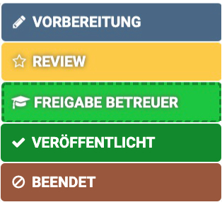
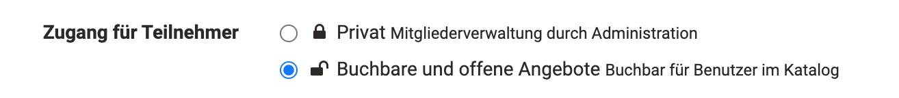
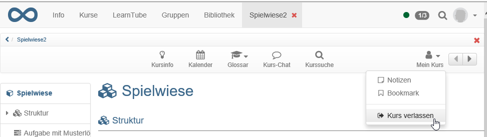
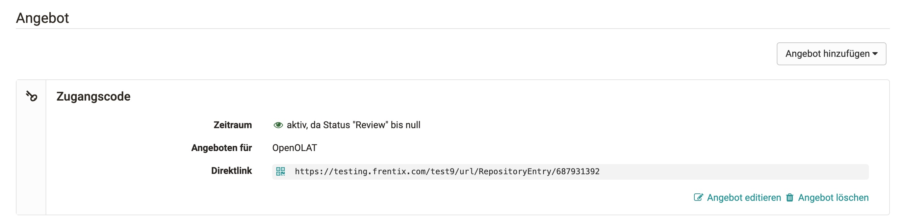
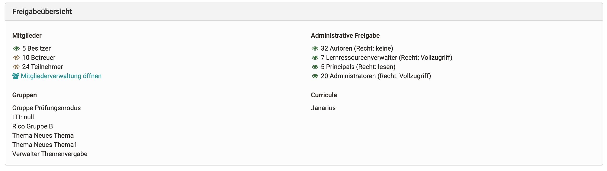
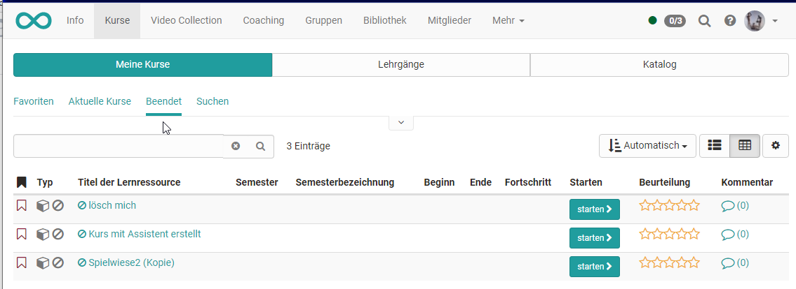

# Zugangskonfiguration / Freigabe {: #access-configuration}

Damit ein Kurs für die Lernenden sichtbar wird, muss er zunächst veröffentlicht werden.
Generell werden folgende Varianten der Publikation unterschieden, die unter "Status" in der Toolbar eines Kurses sichtbar sind:

## Status der Veröffentlichung

Ein Kurs oder eine andere neu erstellte Lernressource ist zunächst nur für die jeweiligen Besitzer:innen zugänglich und hat den Publikationsstatus "Vorbereitung". Unter
"Status" kann der Zustand verändert und die Lernressource für weitere Personen bzw. Rollen zugänglich gemacht werden:

{ class="thumbnail lightbox" }

Publikationsstatus | Zugriff |
---|---|
Vorbereitung | Nur Besitzer:innen dieser Lernressource haben Zugriff. |
Review | Nur Besitzer:innen dieser Lernressource haben Zugriff. Alle Vorbereitungen zu dieser Lernressource sind abgeschlossen und die Inhalte sind zur weiteren Überprüfung freigegeben. |
Freigabe Betreuer:innen | Besitzer:innen und Betreuer:innen dieser Lernressource haben Zugriff. |
Veröffentlicht | Der Kurs ist nun auch im Bereich der aktiven "Kurse" auffindbar. Alle Mitglieder der Lernressource haben Zugriff. |
Beendet | Die Zugriffsart der Mitglieder richtet sich nach der konfigurierten Einstellung des Status "Beendet": "Nur-Lese-Zugriff" oder "Kein Zugriff". |

!!! info "Wichtig"

    Hat ein Kurs den Status "Review", "Freigabe Betreuer:innen" oder "Vorbereitung", erscheint der Kurs unter "Kurse" im Bereich "In Vorbereitung". Ein Zugang zum Kurs mit allen integrierten Kursbausteinen ist aber nicht möglich. Auch ein Zugriff auf die Toolbar ist (noch) nicht möglich.

Die konkrete Variante des Kurszugangs, bzw. generell des Zugangs zu einer Lernressource, wird unter `Kurs > Administration > Einstellungen > Tab "Freigabe"` eingerichtet. Im Folgenden erfahren Sie, welche Optionen Ihnen zur Verfügung stehen.

## Tab Freigabe

### Angebotsarten konfigurieren und Angebote erstellen

Der Zugang zu einem Kurs wird unter `Kurs > Administration > Einstellungen > Tab "Freigabe"` konfiguriert.
Unter "Zugang für Teilnehmer:innen" stehen zwei grundsätzliche Varianten zur Verfügung:

{ class="shadow lightbox" }

Bei der Wahl **"Privat"** werden die Teilnehmenden durch die Besitzer:innen bzw. Personen, die über das Recht der Mitgliederverwaltung verfügen, eingetragen.

Bei der Wahl der Option **"Buchbare und offene Angebote"** können die Lernenden einen Kurs bzw. eine Lernressource selbst buchen, müssen aber eventuell (je nach Angebot) einen Zugangscode eingeben.

[Details zum Tab "Freigabe" >](../learningresources/Course_Settings_Share.de.md)

### Lernressource verlassen

Im Tab "Freigabe" kann mit der Einstellung "Teilnehmer:innen können austreten" auch definiert werden (sofern in der System-Administration erlaubt), ob bzw. wann die Teilnehmenden einen Kurs bzw. eine Lernressource verlassen können. Folgende Optionen stehen zur Wahl:

* "Jederzeit" (Standard): Teilnehmende können den Kurs jederzeit verlassen.
* "Nach Kursenddatum oder Status "Beendet"": Wurde ein Durchführungszeitraum festgelegt, dürfen Teilnehmende den Kurs nach Ablauf dieses Zeitraums verlassen. Unabhängig davon dürfen sie den Kurs verlassen, sobald er den Status "Beendet" hat. Ohne Durchführungszeitraum ist das Verlassen also erst im Status "Beendet" möglich. Bei sonstigen Lernressourcen heisst die Option "Status "Beendet"". [:octicons-tag-16:{ title="ab Release 20.3 (OO-9272)" }](https://track.frentix.com/issue/OO-9272)
* "Nie": Teilnehmende dürfen den Kurs zu keinem Zeitpunkt verlassen. Teilnehmende müssen wenn notwendig von den Besitzer:innen explizit ausgetragen werden.

Wenn Teilnehmende den Kurs verlassen dürfen, können sie dazu im Menü "Mein Kurs" den Eintrag "Kurs verlassen" wählen oder die gleichnamige Aktion auf der Infoseite unter "Meine Daten" nutzen.

{ class="shadow lightbox" }

Die Vorgabe für neue Lernressourcen legt die System-Administration fest.

### Administrative Freigabe

Hier kann festgelegt werden, für welche Organisation / Unterorganisation (wenn eingerichtet) der Kurs für die administrativen Rollen freigegeben ist. Diese umfassen: andere Autor:innen (je nach Recht), Lernressourcenverwalter:innen, Principals, Administrator:innen.

Des Weiteren kann im Tab "Freigabe" festgelegt werden, welche zusätzlichen
Rechte andere OpenOlat Autor:innen an der Lernressource bzw. dem Kurs haben. Dabei
gelten die Rechte generell für alle OpenOlat Autor:innen der Instanz!
Voraussetzung für die Sichtbarkeit für andere Autor:innen ist dann nur, dass die Lernressource nicht mehr im Status "Vorbereitung" ist.

Autor:innen können | Erklärung
:-----|:------------------
referenzieren | Lernressourcen wie zum Beispiel Glossar, Formular, Video oder Test können in Kurse anderer Autor:innen eingebunden werden. Komplette Kurse können auch in Gruppen eingebunden werden.
kopieren | Die Lernressource kann von allen anderen Autor:innen kopiert und so weitergenutzt und in der kopierten Variante auch verändert werden.
exportieren | Die Lernressource ist für alle anderen Autor:innen zum Download freigegeben und kann auch wieder in OpenOlat importiert werden.

!!! warning "Achtung"

    Die Optionen "referenzieren" und "kopieren" machen z.B. Sinn, wenn Sie eine Lernressource als Vorlage oder gutes Beispiel für andere OpenOlat Autor:innen nutzbar machen möchten. Eine Referenzierung macht allerdings *bei Kursen* wenig Sinn und sollte hier eher vermieden werden.

    Überlegen Sie genau, ob Sie die jeweiligen Freigaben wirklich für alle anderen Autor:innen der OpenOlat Instanz machen möchten.

## Angebot / Angebote erstellen {: #offer}

Haben Sie zuvor die Option "Buchbare und offene Angebote" gewählt, können Sie anschliessend Angebote erstellen.

{ class="shadow lightbox" }

Angebote sind unabhängig vom Publikationsstatus des Kurses im Katalog sichtbar, sobald ihre Verfügbarkeit es zulässt (siehe unten, Abschnitt "Verfügbarkeit des Angebots steuern"). Angebote können ausserdem auf einzelne Organisationen oder Unterorganisationen beschränkt werden.

In einem Angebot wird definiert, wer sich unter welchen Umständen in die gewählte Lernressource bzw. den Kurs eintragen bzw. diese buchen kann. Buchen kann dabei als Synonym für belegen, einschreiben, einkaufen verstanden werden. Die Details werden im Folgenden beschrieben.

Wählen Sie den Button "Angebot hinzufügen", um Angebote hinzuzufügen.

!!! info "Wichtig"

    Die Konfiguration eines Zugangs für OpenOlat Gäste (Personen ohne OpenOlat Account) ist nur in **herkömmlichen Kursen** möglich.

### Angebotsoptionen

{ class="size24" } **Zugangscode**

Wählen Sie "Zugangscode", um die Buchungsaufträge auf einen bestimmten Personenkreis einzuschränken. Nur Personen, die über diesen Zugangscode verfügen, können die Ressource buchen. Die Besitzer:innen verteilen den Code ausserhalb von OpenOlat, beispielsweise im Vorfeld per Mail oder bei Blended-Learning-Veranstaltungen an der Tafel. Vor dem ersten Öffnen des Kurses muss die buchende Person diesen Code eingeben. Der Code braucht nur einmal eingetragen zu werden.

{ class="size24" } **Frei verfügbar**

Wählen Sie diese Option, wenn keine weiteren Einschränkungen gelten. Alle OpenOlat Benutzer:innen können die Lernressource öffnen und benutzen. Die buchende Person wird dadurch als Teilnehmer:in der Lernressource hinzugefügt. Wird die Funktion "Automatisches Buchen" eingeschaltet, werden Benutzer:innen automatisch auf die Kursansicht geleitet, ohne die Lernressource mit Hilfe des Buchungsdialogs noch ausdrücklich buchen zu müssen. Der Vorteil bzw. der Unterschied gegenüber der Option "Ohne Buchung" ist, dass die Besitzer:innen sehen, wer den Kurs bzw. die Lernressource gebucht hat.

{ class="size24" } **PayPal und Kreditkarte**

Diese Option ist nur verfügbar, wenn sie in der System-Administration [freigeschaltet](../../manual_admin/administration/Payment_PayPal.de.md) wurde. Wählen Sie PayPal/Kreditkarten, um einen Buchungsauftrag gegen eine finanzielle Vergütung zu ermöglichen. Dabei können Sie einen Betrag definieren, der mit einem PayPal Konto oder mit einer Kreditkarte (Visa/Mastercard) bezahlt werden muss. (Diese Funktion steht nur Benutzer:innen mit Autorenrechten zur Verfügung.)

{ class="size24" } **Ohne Buchung**

Mit diesem Angebot können Sie einen Kurs veröffentlichen, auf den alle OpenOlat Benutzer:innen zugreifen können, ohne dass diese in der Mitgliederverwaltung auftauchen.

{ class="size24" } **Gastzugang**

Im herkömmlichen Kurs kann auch ein Angebot nur für Gäste erstellt werden. Dieses ist dann nur für Gäste verfügbar und kann nicht für verschiedene Unterorganisationen eingeschränkt werden. Auf diesem Weg können Lernressourcen auch Personen komplett ohne OpenOlat Account freigegeben werden.

### Details zur Angebotskonfiguration

Optional kann einer Angebotskonfiguration auch ein Start- und Enddatum beigefügt werden. Diese Konfiguration ist dann nur zwischen den konfigurierten Daten gültig. Sie können auch nur ein Start- oder nur ein Enddatum angeben. Möchten Sie keine zeitliche Einschränkung vorgeben, so lassen Sie dieses Feld leer. Angebote können jederzeit nachträglich angepasst werden.

Sie können auch mehrere Angebote konfigurieren. Diese gelten als verschiedene Optionen, aus denen die buchende Person wählen kann. Achten Sie in diesem Fall auf sinnvolle Beschreibungen. So können z.B. Zugangscodes für Personen aus unterschiedlichen Kontexten kombiniert oder ein Kurs bis zu einem bestimmten Termin frei und danach nur noch mit Zugangscode zugänglich konfiguriert werden.

!!! warning "Achtung"

    Ein angegebenes Start- oder Enddatum bezieht sich ausschliesslich auf den **Buchungsprozess**, nicht auf den Durchführungszeitraum der Lernressource. Hat eine Person eine Lernressource gebucht, so wird sie in der Liste der Teilnehmenden dieser Ressource eingetragen. Von dem Zeitpunkt an entscheidet das System einzig über diese Liste, ob eine Person Zugang zu einer Ressource hat.

    Abgelaufene Angebotskonfigurationen haben daher keinen Einfluss auf eine Teilnehmerschaft. Als Besitzer:in der Ressource können Sie auch jederzeit eine Person zur Liste der Teilnehmenden hinzufügen bzw. daraus entfernen. Im zweiten Fall kann sich die Person durch erneutes Buchen wieder als Teilnehmer:in in die Ressource eintragen.

Sie können die konfigurierten Angebote jederzeit problemlos löschen.
Die bereits getätigten Buchungsaufträge bleiben bestehen und sind davon nicht weiter tangiert.

### Verfügbarkeit des Angebots steuern [:octicons-tag-16:{ title="ab Release 21.0 (OO-9304)" }](https://track.frentix.com/issue/OO-9304)

Über die Einstellung **"Verfügbar wenn"** legen Sie fest, unter welchen Bedingungen ein Angebot im Katalog buchbar ist. Neben der uneingeschränkten Verfügbarkeit steht die Option **"Benutzerdefinierte Bedingung"** zur Verfügung. Ist sie gewählt, konfigurieren Sie die Verfügbarkeit über:

* **"Status ist":** die Kurs- bzw. Durchführungsstatus, in denen das Angebot verfügbar sein soll.
* **"Ab" / "Bis":** grenzen den Verfügbarkeitszeitraum zusätzlich ein. Je Grenze wählen Sie einen Modus:
    * **"Nur Status":** es gilt allein der gewählte Status, ohne Datumsgrenze.
    * **"Absolut":** ein festes Datum.
    * **"Relativ":** ein Datum relativ zum Durchführungszeitraum, zum Beispiel drei Tage vor Kursbeginn. Damit ein relatives Datum wirksam wird, muss der Durchführungszeitraum der Lernressource gesetzt sein.

So wird ein Angebot beispielsweise erst kurz vor Kursbeginn buchbar oder schliesst automatisch einige Tage vor Kursende, ohne dass Sie feste Daten pflegen müssen.

Im Feld **"Interne Bezeichnung"** vergeben Sie einen nur intern sichtbaren Namen für das Angebot. Er hilft Ihnen, mehrere Angebote derselben Lernressource auseinanderzuhalten. Die Angebotskonfiguration ist in die Bereiche **"Katalog"** (Sichtbarkeit und Verfügbarkeit) und **"Mitgliedschaft"** (Art der Mitgliedschaft) gegliedert.

## Freigabeübersicht

{ class="shadow lightbox" }

Ist die Freigabe nach den Wünschen eingestellt, sieht man am Ende der Seite kompakt, wer auf diesen Kurs Zugriff hat und welche Gruppen oder Curricula mit diesem Kurs verknüpft sind.

## Kurszyklus: Beenden und löschen

Wurde ein Kurs durchgeführt und ist abgelaufen, kann er beendet und/oder
gelöscht werden.

Wenn ein Kurs **beendet** wird, richtet sich der Zugriff der Kursmitglieder nach der Einstellung für den Status "Beendet": Bei "Nur-Lese-Zugriff" bleibt der Kurs im Lesemodus zugänglich, bei "Kein Zugriff" sehen die Teilnehmenden die Inhalte nicht mehr. Diese Voreinstellung gibt die System-Administration vor; sie kann pro Kurs im Tab "Optionen" überschrieben werden. [:octicons-tag-16:{ title="ab Release 21.0 (OO-9298)" }](https://track.frentix.com/issue/OO-9298)

Alle Benutzerdaten bleiben bestehen. Der Kurs befindet sich nicht mehr im Tab "Meine Kurse", sondern im Tab "Beendet" gleich nebenan.

{ class="shadow lightbox" }

Im Autorenbereich wird der beendete Kurs mit einem neuen Symbol und durchgestrichen angezeigt.

Falls der Kurs wieder geöffnet werden soll, rufen Sie erneut den Lebenszyklus des Kurses auf und klicken Sie auf "Erneut öffnen".

### Kurs löschen

Unter `Kurs > Administration > Löschen` bzw. über das 3-Punkte-Menü  im Autorenbereich kann eine Lernressource gelöscht werden. In diesem Fall wird die Lernressource in den Tab "Gelöscht" verschoben und liegt sozusagen im Papierkorb.

## Weiterführende Informationen {: #further_information}

[Kurseinstellungen - Tab Freigabe >](../learningresources/Course_Settings_Share.de.md) 
[PayPal Konfiguration >](../../manual_admin/administration/Payment_PayPal.de.md)

[Zum Seitenanfang ^](#access-configuration)
