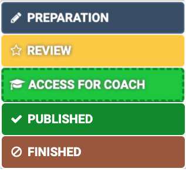
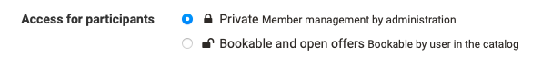
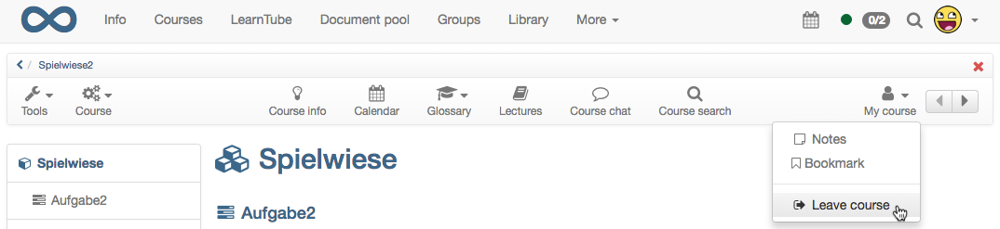
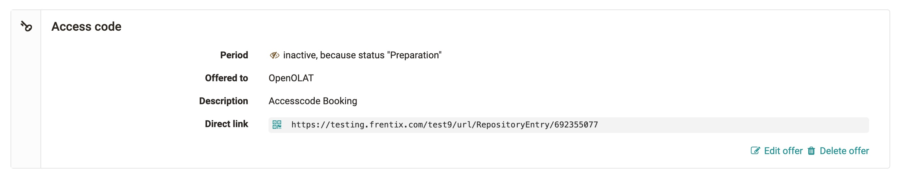
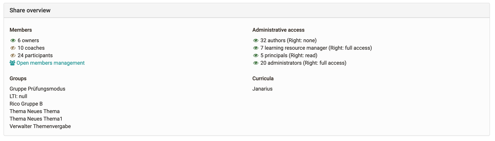
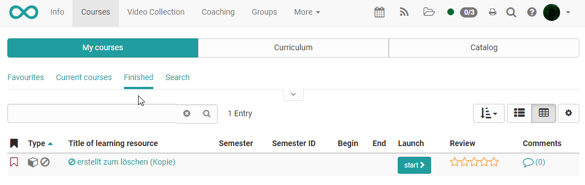

# Access configuration {: #access-configuration}

In order for a course to be visible to learners, it must first be published. In general, a distinction is made between the following publication variants, which are visible under "Status" in the toolbar of a course:

## Publication Status

A newly created learning resource is by default only accessible to its owners and has the publication status "Preparation". Under "Status" the status can be changed and the learning resource can be made accessible to other members:

{ class="thumbnail"}

Publication status| Access|
---|---|
Preparation | Only owners of this learning resource have access.|
Review | Only owners of this learning resource have access. All preparations for this learning resource have been completed and the contents have been released for further review.  
Access For Coach | Owners and coaches of this learning resource have access.  
Published | All members of the learning resource have access.  
Finished | All members still have access to the course, but can only read.  

!!! info "Note"

    If a course has the status "Review", “Access for coach" or "Preparation", the course appears in the courses menu in the tab "In preparation". However, it is not possible to access the course with all integrated course elements. Access to the toolbar is also not (yet) possible.
  
The concrete variant of course access (or access to a learning resource in general) is set up in the "Share" menu of the "Administration" course. In the following, you will learn which options are available to you.

## Tab Share

### Configure offer types and create offers

Access to a course is configured in "Administration" → "Settings" in the "Sharing" tab.
There are two basic options available:

If the option **"Private"** is chosen, the participants are entered by the owners or persons who have the right of members management.

If the option **"Bookable and open offers"** is selected, learners can book a course/learning resource themselves, but may have to (depending on the setting) enter a password
enter.

### Leaving a learning resource

In the tab "Share" you can also define (if allowed by the administrator) if or when the users can leave a course or learning resource. The following options are available:

* At any time (Default): Participants may leave the course at any given time.
* After course end date: If an execution period has been configured for the course, participants are allowed to leave the course after this period. If this option was selected without a configured execution period, participants are not allowed to leave the course at any time.
* Never: Participants may never leave the course. Teilnehmende müssen wenn notwendig vom Kursbesitzer explizit ausgetragen werden.

If members are allowed to leave the course, they can do so by selecting "Leave course" in the "My course" menu.

By default, users can leave a course or learning resource at any time.

### Administrative release

Here you can define for which organization/sub-organization (if set up) the course is released for the administrative roles. These include: other authors (depending on rights), learning resource administrators, principals, administrators.

Furthermore, the tab "Share" can be used to define which additional rights other authors have to the learning resource or course.
These rights generally apply to all OpenOlat authors in the instance! 
The only requirement for visibility to other authors is that the learning resource is no longer in ‘Preparation’ status.

Authors can | Description  
---|---  
reference | Learning resources such as glossary, form, video or test can be integrated in courses of other authors. Complete courses can also be integrated into groups. 
copy | The learning resource can be copied by other authors.  
download | The learning resource is available for download by other authors and can also be imported back into OpenOlat.  

!!! warning "Attention"

    The options "reference" and "copy" make sense if you want to use a template or a good example for other OpenOlat authors. However, referencing makes little sense **for courses** and should rather be avoided here.
    
    Consider carefully whether you really want to make the respective releases for *all* other authors of the OpenOlat instance.

## Configure offers {: #offer}

If you have previously selected the option "Bookable and open offers..." you can then create offers.

{ class="lightbox" }

!!! note "Differences to booking methods before 17.0"

    * Offers can be published independent of the publication status of the course. To do this, select a in the offer creation "time limited" and define a future period. The offer is then available in the catalog for this defined period.
    * Offers can be limited to different parts of organizations (sub-organizations).

You can define when and under which conditions the users of the users of the system can book a learning resource. Booking can be used as a synonym for enroll, purchase. The details are described below.

Select the button "Create offer" to add offers.

!!! info  "Attention"

    The configuration of an access for OpenOlat guests (persons without OpenOlat account) is only possible in **conventional courses**.

### Offer options

{ class="size24" } **Access code**

Select access code to restrict the booking orders to a specific group of people. Only people who have this access code can book the resource. Before opening the course for the first time, the user must enter this code, which may have been sent in advance by e-mail or written on the whiteboard in the case of blended learning events. The code needs to be entered only once.

{ class="size24" } **Free available**

Select this option if no further restrictions apply. All OLAT users can open and use the learning resource. A user will thus be added as a participant. If the function _"Automatic booking"_ is activated, users will automatically be directed to the course view without having to book the learning resource explicitly using the booking dialog. The advantage compared to the option "open without booking" is that the owner can see who has booked his course.

{ class="size24" } **PayPal and credit card**
  
Is only available if enabled by the [administrator](../../manual_admin/administration/PayPal_Configuration.md): Select the PayPal/credit cards to enable booking orders against a financial payment. You can define an amount that has to be paid with a PayPal account or with a credit card (Visa/Mastercard). (This function is only available for users with author rights.)

{ class="size24" } **Without booking**

With this offer you can publish a course which can be accessed by all OpenOlat users without showing up in the member administration.

!!! info "Note"

    Without posting corresponds to the "Open for all" option in the old release.

{ class="size24" } **Guest access**

In the traditional course, an offer can also be created for guests only. This is then only available for guests and cannot be restricted for different sub-organizations. In this way, learning resources can also be shared with people completely without an OpenOlat account.

### Details for offer configuration

Optionally, a start and end date can be added to a booking configuration/offer configuration. This configuration is then only valid between the configured date valid. You can also specify only a start date or only an end date. If you do not want to specify a time restriction, leave this field empty. Offer types can be adjusted later.

You can also configure multiple offer type. These are considered as different options from which the user can choose, in this case make sure that the descriptions are meaningful. For example, course codes can be combined for people from different contexts or a course can be configured to be free until a certain date and then only accessible with a password.

!!! warning "Attention"

    A specified start or end date refers exclusively to the **booking process**, not to the implementation period of the learning resource. If a user has booked a resource, the person is entered in the participant list of this resource. From that point on, the system decides whether a person has access to a resource solely on the basis of the participant list.
    
    Therefore, expired booking configurations have no influence on a participant list. As the owner of the resource, you can also add or remove a person from the list of participants at any time. In the second case, the user can re-enter the resource as a participant by booking again.

You can easily delete the configured offers at any time. The booking orders already made remain in place and are not affected by this affected.

## Share Overview

{ class="lightbox" }

If the sharing is set according to the wishes, you can see compactly at the end of the page, who has access to this course and which groups or curricula are linked to this course.

## Lifecycle: Finish/Delete

If a course has been completed and has expired, it can be finished and/or
deleted.

If a course is  **completed**, it is then in read mode. All user data is
retained and all course members still have access to the course. The course is
no longer in the tab "My Courses", but in the tab "Finished" next to it.

In the authoring area, the finished course is displayed with a new icon and
crossed out.

If you want to reopen the course, go back to the course life cycle and click Reopen.

### Delete course

A learning resource can be deleted in the menu "Administration" → "Delete" or
via the action menu  in the authoring area. In this case, the learning resource is moved to the "Deleted" tab and is in the trash, so to speak.
