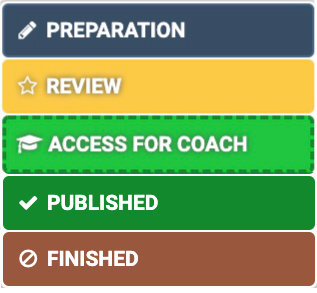
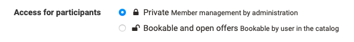
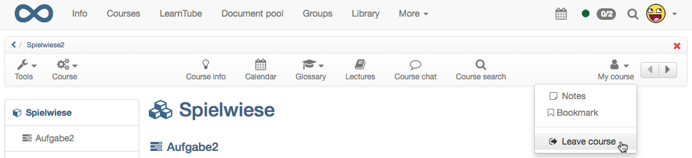
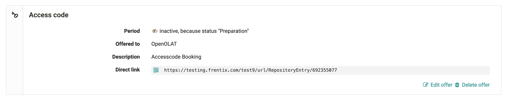
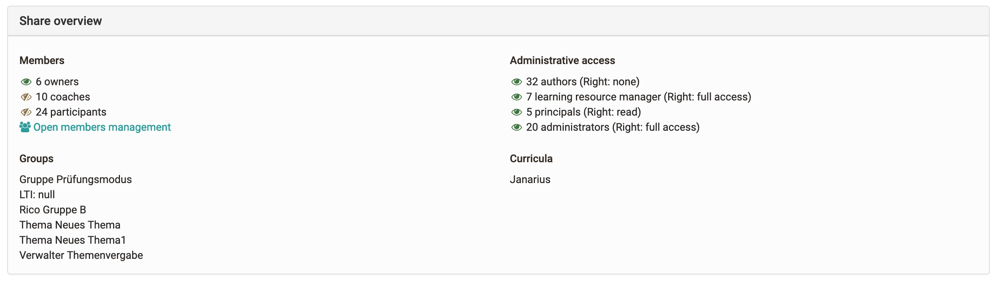
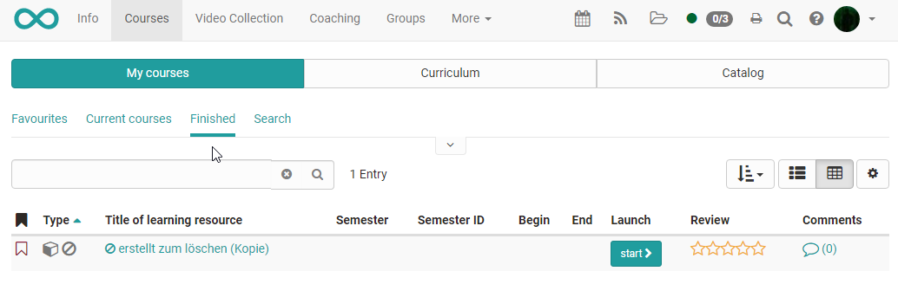

# Access configuration {: #access-configuration}

In order for a course to be visible to learners, it must first be published.
In general, the following publication variants are distinguished, which are visible under "Status" in the toolbar of a course:

## Publication status

A course or another newly created learning resource is initially only accessible to its owners and has the publication status "Preparation". Under
"Status" the state can be changed and the learning resource can be made accessible to further persons or roles:

{ class="thumbnail lightbox" }

Publication status | Access |
---|---|
Preparation | Only owners of this learning resource have access. |
Review | Only owners of this learning resource have access. All preparations for this learning resource are completed and the contents are released for further review. |
Access for coach | Owners and coaches of this learning resource have access. |
Published | The course can now also be found in the area of the active "Courses". All members of the learning resource have access. |
Finished | The type of access for members depends on the configured setting of the status "Finished": "Read-only" or "No access". |

!!! info "Important"

    If a course has the status "Review", "Access for coach" or "Preparation", the course appears under "Courses" in the area "In preparation". However, access to the course with all integrated course elements is not possible. Access to the toolbar is also not (yet) possible.

The concrete variant of course access, or of access to a learning resource in general, is set up under `Course > Administration > Settings > Tab "Share"`. In the following, you learn which options are available to you.

## Tab Share

### Configure offer types and create offers

Access to a course is configured under `Course > Administration > Settings > Tab "Share"`.
Under "Access for participants", two basic variants are available:

{ class="shadow lightbox" }

If **"Private"** is selected, the participants are entered by the owners or by persons who have the right of members management.

If the option **"Bookable and open offers"** is selected, learners can book a course or a learning resource themselves, but may have to enter an access code (depending on the offer).

[Details on the tab "Share" >](../learningresources/Course_Settings_Share.md)

### Leaving a learning resource

In the tab "Share", the setting "Participants can leave" also defines (if allowed in the system administration) whether or when participants can leave a course or a learning resource. The following options are available:

* "At any time" (default): Participants can leave the course at any time.
* "After course end date or status "Finished"": If an execution period has been set, participants may leave the course after this period has ended. Regardless of this, they may leave the course as soon as it has the status "Finished". Without an execution period, leaving is therefore only possible in the status "Finished". For other learning resources, the option is called "Status "Finished"". [:octicons-tag-16:{ title="from Release 20.3 (OO-9272)" }](https://track.frentix.com/issue/OO-9272)
* "Never": Participants may never leave the course. If necessary, participants must be removed explicitly by the owners.

If participants are allowed to leave the course, they can select the entry "Leave course" in the menu "My course" or use the action of the same name on the info page under "My data".

{ class="shadow lightbox" }

The default for new learning resources is set by the system administration.

### Administrative release

Here you can define for which organisation / sub-organisation (if set up) the course is released for the administrative roles. These include: other authors (depending on rights), learning resource managers, principals, administrators.

Furthermore, the tab "Share" can be used to define which additional
rights other OpenOlat authors have to the learning resource or the course. These
rights generally apply to all OpenOlat authors of the instance!
The only requirement for visibility to other authors is that the learning resource is no longer in the status "Preparation".

Authors can | Description
:-----|:------------------
reference | Learning resources such as glossary, form, video or test can be embedded in courses of other authors. Complete courses can also be embedded in groups.
copy | The learning resource can be copied by all other authors and thus reused and also modified in the copied variant.
export | The learning resource is released for download by all other authors and can also be imported back into OpenOlat.

!!! warning "Attention"

    The options "reference" and "copy" make sense, for example, if you want to make a learning resource usable as a template or good example for other OpenOlat authors. However, referencing makes little sense *for courses* and should rather be avoided here.

    Consider carefully whether you really want to grant the respective releases to all other authors of the OpenOlat instance.

## Offer / Create offers {: #offer}

If you have previously selected the option "Bookable and open offers", you can then create offers.

{ class="shadow lightbox" }

Offers are visible in the catalog independently of the publication status of the course, as soon as their availability allows it (see below, section "Manage offer availability"). Offers can also be restricted to individual organisations or sub-organisations.

An offer defines who can enrol in or book the selected learning resource or course under which circumstances. Booking can be understood as a synonym for enrolling, registering, purchasing. The details are described below.

Select the button "Add offer" to add offers.

!!! info "Important"

    The configuration of an access for OpenOlat guests (persons without an OpenOlat account) is only possible in **conventional courses**.

### Offer options

{ class="size24" } **Access code**

Select "Access code" to restrict the booking orders to a specific group of persons. Only persons who have this access code can book the resource. The owners distribute the code outside OpenOlat, for example in advance by e-mail or on the board at blended learning events. Before opening the course for the first time, the booking person must enter this code. The code only needs to be entered once.

{ class="size24" } **Freely available**

Select this option if no further restrictions apply. All OpenOlat users can open and use the learning resource. The booking person is thereby added as a participant of the learning resource. If the function "Auto-booking" is switched on, users are automatically directed to the course view without having to book the learning resource explicitly using the booking dialog. The advantage or difference compared to the option "Without booking" is that the owners see who has booked the course or the learning resource.

{ class="size24" } **PayPal and credit card**

This option is only available if it has been [enabled](../../manual_admin/administration/Payment_PayPal.md) in the system administration. Select PayPal/credit cards to enable a booking order against a financial payment. You can define an amount that has to be paid with a PayPal account or with a credit card (Visa/Mastercard). (This function is only available to users with author rights.)

{ class="size24" } **Without booking**

With this offer you can publish a course that all OpenOlat users can access without appearing in the members management.

{ class="size24" } **Guest access**

In the conventional course, an offer for guests only can also be created. This offer is then only available to guests and cannot be restricted to different sub-organisations. In this way, learning resources can also be released to persons completely without an OpenOlat account.

### Details on the offer configuration

Optionally, a start and end date can be added to an offer configuration. The configuration is then only valid between the configured dates. You can also specify only a start date or only an end date. If you do not want to specify a time restriction, leave this field empty. Offers can be adjusted at any time afterwards.

You can also configure several offers. These count as different options from which the booking person can choose. In this case, make sure the descriptions are meaningful. For example, access codes for persons from different contexts can be combined, or a course can be configured to be free until a certain date and only accessible with an access code afterwards.

!!! warning "Attention"

    A specified start or end date refers exclusively to the **booking process**, not to the execution period of the learning resource. Once a person has booked a learning resource, they are entered in the list of participants of this resource. From that point on, the system decides solely on the basis of this list whether a person has access to a resource.

    Expired offer configurations therefore have no influence on a participation. As the owner of the resource, you can also add a person to the list of participants or remove them from it at any time. In the second case, the person can enter the resource again as a participant by booking again.

You can delete the configured offers at any time without problems.
The booking orders already made remain in place and are not affected by this.

### Manage offer availability [:octicons-tag-16:{ title="from Release 21.0 (OO-9304)" }](https://track.frentix.com/issue/OO-9304)

The **"Available if"** setting defines the conditions under which an offer can be booked in the catalog. In addition to unrestricted availability, the **"Custom condition"** option is available. When it is selected, you configure the availability via:

* **"Status is":** the course or implementation statuses in which the offer should be available.
* **"From" / "Until":** additionally narrow down the availability period. For each limit you choose a mode:
    * **"Status only":** only the selected status applies, without a date limit.
    * **"Absolute":** a fixed date.
    * **"Relative":** a date relative to the execution period, for example three days before the course starts. For a relative date to take effect, the execution period of the learning resource must be set.

This way an offer becomes bookable shortly before the course starts, for example, or closes automatically a few days before the course ends, without you having to maintain fixed dates.

In the **"Internal label"** field you assign a name for the offer that is only visible internally. It helps you tell several offers of the same learning resource apart. The offer configuration is divided into the areas **"Catalog"** (visibility and availability) and **"Membership"** (type of membership).

## Share overview

{ class="shadow lightbox" }

Once the sharing is set as desired, you see compactly at the end of the page who has access to this course and which groups or curricula are linked to this course.

## Lifecycle: Finish and delete

If a course has been held and has expired, it can be finished and/or
deleted.

When a course is **finished**, member access depends on the setting for the status "Finished": with "Read-only" the course remains accessible in read mode, with "No access" participants no longer see the content. This default is set by the system administration; it can be overridden per course in the tab "Options". [:octicons-tag-16:{ title="from Release 21.0 (OO-9298)" }](https://track.frentix.com/issue/OO-9298)

All user data is retained. The course is no longer in the tab "My courses", but in the tab "Finished" right next to it.

{ class="shadow lightbox" }

In Authoring, the finished course is displayed with a new icon and crossed out.

If the course is to be reopened, open the life cycle of the course again and click "Reopen".

### Delete course

Under `Course > Administration > Delete` or via the action menu  in Authoring, a learning resource can be deleted. In this case, the learning resource is moved to the tab "Deleted" and lies in the trash, so to speak.

## Further information {: #further_information}

[Course settings - Tab Share >](../learningresources/Course_Settings_Share.md) 
[PayPal Configuration >](../../manual_admin/administration/Payment_PayPal.md)

[To the top of the page ^](#access-configuration)
